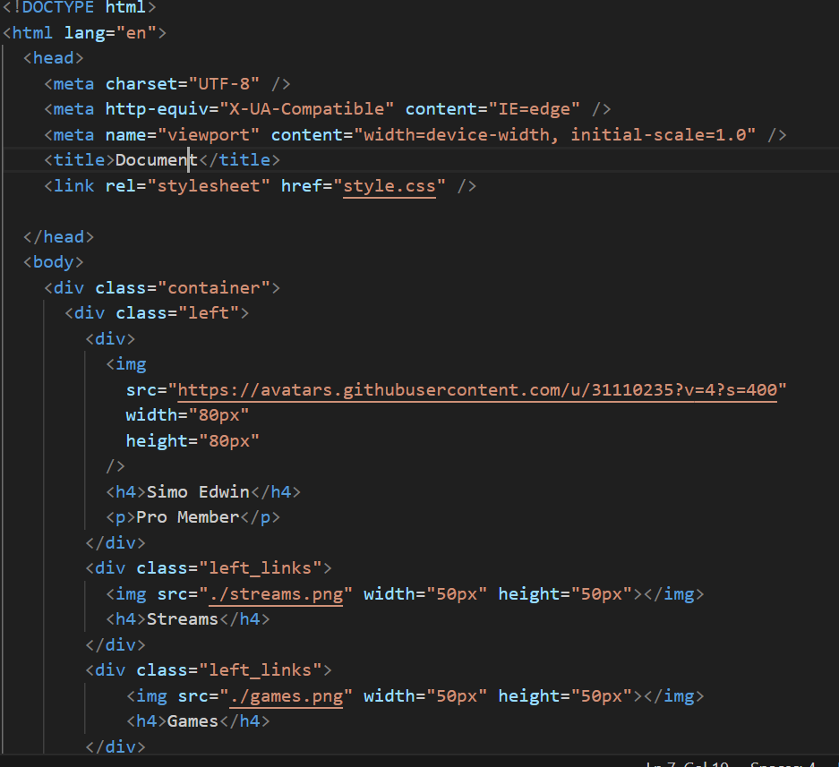
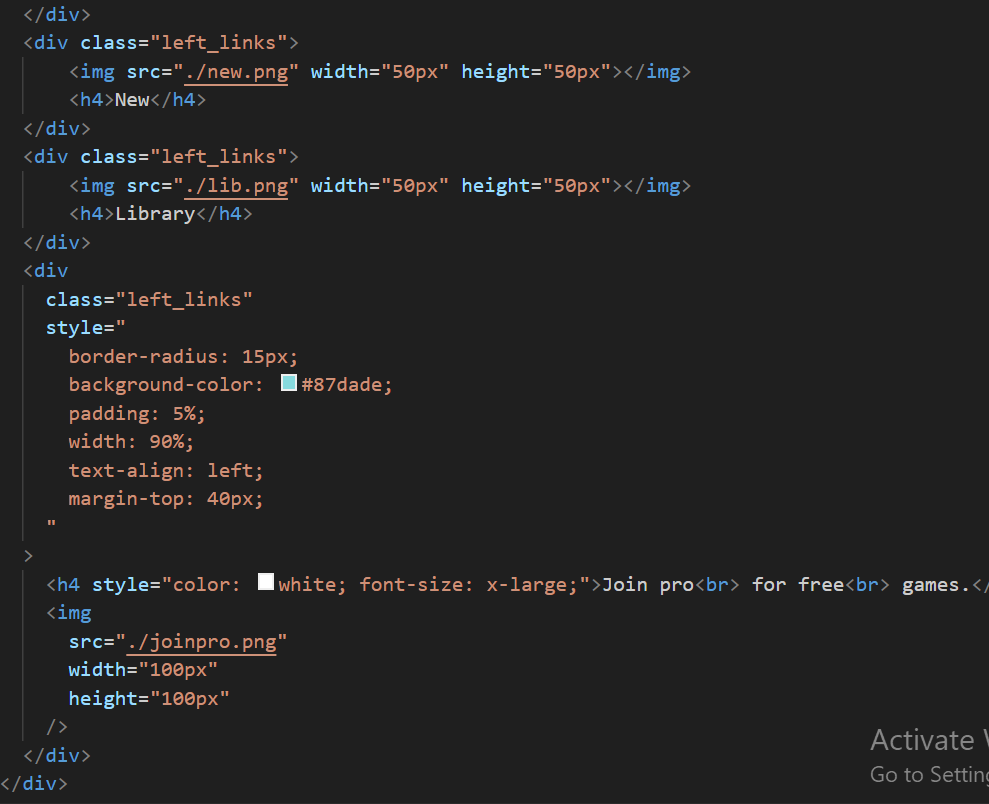
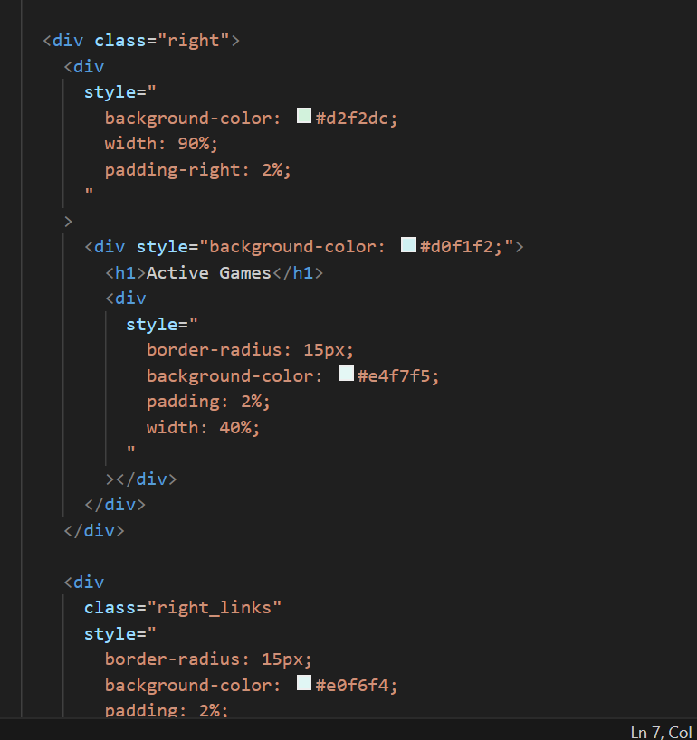
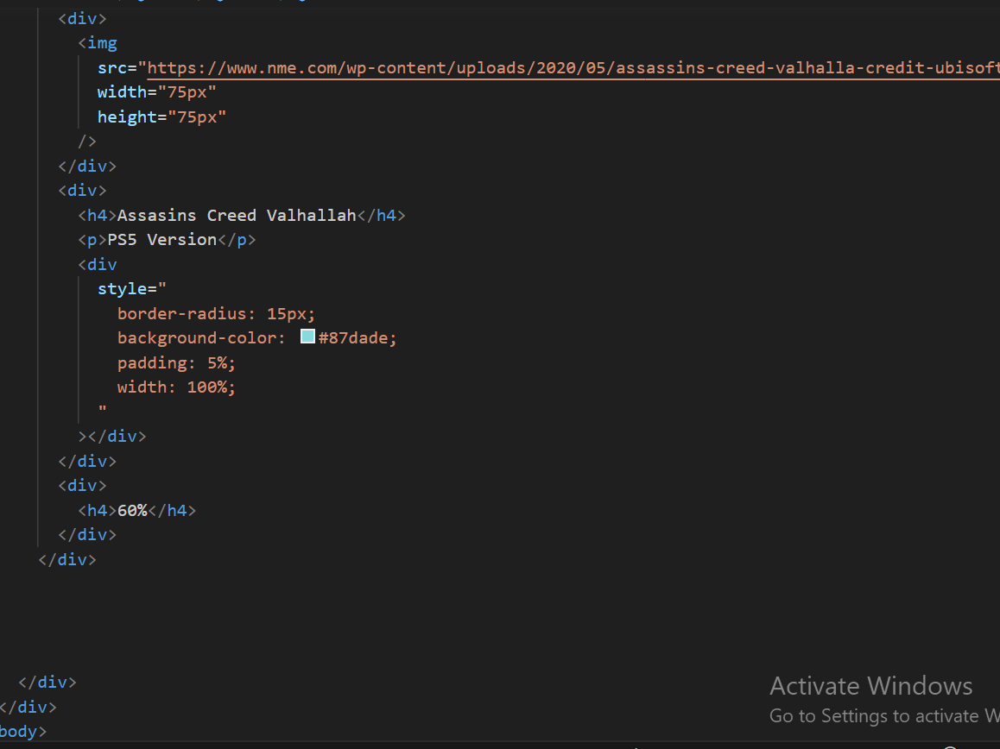
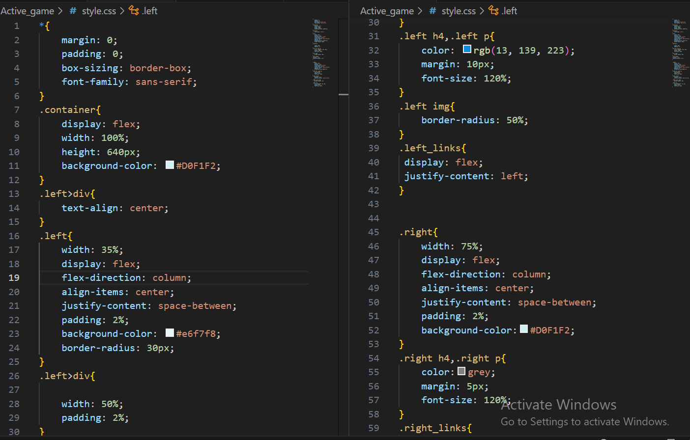
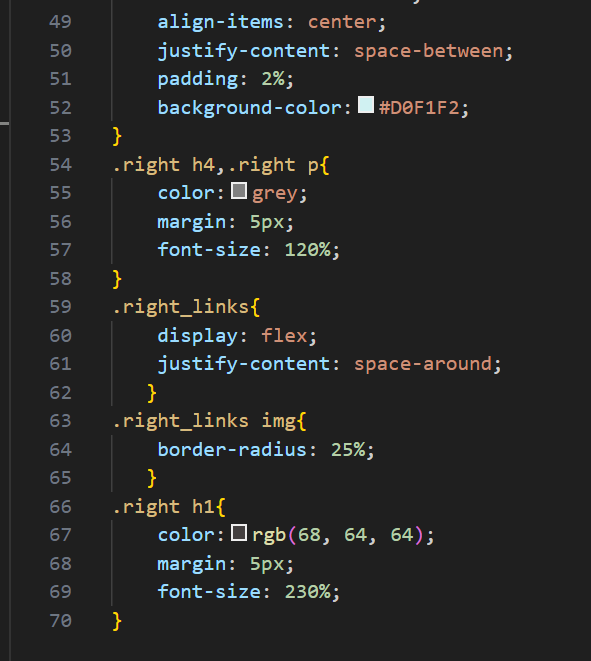

Hosted link-https://gautamkamboj.github.io/vs_code/Active_game/index.html

## HTML

Document Structure:

!DOCTYPE html>: This declaration defines the document type and version of HTML used.
html lang="en">: The root element that encapsulates the entire HTML document, with the "en" attribute indicating the document's language as English.
Head Section:

head>: Contains metadata and links to external resources.
meta charset="UTF-8">: Specifies the character encoding for the document.
meta http-equiv="X-UA-Compatible" content="IE=edge">: Sets compatibility with Internet Explorer.
meta name="viewport" content="width=device-width, initial-scale=1.0">: Configures the viewport for responsive design.
title>Document /title>: Sets the title of the web page that appears in the browser tab.
link rel="stylesheet" href="style.css">: Links an external CSS file named "style.css" to style the page.
Body Section:

body>: Contains the visible content of the web page.
Header Section:

header class="header">: Defines the header section of the page.
h1>css flexbox photo gallery /h1>: Displays a heading at the top of the page.
Main Content:

div class="container">: Contains the main content of the page, structured into left and right sections.
div class="left">: Represents the left section of the page.
Contains information about a user or profile, including an image, name, and a "Join Pro" section.
div class="right">: Represents the right section of the page.
Contains information about active games and multiple game entries, each with an image, title, version, and percentage completion.
Styling:

Throughout the HTML, various div> elements are styled using inline CSS to define background colors, padding, border-radius, and more.
Images:

Several img> elements are used to display images, including user avatars and game thumbnails.

## CSS

# '*' Selector:

This rule applies the following styles to all elements on the page:
margin: 0; and padding: 0;: Resets margin and padding to zero, removing default spacing.

box-sizing: border-box;: Sets the box-sizing property to border-box, which ensures that padding and borders are included in the element's total width and height.

font-family: sans-serif;: Sets the default font family to a sans-serif typeface.

# .container Selector:

Styles the container element that holds the left and right sections of your page.
display: flex;: Makes the container a flex container to arrange its children in a flex layout.
width: 100%;: Sets the container's width to 100% of its parent's width.
height: 640px;: Sets the container's height to 640 pixels.
background-color: #D0F1F2;: Sets the background color of the container.

# .left Selector:

Styles the left section of your page.
width: 35%;: Sets the width of the left section to 35% of the container's width.
display: flex;: Makes the left section a flex container.
flex-direction: column;: Arranges the child elements vertically.
align-items: center;: Centers the child elements horizontally.
justify-content: space-between;: Distributes child elements evenly with space in between.
padding: 2%;: Adds padding to the left section.
background-color: #e6f7f8;: Sets the background color of the left section.
border-radius: 30px;: Applies a border-radius to round the corners of the left section.

# .left h4, .left p Selectors:

Styles the h4 and p elements inside the left section.
color: rgb(13, 139, 223);: Sets the text color to a shade of blue.
margin: 10px;: Adds margin around the elements.
font-size: 120%;: Sets the font size to 120% of the default size.

# .left img Selector:

Styles the img element inside the left section.
border-radius: 50%;: Applies a border-radius to make the image a circle.

# .left_links Selector:

Styles a group of links inside the left section.
display: flex;: Makes the links flex items.
justify-content: left;: Aligns the links to the left within their container.

# .right Selector:

Styles the right section of your page.
width: 75%;: Sets the width of the right section to 75% of the container's width.
display: flex;: Makes the right section a flex container.
flex-direction: column;: Arranges the child elements vertically.
align-items: center;: Centers the child elements horizontally.
justify-content: space-between;: Distributes child elements evenly with space in between.
padding: 2%;: Adds padding to the right section.
background-color: #D0F1F2;: Sets the background color of the right section.

# .right h4, .right p Selectors:

Styles the h4 and p elements inside the right section.
color: grey;: Sets the text color to grey.
margin: 5px;: Adds margin around the elements.
font-size: 120%;: Sets the font size to 120% of the default size.

# .right_links Selector:

Styles a group of links or elements inside the right section.
display: flex;: Makes the links flex items.
justify-content: space-around;: Distributes the elements evenly with space around them.

# .right_links img Selector:

Styles the img elements inside the right links.
border-radius: 25%;: Applies a border-radius to make the images slightly rounded.

# .right h1 Selector:

Styles an h1 element inside the right section.
color: rgb(68, 64, 64);: Sets the text color.
margin: 5px;: Adds margin around the element.
font-size: 230%;: Sets the font size to 230% of the default size.