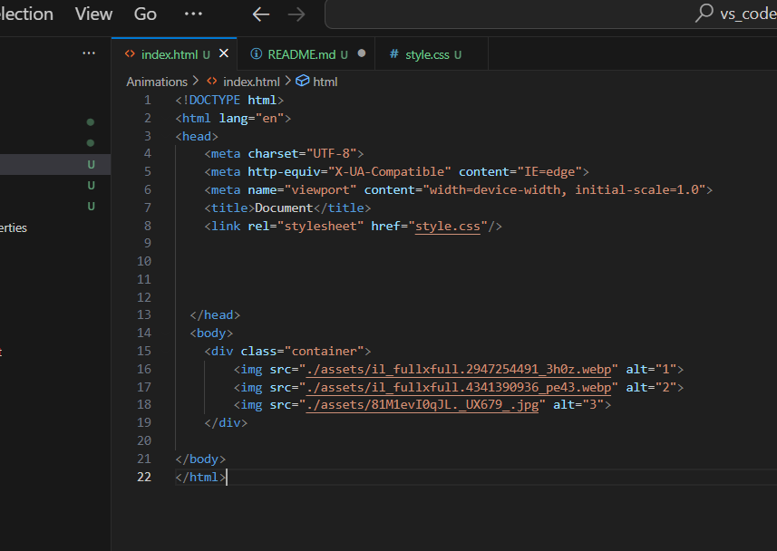
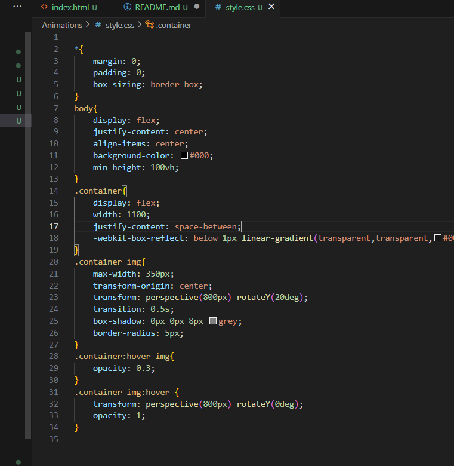

https://gautamkamboj.github.io/vs_code/Animations/index.html

## HTML CSS

The HTML structure includes an img> tag for each image inside a div> with the class "container."
The images have src attributes pointing to image files and alt attributes for alternative text.

The CSS code starts with a CSS reset to remove default margin and padding for all elements (* selector).

The body is set to display: flex to horizontally and vertically center its content. The background color is set to black (#000) to create a black background.

The .container class is applied to the div that contains the images. It's displayed as a flex container with a fixed width of 1100 pixels and space between its children.

The -webkit-box-reflect property adds a reflection effect below each image.

Images within the container have specific styling:

max-width is set to 350px to limit their size.
transform-origin sets the transformation pivot to the center of each image.
transform applies a 3D rotation effect with a perspective.
transition smoothens the hover effect with a duration of 0.5s.
box-shadow adds a subtle shadow to each image.
border-radius rounds the corners of the images.
When hovering over the .container, the opacity of images is reduced to 0.3, creating a dimming effect.

When hovering over an individual image, it returns to its original state with full opacity and no rotation.