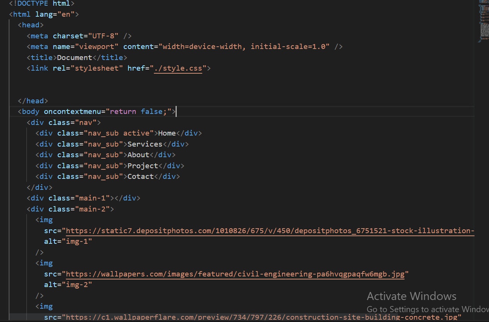
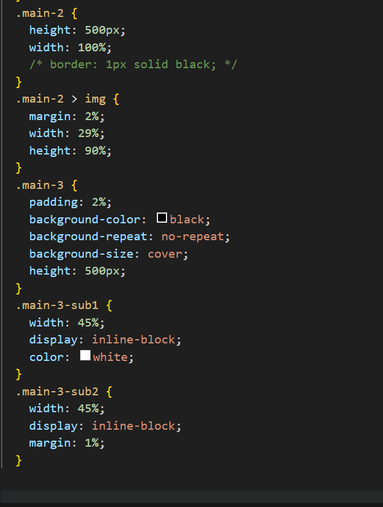

Hosted link- https://gautamkamboj.github.io/vs_code/Background_properties/index.html

## HTML

!DOCTYPE html>: This declaration specifies that the document is an HTML5 document.

html lang="en">: The root element of the HTML document, indicating that the document is in English ("en").

head>: This section contains metadata about the document and references an external CSS file named "style.css."

meta charset="UTF-8" />: Specifies the character encoding as UTF-8.
meta name="viewport" content="width=device-width, initial-scale=1.0" />: Sets the viewport settings for responsive design.
title>Document /title>: Sets the title of the webpage, which appears in the browser's title bar or tab.
link rel="stylesheet" href="./style.css">: Links an external CSS stylesheet named "style.css" to the HTML document.
body oncontextmenu="return false;">: The main content of the webpage is contained within the body> element. Additionally, the oncontextmenu attribute is used to disable right-click context menus on the page.

div class="nav">: This div> element represents a navigation bar.

Inside the navigation bar, there are five navigation links represented by div> elements with the class "nav_sub." One of them, with the class "active," likely represents the current or active page. The links include "Home," "Services," "About," "Project," and "Contact."
div class="main-1">: This div> element represents a section of the main content, which appears to be empty in the provided code.

div class="main-2">: This div> element represents another section of the main content.

Inside this section, there are three img> elements that display images. Each img> element has a src attribute pointing to an image file and an alt attribute for alternative text.

div class="main-3">: This div> element represents a third section of the main content.

Inside this section, there is a paragraph (p) with the class "main-3-sub1," containing Lorem Ipsum text. This paragraph may be used for providing content or descriptions.
There is also an img> element with the class "main-3-sub2" that displays another image.

## CSS

*: This selector targets all elements on the page and sets some default styles for them.

margin: 0;: Sets the margin of all elements to 0.
padding: 0;: Sets the padding of all elements to 0.
box-sizing: border-box;: Specifies the box-sizing property as "border-box," which includes padding and border within the element's total width and height.
.nav: This rule targets elements with the class "nav," which represents the navigation bar.

max-width: 100vw;: Sets the maximum width of the navigation bar to 100% of the viewport width to make it responsive.
padding: 2%;: Adds padding around the navigation bar.
background: Defines a linear gradient background with varying degrees of transparency, creating a semi-transparent black-to-transparent gradient.
.nav_sub: This rule targets elements with the class "nav_sub," which are the navigation links within the navigation bar.

display: inline-block;: Makes the navigation links behave as inline-block elements, allowing them to appear side by side.
margin-inline: 5%;: Sets a horizontal margin of 5% between the navigation links.
color: white;: Sets the text color of the navigation links to white.
.active: This rule targets the navigation link with the class "active," which likely represents the current or active page link.

background-color: white;: Changes the background color of the active link to white.
color: black;: Changes the text color of the active link to black.
padding: 0.6% 1.5%;: Adds padding to the active link to increase its size and improve visual clarity.
.main-1: This rule targets the element with the class "main-1," which appears to be a section with a background image.

background-image: Sets the background image using the specified URL.
height: 500px;: Sets the height of the element to 500 pixels.
width: 100%;: Sets the width of the element to 100% of its container.
background-repeat: no-repeat;: Prevents the background image from repeating.
background-size: cover;: Scales the background image to cover the entire element.
.main-2: This rule targets the element with the class "main-2," which appears to be another section.

height: 500px;: Sets the height of the element to 500 pixels.
width: 100%;: Sets the width of the element to 100% of its container.
.main-2 > img: This rule targets the images inside the "main-2" section.

margin: 2%;: Adds a 2% margin around each image.
width: 29%;: Sets the width of each image to 29% of its container.
height: 90%;: Sets the height of each image to 90% of its container.
.main-3: This rule targets the element with the class "main-3," which appears to be another section.

padding: 2%;: Adds padding around the element.
background-color: black;: Sets the background color to black.
background-repeat: no-repeat;: Prevents the background from repeating.
background-size: cover;: Scales the background to cover the entire element.
height: 500px;: Sets the height of the element to 500 pixels.
.main-3-sub1: This rule targets the paragraph inside the "main-3" section.

width: 45%;: Sets the width of the paragraph to 45% of its container.
display: inline-block;: Makes the paragraph behave as an inline-block element, allowing it to appear inline with other elements.
color: white;: Sets the text color to white.
.main-3-sub2: This rule targets the image inside the "main-3" section.

width: 45%;: Sets the width of the image to 45% of its container.
display: inline-block;: Makes the image behave as an inline-block element.
margin: 1%;: Adds a 1% margin around the image.