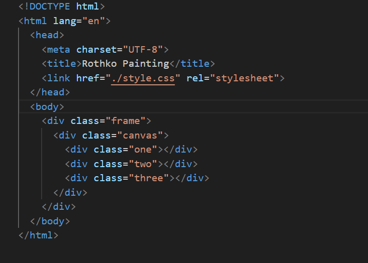

Hosted link- https://gautamkamboj.github.io/vs_code/Box_model/index.html

## HTML

!DOCTYPE html>: This declaration specifies that the document is an HTML5 document.

html lang="en">: The root element of the HTML document, indicating that the document is in English ("en").

head>: This section contains metadata about the document, including the character encoding, page title, and a link to an external CSS stylesheet.

meta charset="UTF-8">: Specifies the character encoding as UTF-8.
title>Rothko Painting /title>: Sets the title of the webpage to "Rothko Painting."
link href="./styles.css" rel="stylesheet">: Links an external CSS stylesheet named "styles.css" to the HTML document to apply styles to the content.
body>: The main content of the webpage is contained within the body> element.

div class="frame">: This div> element represents a frame or container for the canvas.

div class="canvas">: This div> element represents the canvas itself and contains three child div> elements.

div class="one">/div>: A div> element with the class "one."
div class="two">/div>: A div> element with the class "two."
div class="three">/div>: A div> element with the class "three."

## CSS

.canvas: Styles applied to an element with the class "canvas."

width: 500px;: Sets the width of the element to 500 pixels.
height: 600px;: Sets the height of the element to 600 pixels.
background-color: #4d0f00;: Sets the background color of the element to a dark reddish-brown (#4d0f00).
overflow: hidden;: Hides any content that overflows the dimensions of this element.
filter: blur(2px);: Applies a 2-pixel blur effect to the content within this element.
.frame: Styles applied to an element with the class "frame."

border: 50px solid black;: Adds a black border with a width of 50 pixels around the element.
width: 500px;: Sets the width of the element to 500 pixels.
padding: 50px;: Adds 50 pixels of padding inside the element.
margin: 20px auto;: Centers the element horizontally with a top and bottom margin of 20 pixels.
.one and .two: Styles applied to elements with the classes "one" and "two."

.one:

width: 425px;: Sets the width of the element to 425 pixels.
height: 150px;: Sets the height of the element to 150 pixels.
background-color: #efb762;: Sets the background color to a light orange-brown (#efb762).
margin: 20px auto;: Centers the element horizontally with a top and bottom margin of 20 pixels.
box-shadow: 0 0 3px 3px #efb762;: Adds a light orange-brown shadow around the element.
border-radius: 9px;: Applies a border radius of 9 pixels to round the corners.
transform: rotate(-0.6deg);: Applies a slight counterclockwise rotation to the element.

.two:

width: 475px;: Sets the width of the element to 475 pixels.
height: 200px;: Sets the height of the element to 200 pixels.
background-color: #8f0401;: Sets the background color to a dark red (#8f0401).
margin: 0 auto 20px;: Centers the element horizontally with a bottom margin of 20 pixels.
box-shadow: 0 0 3px 3px #8f0401;: Adds a dark red shadow around the element.
border-radius: 8px 10px;: Applies different border radii to round the corners.
transform: rotate(0.4deg);: Applies a slight clockwise rotation to the element.
.one, .two: Styles applied to elements with the classes "one" and "two."

filter: blur(1px);: Applies a 1-pixel blur effect to both elements.
.three: Styles applied to an element with the class "three."

width: 91%;: Sets the width of the element to 91% of its parent's width.
height: 28%;: Sets the height of the element to 28% of its parent's height.
background-color: #b20403;: Sets the background color to a dark red (#b20403).
margin: auto;: Centers the element horizontally.
filter: blur(2px);: Applies a 2-pixel blur effect to the element.
box-shadow: 0 0 5px 5px #b20403;: Adds a dark red shadow around the element.
border-radius: 30px 25px 60px 12px;: Applies different border radii to round the corners.