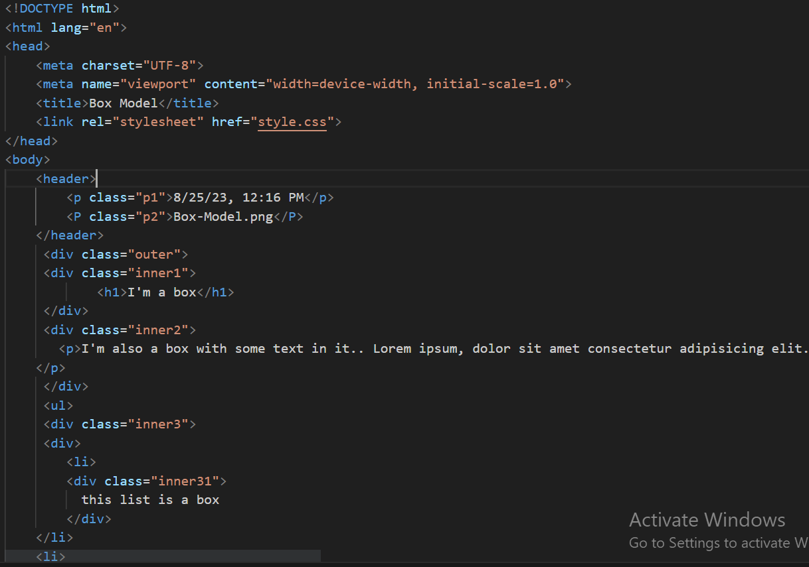
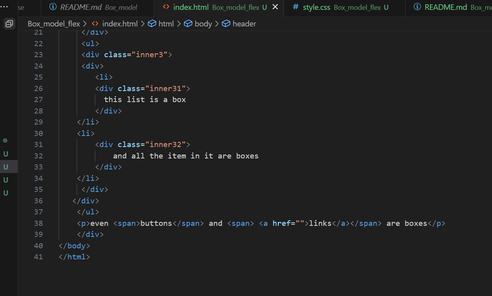
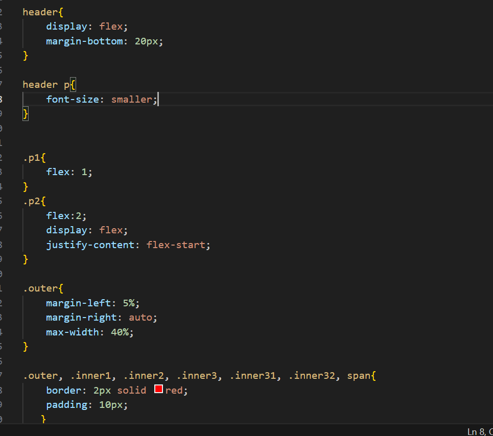
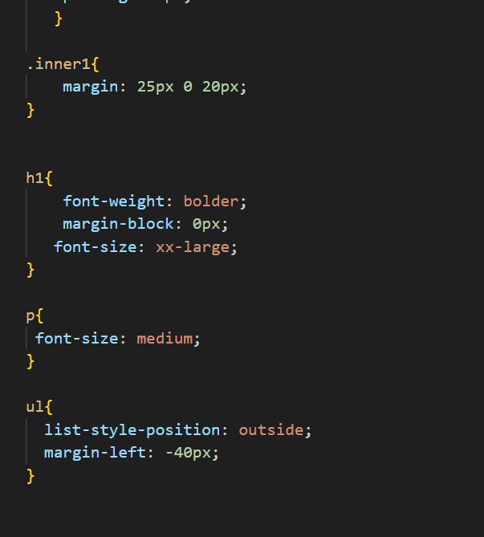

Hosted link- https://gautamkamboj.github.io/vs_code/Box_model_flex/index.html

## HTML

!DOCTYPE html>: This declaration specifies that the document is written in HTML5.

html lang="en">: The root element of the HTML document, with the lang attribute indicating that the content is in English.

head>: The head section of the document, containing metadata and links to external resources.

meta charset="UTF-8">: Specifies the character encoding of the document as UTF-8.
meta name="viewport" content="width=device-width, initial-scale=1.0">: Sets the viewport properties for responsive design.
title>Box Model /title>: Defines the title of the webpage, which appears in the browser's title bar or tab.
link rel="stylesheet" href="style.css">: Links an external CSS file named "style.css" for styling.
body>: The body of the HTML document, where the visible content is placed.

header>: A header section containing two paragraphs with classes p1 and p2. These paragraphs display date and file name information.

div class="outer">: A container div with the class "outer" that wraps several inner divs and content.

div class="inner1">: An inner div with the class "inner1" containing an h1> element with the text "I'm a box."

div class="inner2">: Another inner div with the class "inner2" containing a p> element with text.

ul>: An unordered list element that contains list items.

div class="inner3">: An inner div with the class "inner3."

Nested within "inner3," there are two list items li>, each containing a div> with classes "inner31" and "inner32." These divs contain text.
p>: A paragraph element with text that includes two span> elements.

span>: The first span> element surrounds the word "buttons."
span>: The second span> element surrounds an a> (anchor) element with an empty href attribute, representing a link.

## CSS

header: This rule targets the header> element and applies styles to it. It sets the display to flex, which allows for flexible layout of child elements within the header. It also adds a margin at the bottom of 20 pixels.

header p: This rule targets p> elements that are descendants of the header> element. It sets the font size to smaller.

.p1 and .p2: These rules target elements with the classes .p1 and .p2. .p1 is given a flex property of 1, which makes it occupy a portion of available space within its parent. .p2 is given a flex property of 2 and is further customized with display: flex and justify-content: flex-start to control the layout of its child elements.

.outer, .inner1, .inner2, .inner3, .inner31, .inner32, span: These rules target various elements with different classes and the span> element. They all share common styles like a 2-pixel red border and 10 pixels of padding.

.inner1: This rule targets elements with the class .inner1 and adds a top margin of 25 pixels and a bottom margin of 20 pixels.

h1: This rule targets h1> elements and applies styles to them. It sets the font weight to bolder, removes any margin block, and increases the font size to xx-large.

p: This rule targets all p> elements in the document and sets their font size to medium.

ul: This rule targets unordered lists (ul>) and specifies styles for list items, such as list-style positioning and a negative left margin to align the list items correctly.
