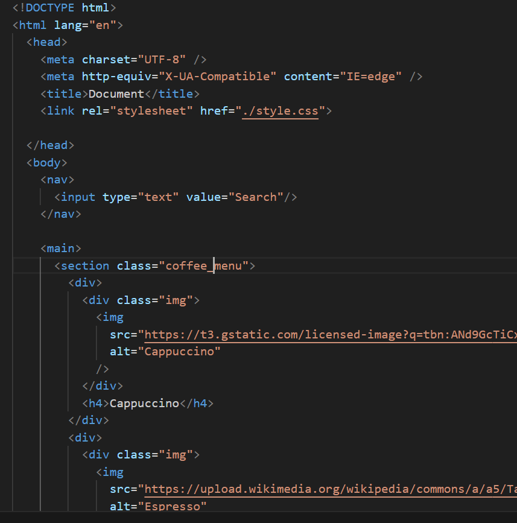
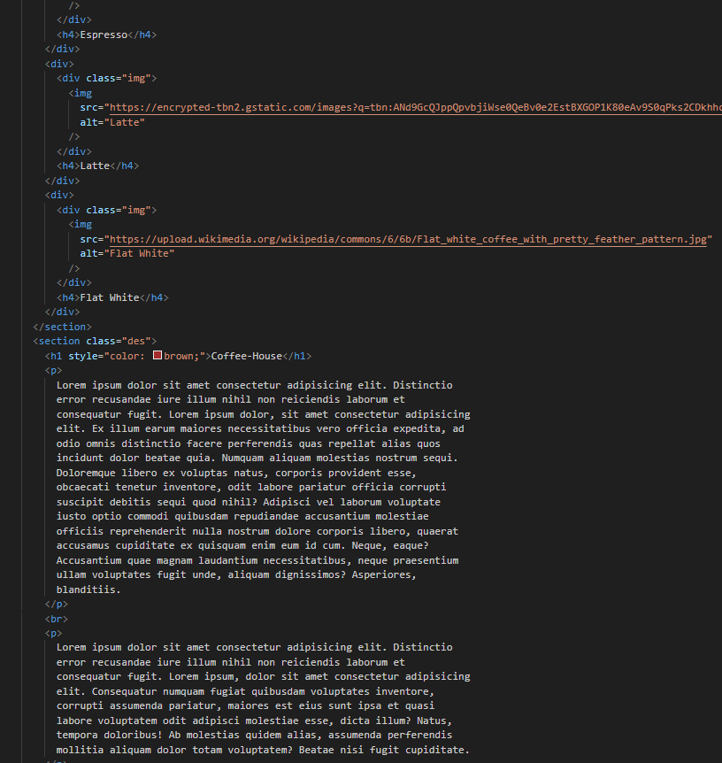
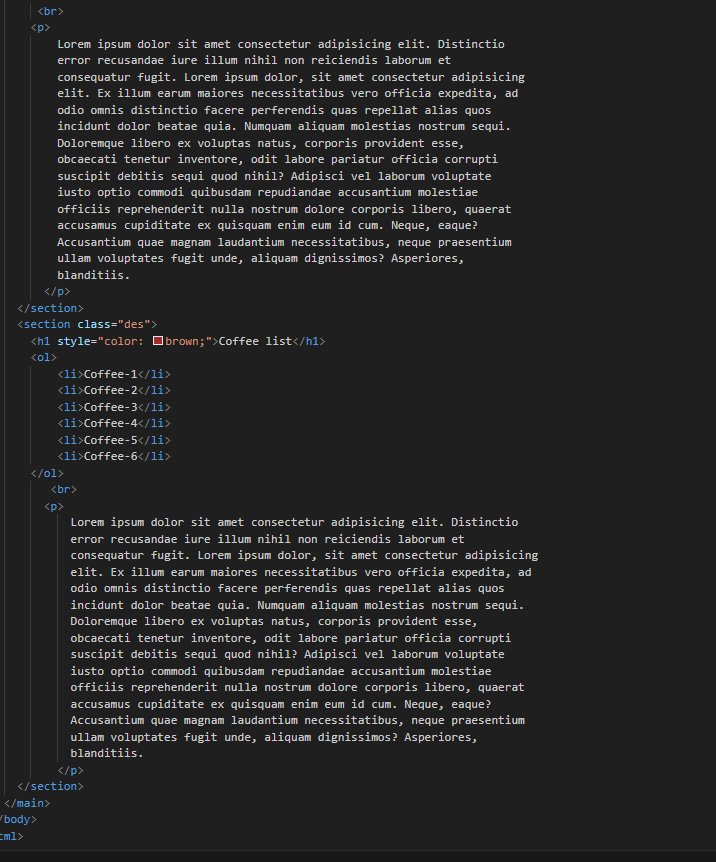
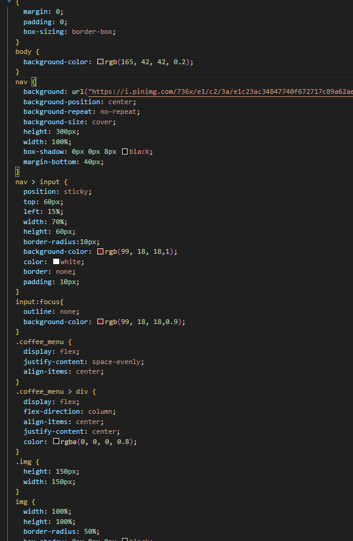
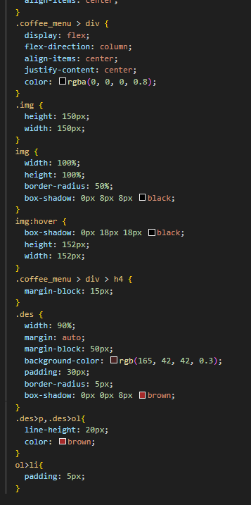

Hosted link- https://gautamkamboj.github.io/vs_code/Coffee_house/index.html

## HMTL

html>: This is the root element that encapsulates the entire HTML document. It defines the document as an HTML file and sets the language to English.

head>: The head section contains meta-information about the document, such as character encoding, metadata, and links to external resources like stylesheets and scripts. It doesn't display content directly on the webpage.

meta>: These are meta tags used to provide metadata about the document. In this case, they specify the character set and the viewport settings for responsive design.

title>: Sets the title of the HTML document, which appears in the browser's title bar or tab.

link>: Specifies an external resource to be loaded, such as a stylesheet. It links the HTML document to an external CSS file for styling.

body>: This is the main content of the HTML document, and it contains everything that is displayed on the webpage.

nav>: Typically used to define a section of navigation links or menus. In this case, it contains an input element for search.

input>: An input element is used for user input, in this case, for a search bar.

main>: Defines the main content of the HTML document, which usually includes the primary content of the webpage.

section>: This tag is used to define sections or divisions within the content. In your code, it's used to group related content.

div>: A generic container element used to group and style elements together. It doesn't have any inherent semantic meaning.

h1>, h4>: Heading tags are used to define headings. h1> is the highest level, typically used for the main title, and h4> is used for subheadings.

p>: Defines a paragraph of text, typically used for regular content.

ol> and li>: ol> is an ordered list element, and li> is used to define list items within ordered lists. These are used to create numbered lists.

img>: This tag is used to embed images in the document. It has attributes for specifying the image source, alt text, and dimensions.

br>: This is a line break tag, used to create a line break within a paragraph or other inline content.

## CSS

*: This universal selector applies the following styles to all HTML elements on the page.

margin: 0;: Sets the margin to 0 for all elements.
padding: 0;: Sets the padding to 0 for all elements.
box-sizing: border-box;: Ensures that padding and borders are included in the element's total width and height.
body: Styles applied to the body> element.

background-color: rgb(165, 42, 42, 0.2);: Sets the background color of the entire page to a semi-transparent reddish-brown color.
nav: Styles applied to the nav> element, which represents the navigation bar.

background: Sets a background image for the navigation bar.
background-position: center;: Centers the background image.
background-repeat: no-repeat;: Prevents the background image from repeating.
background-size: cover;: Scales the background image to cover the entire element.
height: 300px;: Sets the height of the navigation bar to 300 pixels.
width: 100%;: Sets the width to 100%.
box-shadow: 0px 0px 8px black;: Adds a black box shadow to the navigation bar.
margin-bottom: 40px;: Adds a bottom margin to create space below the navigation bar.
nav > input: Styles applied to an input> element within the navigation bar.

position: sticky;: Makes the input element stick to the top of the page when scrolling.
top: 60px;: Sets the top position to 60 pixels, creating space below the navigation bar.
left: 15%;: Sets the left position to 15%.
width: 70%;: Sets the width to 70%.
height: 60px;: Sets the height to 60 pixels.
border-radius: 10px;: Adds rounded corners to the input element.
background-color: rgb(99, 18, 18, 1);: Sets the background color to a reddish-brown with full opacity.
color: white;: Sets the text color to white.
border: none;: Removes the input element's border.
padding: 10px;: Adds padding to the input element.
input:focus: Styles applied to the input element when it receives focus (clicked or selected).

outline: none;: Removes the default focus outline.
background-color: rgb(99, 18, 18, 0.9);: Reduces the opacity of the background color when focused.
.coffee_menu: Styles applied to an element with the class "coffee_menu."

display: flex;: Configures the element as a flex container.
justify-content: space-evenly;: Distributes child elements evenly along the main axis.
align-items: center;: Centers child elements vertically.
.coffee_menu > div: Styles applied to child div> elements within the "coffee_menu" element.

display: flex;: Configures the child elements as flex containers.
flex-direction: column;: Arranges child elements vertically.
align-items: center;: Centers child elements horizontally and vertically.
justify-content: center;: Centers child elements horizontally and vertically.
color: rgba(0, 0, 0, 0.8);: Sets the text color to a semi-transparent black.
.img: Styles applied to elements with the class "img."

height: 150px;: Sets the height of elements with this class to 150 pixels.
width: 150px;: Sets the width of elements with this class to 150 pixels.
img: Styles applied to img> elements.

width: 100%;: Sets the width of images to 100% of their container.
height: 100%;: Sets the height of images to 100% of their container.
border-radius: 50%;: Applies a circular border-radius to images, making them round.
box-shadow: 0px 8px 8px black;: Adds a black box shadow to images.
img:hover: Styles applied to images when hovered.

box-shadow: 0px 18px 18px black;: Increases the box shadow when hovered.
height: 152px;: Increases the height by 2 pixels when hovered.
`width: 152px