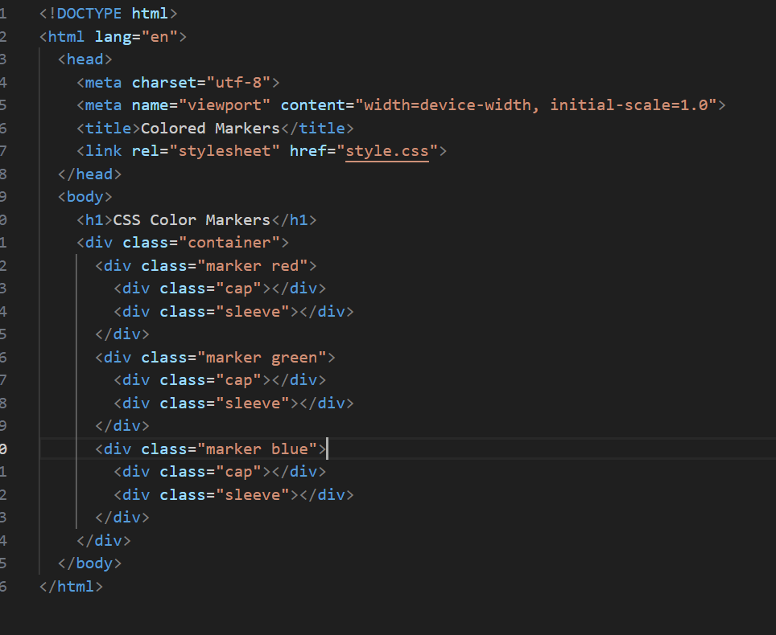
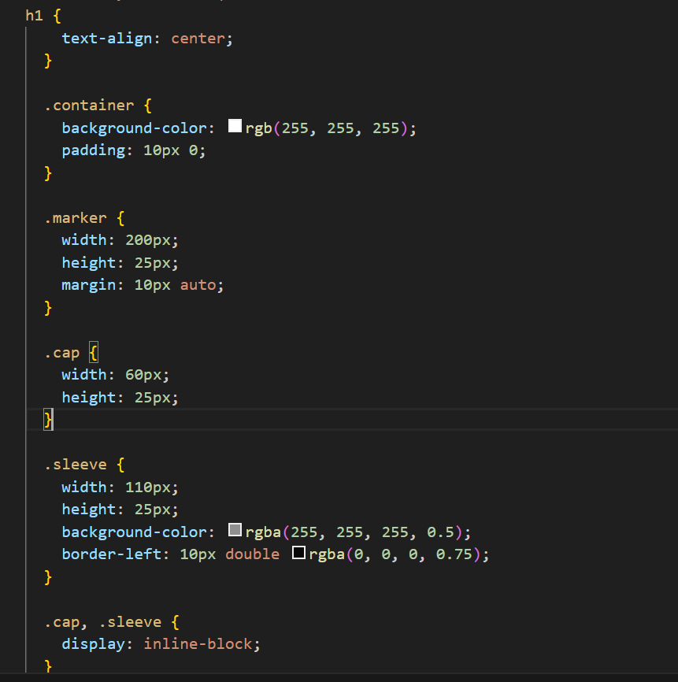
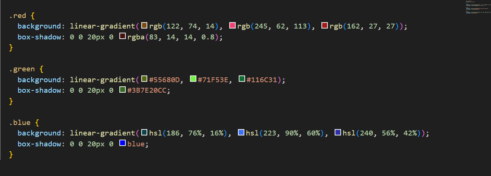

## HTML

hosted link - https://gautamkamboj.github.io/vs_code/Color_markers/index.html

!DOCTYPE html>: This declaration specifies that the document is an HTML5 document.

html lang="en">: The root element of the HTML document, indicating that the document is in English ("en").

head>: This section contains metadata about the document, such as character encoding and the viewport settings.

meta charset="utf-8">: Specifies that the character encoding for the document is UTF-8, which includes a wide range of characters from different languages.

meta name="viewport" content="width=device-width, initial-scale=1.0">: Defines the viewport settings, ensuring that the webpage is initially scaled to fit the device's width. This is important for responsive design on mobile devices.

title>Colored Markers/title>: Sets the title of the webpage to "Colored Markers," which is displayed in the browser's title bar or tab.

link rel="stylesheet" href="styles.css">: Links an external CSS stylesheet named "styles.css" to the HTML document. This stylesheet likely contains styling rules for the webpage's elements.

body>: The main content of the webpage is contained within the body> element.

h1>CSS Color Markers/h1>: An h1> heading element displaying the text "CSS Color Markers." This is typically used as the main page title.

div class="container">: A div> element with a class attribute of "container." This is often used as a wrapper for other elements and can be styled using CSS.

div class="marker red">: A div> element with classes "marker" and "red." This represents a colored marker. The "red" class likely applies specific styling to this marker to make it appear red.

div class="cap">/div>: A div> element with a class of "cap." This likely represents the marker's cap and can be styled separately.

div class="sleeve">/div>: A div> element with a class of "sleeve." This likely represents the marker's sleeve or body and can also be styled separately.

Similar div> elements with classes "marker green" and "marker blue" represent markers of different colors (green and blue).

## CSS

h1: This rule targets the h1 element, which is the main page title.

text-align: center;: This centers the text horizontally within its container, giving the heading a centered alignment.
.container: This rule targets the div element with the class "container," which wraps the markers.

background-color: rgb(255, 255, 255);: Sets the background color of the container to white.

padding: 10px 0;: Adds padding to the top and bottom of the container, creating spacing.

.marker: This rule targets all elements with the class "marker," which represent the colored markers.

width: 200px;: Sets a fixed width of 200 pixels for the markers.
height: 25px;: Sets a fixed height of 25 pixels for the markers.
margin: 10px auto;: Centers the markers horizontally by setting left and right margins to "auto."
.cap: This rule targets the div elements with the class "cap," representing the cap of the markers.

width: 60px;: Sets a fixed width of 60 pixels for the cap.
height: 25px;: Sets a fixed height of 25 pixels for the cap.
.sleeve: This rule targets the div elements with the class "sleeve," representing the sleeve or body of the markers.

width: 110px;: Sets a fixed width of 110 pixels for the sleeve.

height: 25px;: Sets a fixed height of 25 pixels for the sleeve.

background-color: rgba(255, 255, 255, 0.5);: Sets the background color of the sleeve to a semi-transparent white color.

border-left: 10px double rgba(0, 0, 0, 0.75);: Adds a double border (10 pixels wide) on the left side of the sleeve with a semi-transparent black color.

.cap, .sleeve: These rules apply to both the cap and sleeve elements.

display: inline-block;: Makes the cap and sleeve elements behave as inline-block elements, allowing them to appear side by side.
.red, .green, .blue: These rules target the marker elements with the classes "red," "green," and "blue" to style them based on their colors.

background: Sets a linear gradient background for each marker, creating a gradient effect from one color to another.
box-shadow: Adds a shadow effect to the markers to make them appear raised.