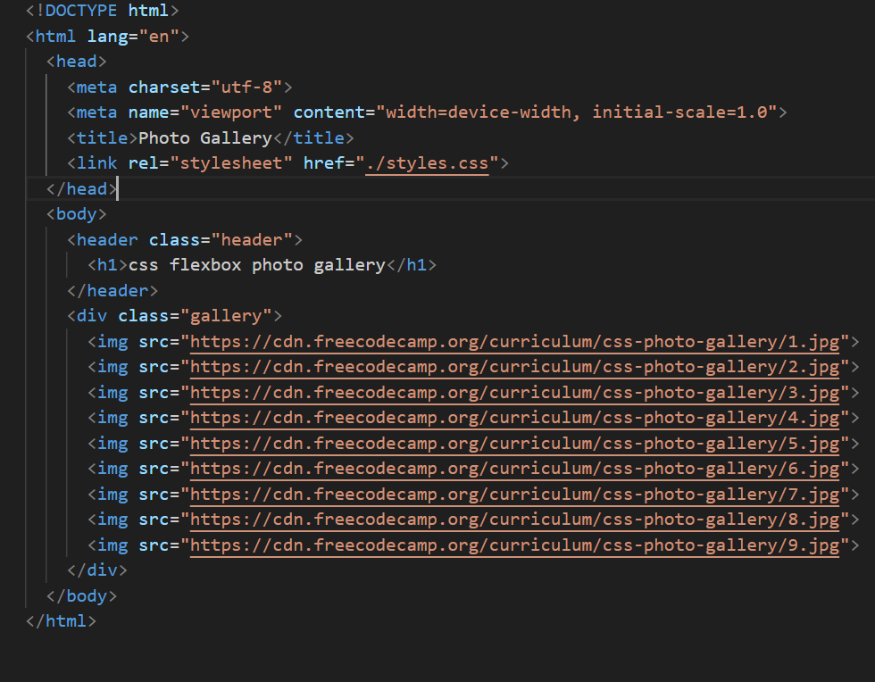
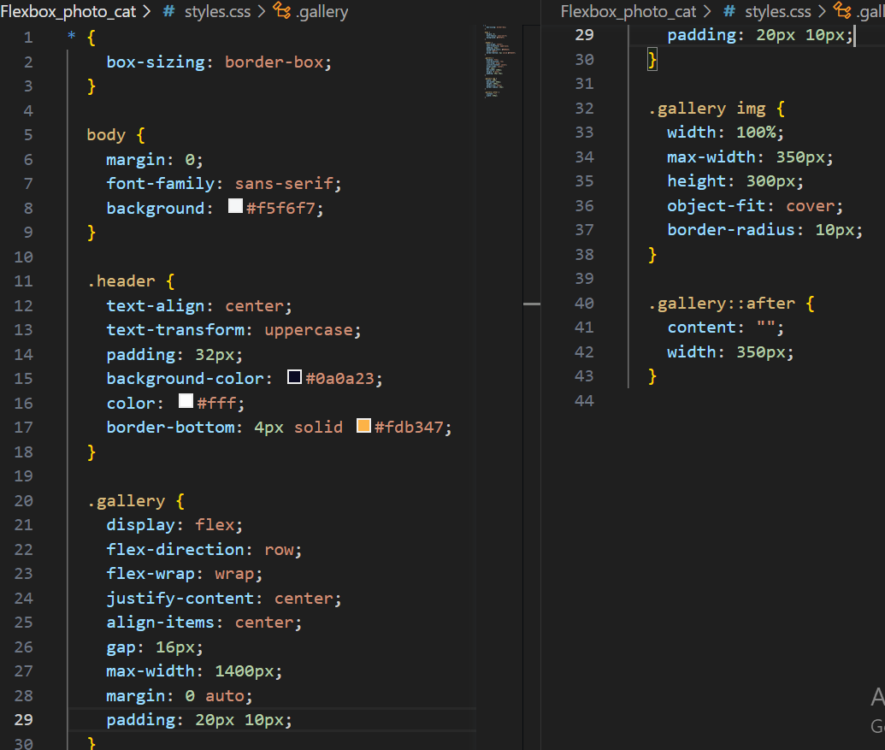

Hosted link-https://gautamkamboj.github.io/vs_code/Flexbox_photo_cat/index.html

## HMTL

!DOCTYPE html>: This declaration defines the document type and version of HTML being used, which is HTML5 in this case.

html lang="en">: This is the root element of the HTML document, and it specifies that the document is written in English (language code "en").

head>: This section of the HTML document contains metadata about the webpage, such as character encoding, viewport settings, and the title of the page. It doesn't display content on the webpage itself.

meta charset="utf-8">: Specifies the character encoding for the document as UTF-8, which includes a wide range of characters from different languages and special symbols.

meta name="viewport" content="width=device-width, initial-scale=1.0">: Sets the viewport settings for responsive design. It ensures that the webpage is initially scaled to 1.0 and adapts to the device's width.

title>Photo Gallery /title>: Sets the title of the webpage, which appears in the browser's title bar or tab.

link rel="stylesheet" href="./styles.css">: Links an external CSS (Cascading Style Sheets) file named "styles.css" to the HTML document. This allows you to apply styles to the HTML elements from an external stylesheet.

body>: This is the main content area of the webpage, where the visible content is placed.

header class="header">: Defines the header section of the webpage. It contains an h1> element with the text "css flexbox photo gallery." The class="header" attribute is used to apply styles to this header section.

div class="gallery">: This div> element represents a container for the photo gallery. Inside this container, there are several img> elements, each with a src attribute pointing to different image URLs. These images will be displayed in the photo gallery on the webpage.

## CSS

*:

The universal selector * selects all elements on the page.
box-sizing: border-box; applies the "border-box" box-sizing model to all elements. This means that an element's total width and height include its padding and border, rather than being added to it.
body:

Styles for the overall body of the webpage.
margin: 0; sets the margin of the body to zero, removing any default margin.
font-family: sans-serif; specifies the font family for text within the body.
background: #f5f6f7; sets the background color of the body.
.header:

Styles for a header section in the webpage.
text-align: center; centers the text within the header.
text-transform: uppercase; transforms the text to uppercase.
padding: 32px; adds padding around the header content.
background-color: #0a0a23; sets the background color of the header.
color: #fff; sets the text color to white.
border-bottom: 4px solid #fdb347; adds a 4px solid orange border at the bottom of the header.
.gallery:

Styles for a gallery section in the webpage.
display: flex; arranges the gallery items in a flex container.
flex-direction: row; specifies that the items should be arranged in a row (horizontally).
flex-wrap: wrap; allows items to wrap to the next row if there's not enough space.
justify-content: center; centers the items horizontally within the container.
align-items: center; centers the items vertically within the container.
gap: 16px; adds a 16px gap between gallery items.
max-width: 1400px; sets the maximum width of the gallery to 1400px.
margin: 0 auto; centers the gallery horizontally on the page.
padding: 20px 10px; adds padding around the gallery content.
.gallery img:

Styles for images within the gallery.
width: 100%; ensures that images take up the full width of their container.
max-width: 350px; sets a maximum width of 350px for the images.
height: 300px; sets a fixed height of 300px for the images.
object-fit: cover; scales and crops the images to cover the entire container while maintaining aspect ratio.
border-radius: 10px; adds rounded corners to the images with a radius of 10px.
.gallery::after:

Pseudo-element ::after applied to the .gallery container.
content: ""; generates an empty content box.
width: 350px; sets the width of the pseudo-element to 350px.
