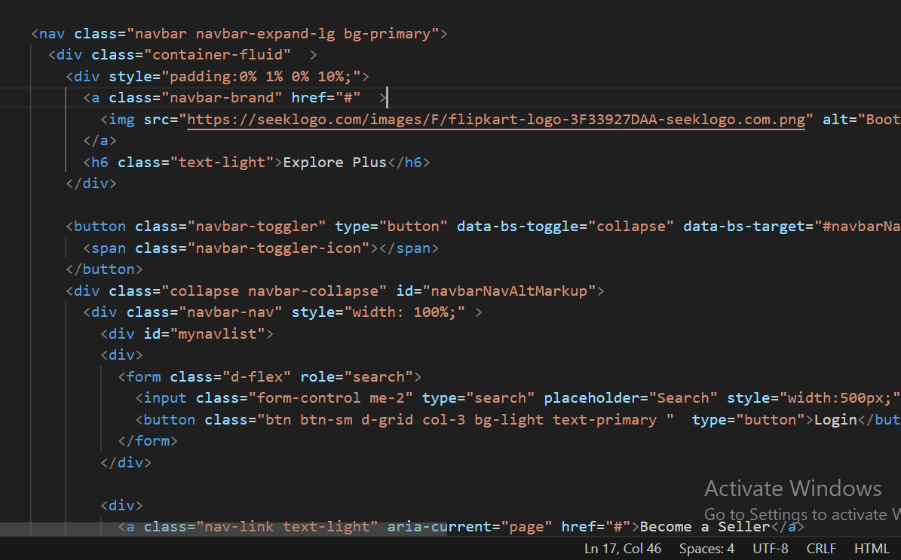
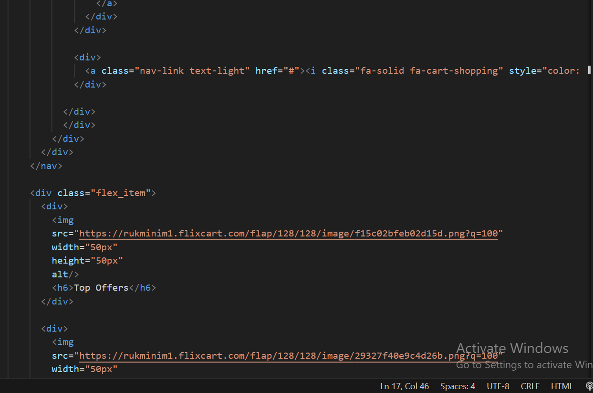
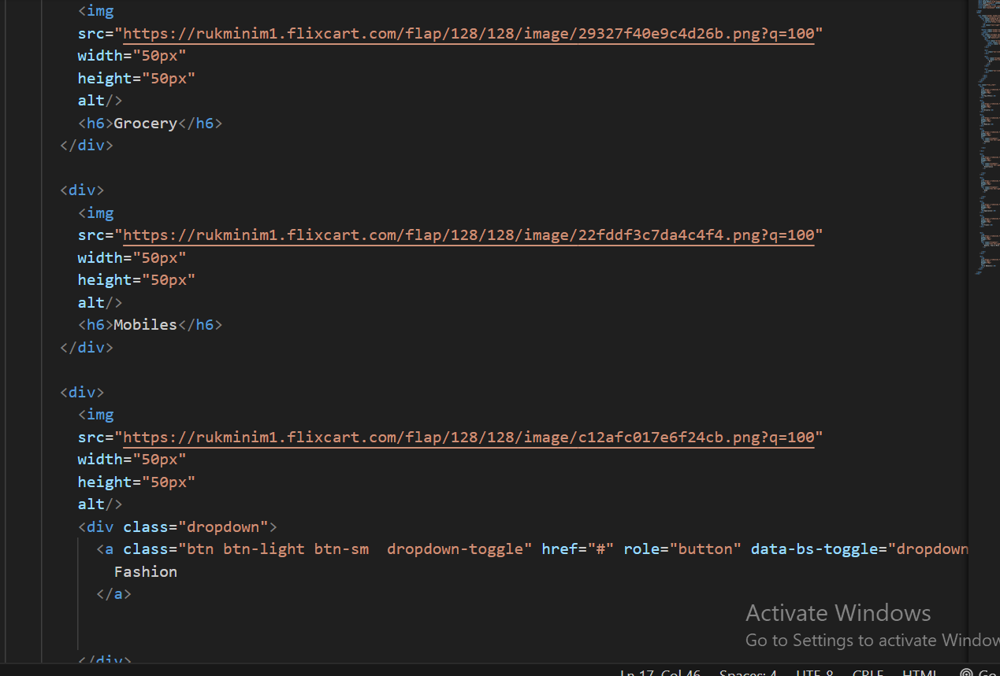
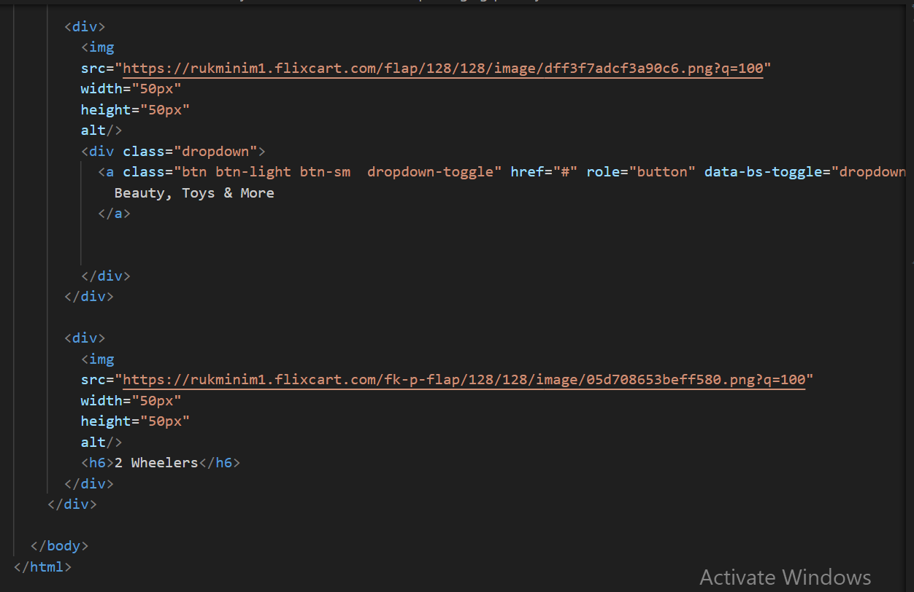
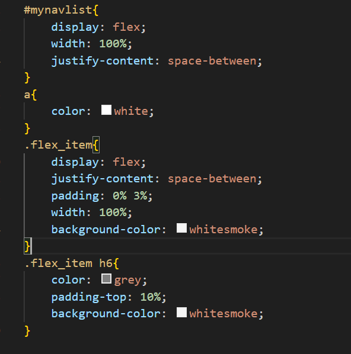

Hosted link-https://gautamkamboj.github.io/vs_code/Flipkart/index.html

## HTML Tags:

!DOCTYPE html>: This is the document type declaration and defines the document type and version of HTML you are using.

html lang="en">: The root element of an HTML page, indicating that the language of the document is English.

head>: Contains metadata about the document, such as character encoding, title, and links to external resources.

meta charset="UTF-8">: Specifies the character encoding for the document as UTF-8.
meta http-equiv="X-UA-Compatible" content="IE=edge">: Instructs Internet Explorer to use the latest rendering engine available.
meta name="viewport" content="width=device-width, initial-scale=1.0">: Sets the viewport properties for responsive design.
title>flipkart /title>: Sets the title of the web page.
link>: Links to external resources, such as CSS stylesheets.
body>: Contains the content of the web page that is visible to the user.

nav class="navbar navbar-expand-lg bg-primary">: Defines a navigation bar with the Bootstrap navbar classes.

div class="container-fluid">: Creates a container for the navigation bar.

a class="navbar-brand" href="#">: Defines a link with the Bootstrap navbar-brand class, typically used for a brand logo.

h6 class="text-light">Explore Plus /h6>: Heading element with light text for additional navigation options.

button class="navbar-toggler" type="button" data-bs-toggle="collapse" data-bs-target="#navbarNavAltMarkup" aria-controls="navbarNavAltMarkup" aria-expanded="false" aria-label="Toggle navigation">: Button to toggle the navigation menu on smaller screens.

div class="collapse navbar-collapse" id="navbarNavAltMarkup">: Contains the navigation links.

div class="navbar-nav" style="width: 100%;">: Container for navigation links.

div id="mynavlist">: A section for navigation links and search bar.

div>: Contains a search form.

input class="form-control me-2" type="search" placeholder="Search" style="width:500px;" aria-label="Search">: Input field for search.
button class="btn btn-sm d-grid col-3 bg-light text-primary " type="button">Login /button>: Login button.
div>: A link for becoming a seller.

div>: A dropdown menu under "More."
div>: A link for the shopping cart.

div class="flex_item">: A container for a list of items with images and text.

A series of div> elements with images and headings. These appear to represent different product categories.

## CSS Classes:

.navbar, .navbar-expand-lg, .bg-primary: These are Bootstrap classes applied to the navigation bar, defining its appearance and behavior.

.container-fluid: A Bootstrap class used to create a fluid-width container.

.navbar-brand: A Bootstrap class typically used for branding logos in the navigation bar.

.text-light: A Bootstrap class to set the text color to light.

.navbar-toggler: A Bootstrap class for the navigation toggle button.

.collapse, .navbar-collapse: Bootstrap classes related to collapsing navigation menus on smaller screens.

.navbar-nav: A Bootstrap class for styling navigation links.

.form-control, .btn, .btn-sm, .d-grid, .col-3, .bg-light, .text-primary: Bootstrap classes for styling form elements and buttons.

.dropdown: A Bootstrap class used for creating dropdown menus.

.flex_item: A custom CSS class applied to a container div for a list of items.