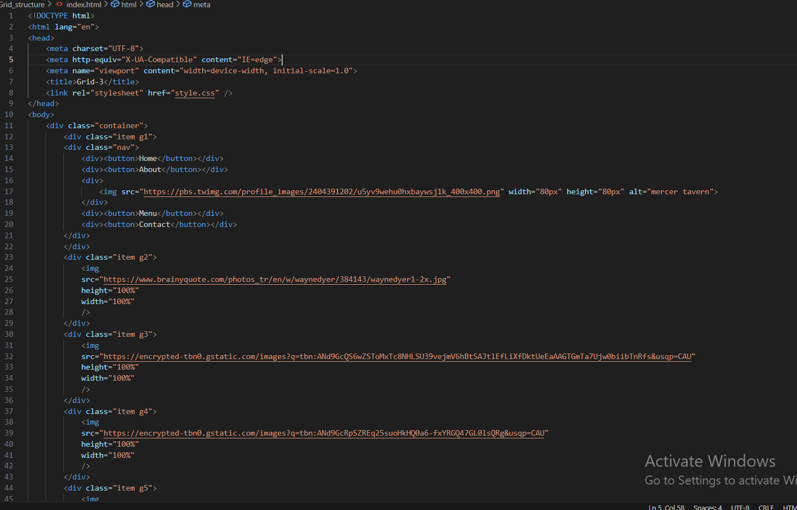

Hosted link-https://gautamkamboj.github.io/vs_code/Grid_magazine/index.html

## HTML

Document Structure:

The document starts with the usual !DOCTYPE html> declaration and contains an HTML html> element with a specified language attribute (lang="en").
Metadata:

The document includes head> with various meta> tags for character encoding (meta charset="UTF-8">), viewport settings (meta name="viewport" content="width=device-width, initial-scale=1.0">), and a title> tag for the document's title.

External Resources:

The HTML document links to external resources, such as Google Fonts and Font Awesome for custom fonts and icons.
Main Content:

The main content of the article is enclosed within a main> element.
The content is divided into sections, including a heading section (section class="heading">) and a text section (section class="text">).
The heading section contains a title, subtitle, author information, and social icons.
The text section contains paragraphs of text, a blockquote with a quote, and additional content with images and a brief history section.

Images:

Several img> elements are used to display images within the article. Each image has attributes specifying the image source (src), alternative text (alt), dimensions (width and height), and a loading attribute.

Lists:

Unordered lists (ul>) are used to list the history of the curriculum changes with list items (li>).
Each list item contains headings (h4>) and paragraphs of text.
Styling Classes:

The HTML elements are assigned CSS classes (e.g., "hero-title", "quote") to apply specific styling.
Links:

Links (a>) are used for author attribution and social media links. The target="_blank" attribute is used to open links in a new tab.

## CSS

Reset Styles:

The *, ::before, and ::after pseudo-elements are set to have padding and margin set to 0, and the box-sizing is set to border-box. This is a common technique to reset default spacing and ensure consistent box sizing.
Root Font Size:

The html element has its font size set to 62.5%, which is often used to make it easier to work with rem units (1rem = 10px) for font sizes. This allows for more straightforward scaling of font sizes.

Body Styles:

The body element is styled with a chosen font-family, text color, and background color.
Heading Styles:

h1 elements have a different font-family and color.
h2, h3, h4, h5, and h6 elements also have a different font-family.
Link Styles:

Anchor (a>) elements have their text decoration removed (no underlines) and are given a specific text color.
Main Element Styles:

The main element is styled as a grid container with three columns and a row gap. This can be useful for creating a responsive layout.
Image Styles:

All img elements are set to have a width of 100% and use object-fit: cover, ensuring that images scale within their containers.
Horizontal Rule Styles:

Horizontal rules (hr>) are styled with margin and a border to create a separator effect.

Heading Section Styles:

The .heading section is styled as a grid container with two columns and a gap between rows.
Text Styles:

The .text section is styled with a specific font size, letter spacing, column width, and justified text alignment.
Hero Section Styles:

The .hero section is styled with a full-width column, and the position property is used to control its position within the grid.
Author and Social Icons Styles:

The author information is styled with specific font sizes, and the social icons are displayed as a grid with specific sizing and alignment.
First Letter Styles:

The first letter of paragraphs with the class .first-paragraph is enlarged, given a specific color, floated to the left, and has a margin on the right.
Quote Styles:

The .quote class is styled with a specific color, font size, and custom quote marks before and after the text.
Text with Images Styles:

The .text-with-images section is styled as a grid with two columns and a gap.
List Styles:

Unordered lists with the class .lists have their list style type removed and specific margins set for list items.
Image Wrapper Styles:

The .image-wrapper section is styled as a grid container with specific column and row configurations. It also includes responsive styles for smaller screens using media queries.
