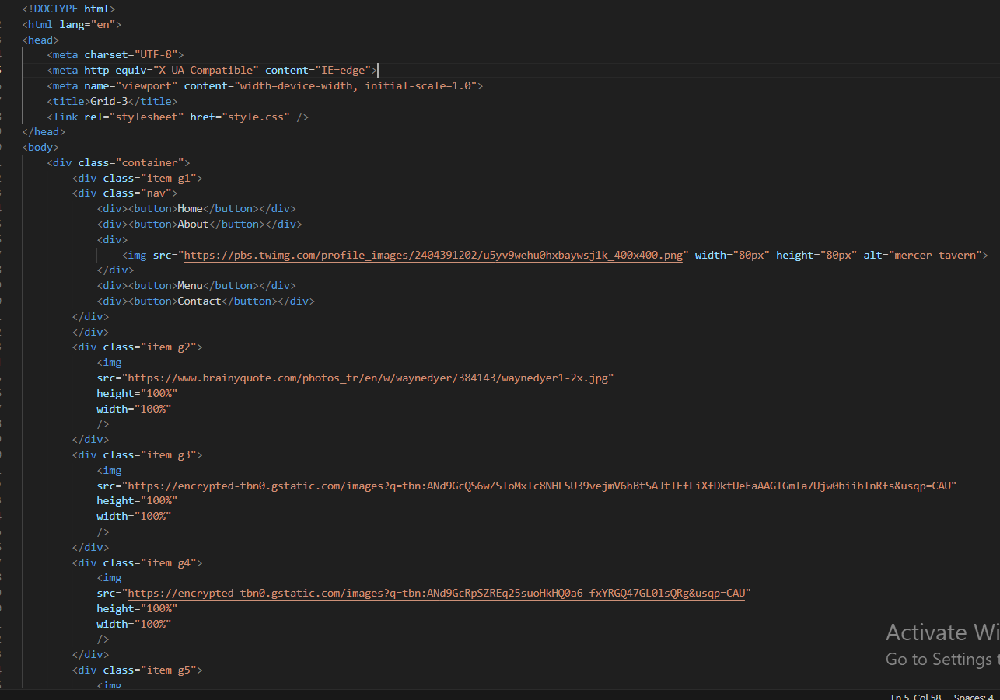
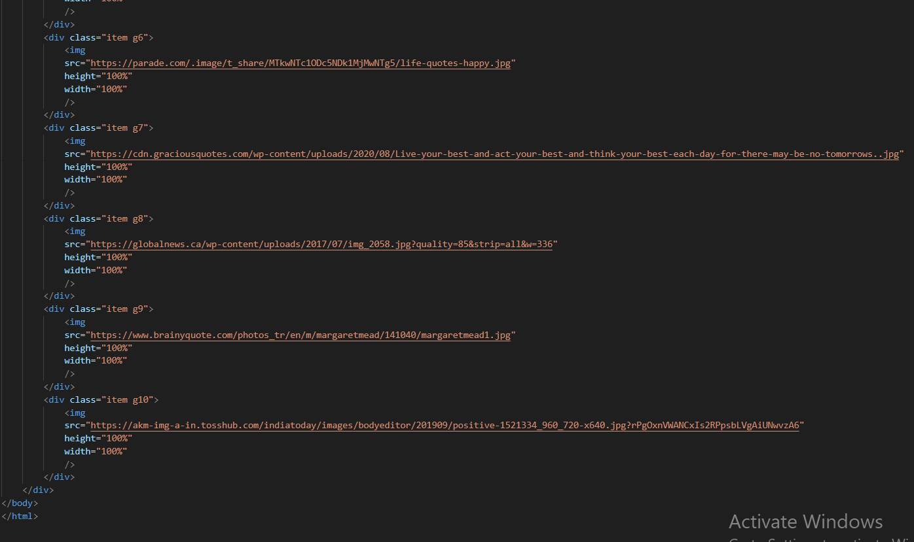
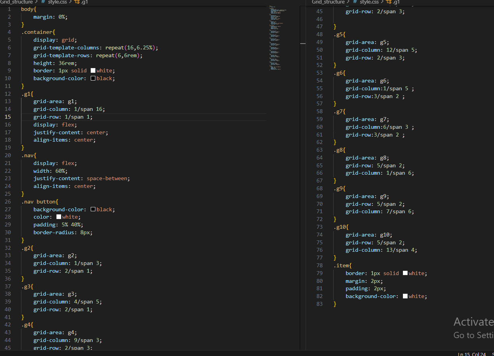

Hosted link-https://gautamkamboj.github.io/vs_code/Grid_structure/index.html

## HTML

The HTML document is declared with the !DOCTYPE html> declaration, and it's written in English (html lang="en">).

In the head> section, you include:

Character set and viewport meta tags.
A title for the webpage.
A link to an external stylesheet (style.css).
A link to Google Fonts, specifically the "Barlow Semi Condensed" font.
The body> of the page contains the main content.

Inside the body>, you have a div> with the class container, which is likely meant to serve as a container for the following grid layout.

Within the container, there are ten div> elements with the class item and unique classes like g1, g2, and so on. These represent grid items that will be positioned in the grid container.

Each item contains an img> element with different image sources. These images are intended to be displayed in the grid.

In the first item (.g1), there is a nested div> with the class nav. This div> appears to contain buttons and an image.

## CSS

body:

Removes the default margin on the body.

.container:

Defines a grid container with the following properties:
display: grid: Specifies that the container should be displayed as a grid.
grid-template-columns: Specifies a 16-column grid with each column having a width of 6.25%.
grid-template-rows: Specifies a 6-row grid with each row having a height of 6rem.
height: Sets the container's height to 36rem.
border: Adds a white border to the container.
background-color: Sets the background color of the container to black.

.g1, .g2, .g3, ..., .g10:

These classes define the positioning of each grid item within the grid container.
grid-area: Specifies the grid area for each item.
grid-column and grid-row: Defines the placement of the item within the grid by specifying the starting column and row, as well as the number of columns and rows it spans.
display: flex: Makes each item a flex container.
justify-content and align-items: Center the content horizontally and vertically within each grid item.

.nav:

Defines the styling for the navigation container within the first grid item.
display: flex: Makes the navigation items (buttons) flex items.
width: Sets the width of the navigation container to 60% of its parent.
justify-content: space-between: Aligns the navigation items with space between them.
align-items: center: Vertically centers the navigation items.

.nav button:

Defines the styling for the navigation buttons.
background-color: Sets the background color of the buttons to black.
color: Sets the text color to white.
padding: Adds padding to the buttons.
border-radius: Applies rounded corners to the buttons.

.item:

Defines the styling for all grid items.
border: Adds a white border to each item.
margin and padding: Sets margins and padding for each item.
background-color: Sets the background color of each item to white.