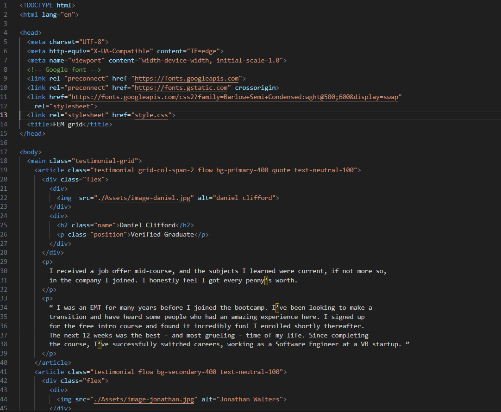
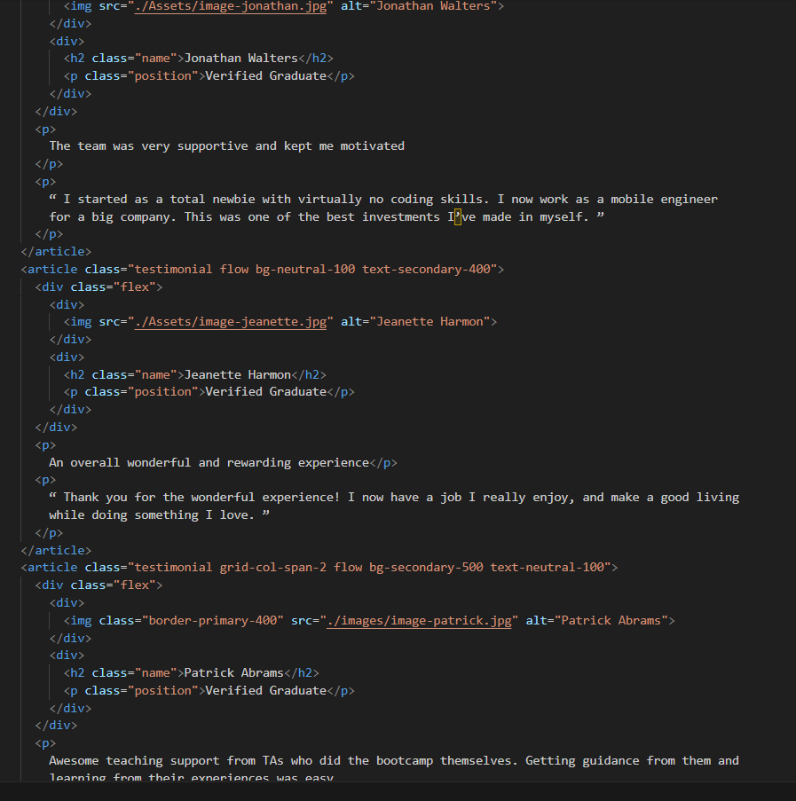
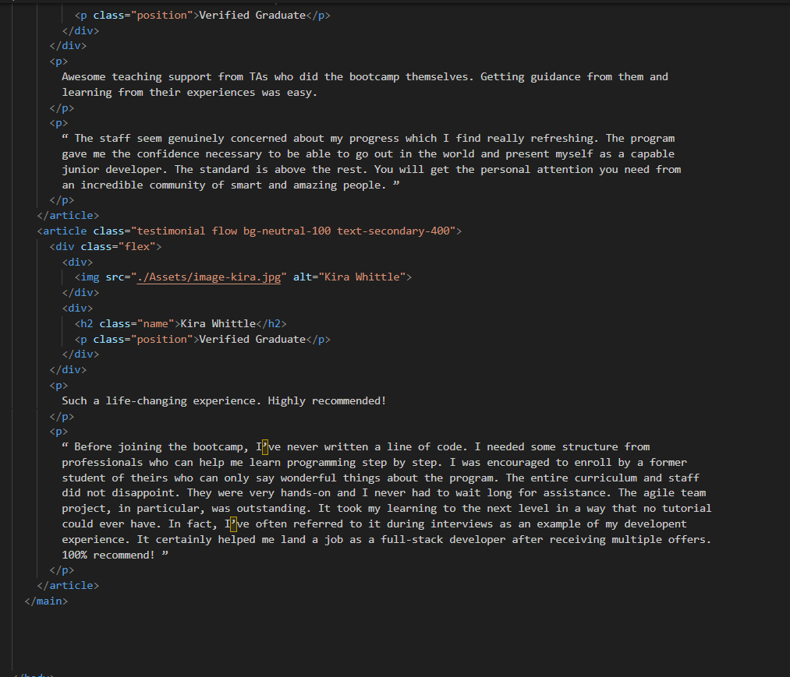
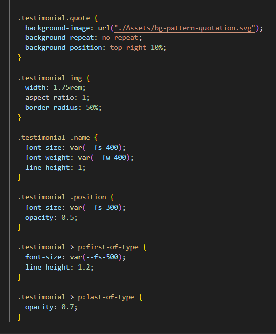

Hosted link-https://gautamkamboj.github.io/vs_code/Grid_template/index.html

## HMTL

!DOCTYPE html>: This declaration specifies the document type and version of HTML you are using.

html lang="en">: This is the root element of your HTML document, and it specifies that the document is written in English.

head>: This section contains meta information about the document, including character encoding, viewport settings, and links to external resources like Google Fonts and a custom CSS file.

link>: These elements link to external resources, such as Google Fonts and a custom CSS file called "style.css," which is used to style the webpage.

title>: Sets the title of the webpage, which typically appears in the browser's title bar or tab.

body>: This is the main content of your webpage, where you have testimonials displayed.

main class="testimonial-grid">: This is the main content section of the webpage, and it has the class "testimonial-grid" applied.

article>: These elements represent individual testimonials. Each testimonial has a class indicating its background color and text color.

div class="flex">: This division contains two child elements, typically used for aligning content side by side.

img>: This element is used to display images of the graduates.

h2>: Heading element used for the name of the graduate.

p>: Paragraph elements used for the graduate's position and testimonial content.

## CSS

Custom Properties (--clr-primary-400, --clr-secondary-400, ...): These custom properties define color values, font families, font weights, and font sizes that are used throughout the stylesheet. Custom properties make it easy to maintain a consistent design by centralizing key values.

Box Sizing and Reset Styles: These rules ensure that the box-sizing property is set to "border-box" for all elements, and default margin is removed from various HTML elements.

Font Inheritance: This rule sets the font property of inputs, buttons, text areas, and selects to inherit the font, allowing them to inherit the font-family defined earlier.

Prefers Reduced Motion: These rules target users who prefer reduced motion, adjusting animations and transitions accordingly.

Body Styles: This rule sets basic styles for the body element, including font-family, font-weight, and background color.

Heading Styles: The font-weight for h1, h2, and h3 elements is increased to a higher font weight (bold) for emphasis.

Utility Classes (e.g., .flex, .flow, .bg-primary-400): These classes define reusable utility styles for layout and background colors. For example, the .flex class makes elements inside it display as flex items, and the .bg-primary-400 class sets the background color using the custom property --clr-primary-400.

Component Styles (e.g., .testimonial-grid, .testimonial): These rules define styles for specific components. The .testimonial-grid class creates a grid layout for testimonials, and the .testimonial class styles individual testimonials. The layout is adjusted using media queries for different screen sizes.

Background Image: The .testimonial.quote class sets a background image for testimonials with a quotation pattern.

Image Styles: The .testimonial img class styles images within testimonials, setting their width, aspect ratio, and border-radius.

Name and Position Styles: The .testimonial .name and .testimonial .position classes style the name and position of the testimonial author.

Paragraph Styles: The styles for the paragraphs within testimonials are set, adjusting font size and opacity for the first and last paragraphs.