https://gautamkamboj.github.io/vs_code/Major_project_aria/index.html

## HTML

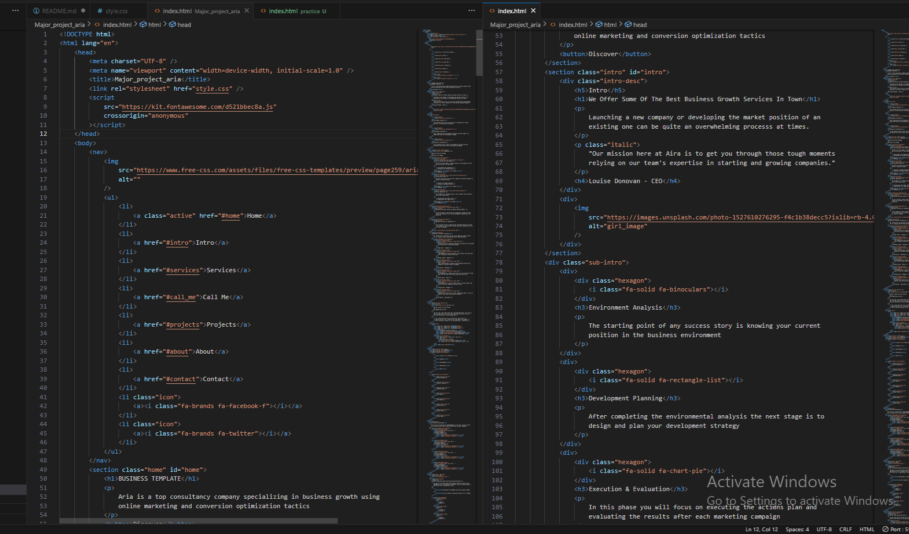

Document Type Declaration (!DOCTYPE html>): This declaration tells the browser that the document is written in HTML5.

html> Element: The root element that encloses the entire HTML document. The lang attribute specifies the language as English.

head> Element: Contains meta-information about the document, including character encoding, viewport settings, the document's title, links to external stylesheets, and scripts.

Meta Tags (meta>): These provide metadata about the document, such as character encoding (charset) and viewport settings for responsive design.

title> Element: Sets the title of the webpage, which is displayed in the browser's title bar or tab.

External Stylesheet (link>): Links to an external CSS file (style.css in this case) for styling the webpage.

External Script (script>): Links to an external JavaScript library (Font Awesome in this case) for including icons in the webpage.

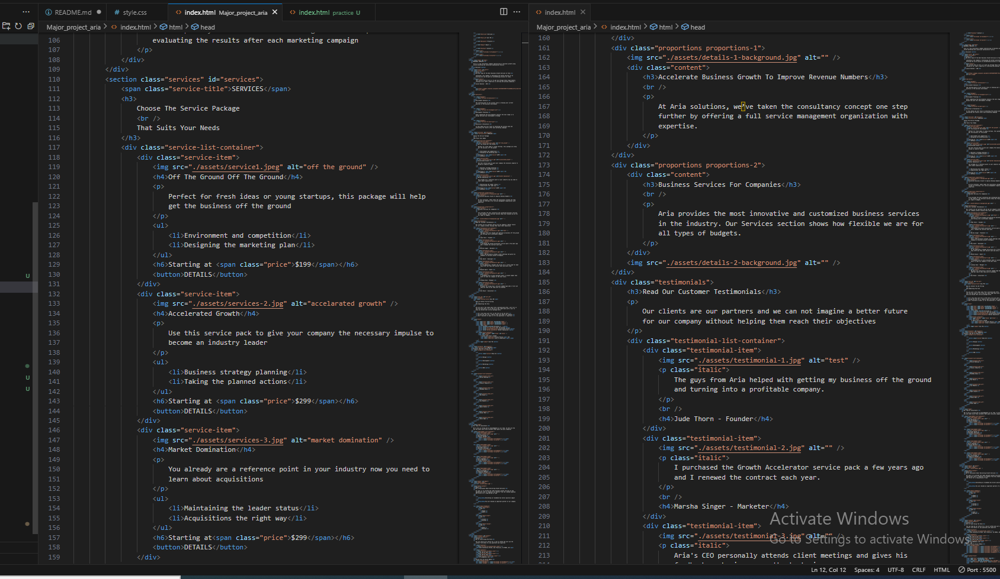

body> Element: Contains the visible content of the webpage, including the navigation menu, sections, and footer.

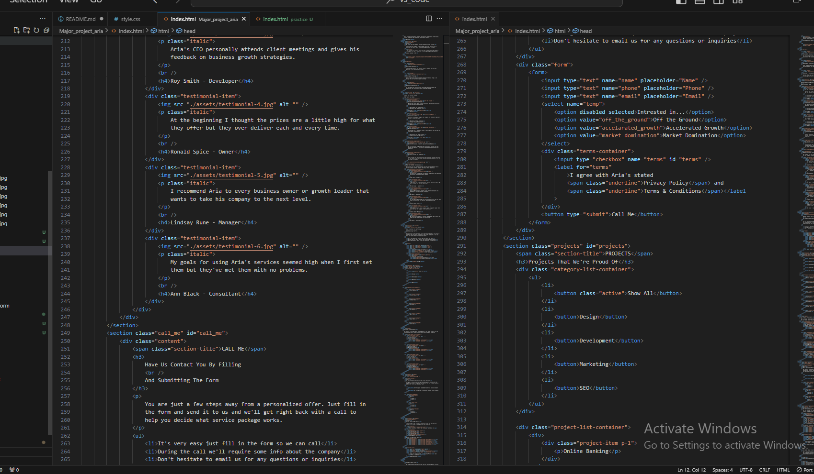

Navigation (nav>): Contains the website's navigation menu, typically including links to different sections of the webpage and possibly social media icons.

Sections (section>): These are distinct content areas within the webpage, each with its own purpose. In this example, there are several sections like "Home," "Intro," "Services," "Projects," "About," and "Contact."

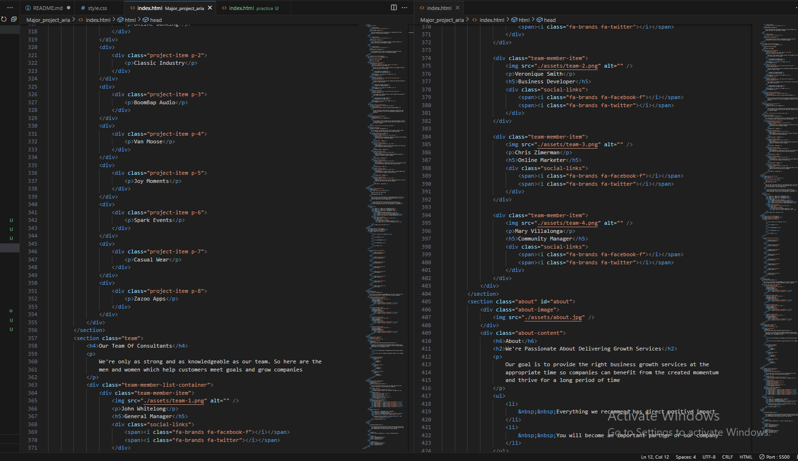

Headings (h1>, h2>, h3>, h4>, h5>): Used for defining headings and subheadings within sections, providing structure and hierarchy to the content.

Paragraphs (p>): Used for regular text content and descriptions.

Images (img>): Displays images within the content. These can be logos, illustrations, or photos.

Buttons (button>): Provides interactive elements that users can click on, often used for actions like "Discover" or "Details."

Lists (ul>, li>): Used for creating unordered lists, such as the navigation menu items.

Icons (i>): Typically used in conjunction with Font Awesome to display icons within the webpage, like social media icons.

Forms (form>): Used for collecting user input, such as the "Call Me" form and the contact form in this example.

Input Fields (input>): These elements allow users to enter data, like their name, email, or phone number.

Select Element (select>): Creates a dropdown menu for users to select options, often used in forms.

Checkboxes (input type="checkbox">): Allows users to select options by checking a box.

Labels (label>): Provides text labels for form elements, improving accessibility and usability.

Footer (footer>): Contains information typically placed at the bottom of the webpage, such as additional links, copyright information, and a brief summary of the website

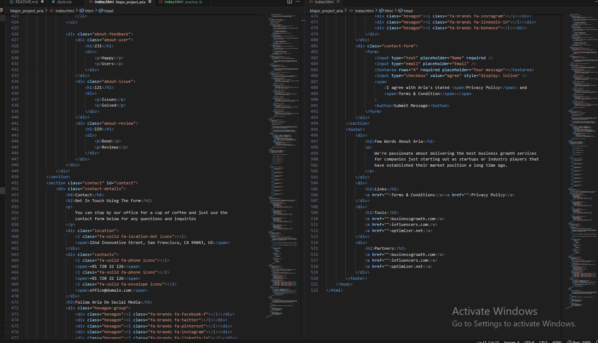

## CSS

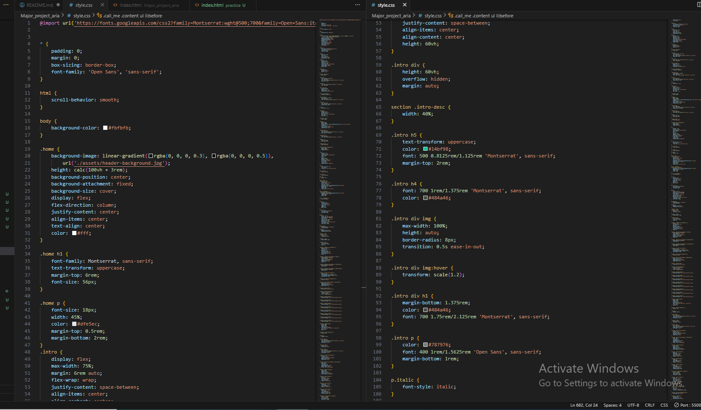

Font Import (`@import url(...)'): Imports two Google Fonts, Montserrat and Open Sans, to be used for text on the webpage.

Universal Selector (* {...}): Defines some common styles for all HTML elements. It sets padding and margin to 0, includes the box-sizing property to include padding and borders in the element's total width and height, and specifies the default font family as 'Open Sans'.

html Element Styles: Sets scroll-behavior to smooth, enabling smooth scrolling when navigating through the page.

body Element Styles: Sets the background color of the entire webpage to a light grayish-blue color.

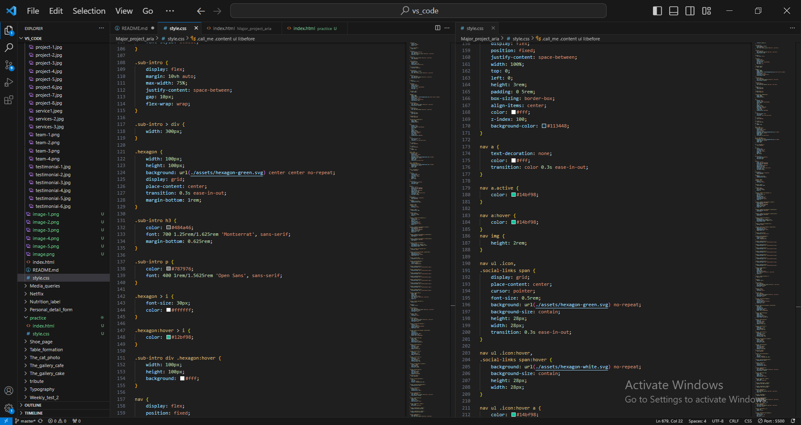

.home Section Styles: This section styles the introductory section of the webpage with a background image, which is a combination of a gradient and a fixed background image. The text within this section is centered and styled with varying font sizes and colors.

.intro Section Styles: Styles the introductory section below the home section. It contains a flexible layout with text and images.

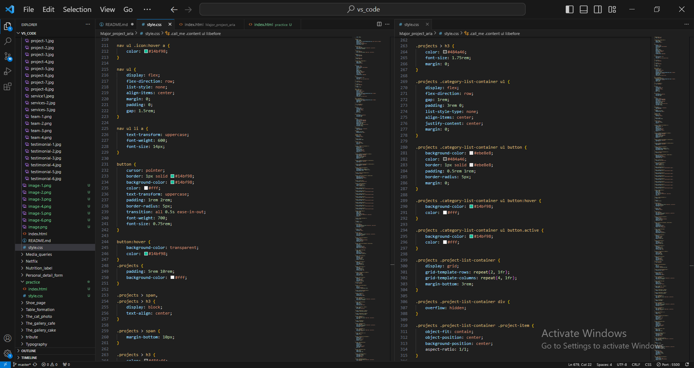

.sub-intro Section Styles: Styles a section with a list of hexagon-shaped elements and text.

nav Element Styles: Styles the navigation bar at the top of the page, including the links and social media icons. It's fixed to the top of the viewport and has a dark blue background.

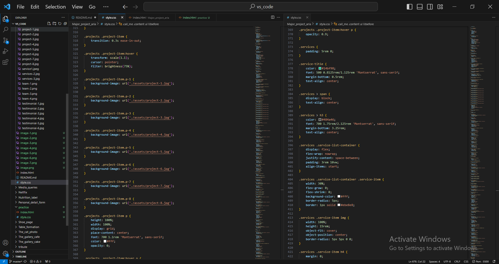

.projects Section Styles: Styles the section that displays projects. It includes buttons for filtering the projects, and each project is displayed as a grid of images.

.services Section Styles: Styles the section that displays services offered. It includes a list of services with icons and descriptions.

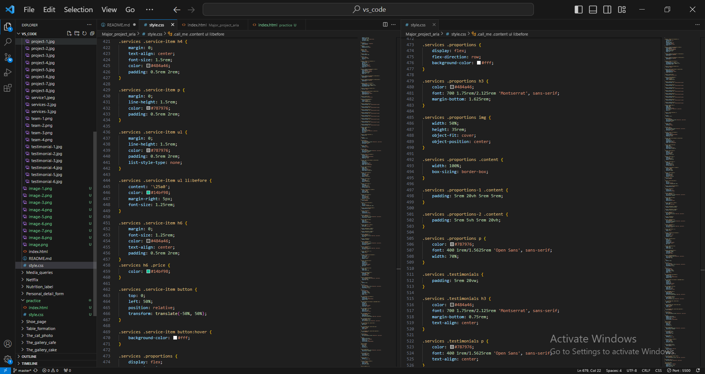

.team Section Styles: Styles the section that displays information about the team. It includes team member profiles with images and social links.

.call_me Section Styles: Styles the section that provides a call to action and a contact form.

.about and .contact Section Styles: Styles the "About" and "Contact" sections of the webpage.

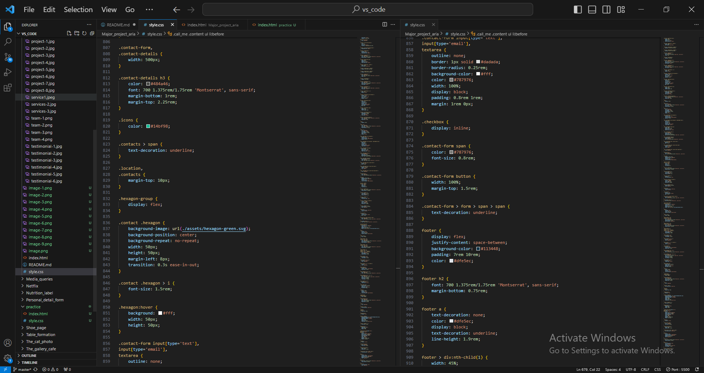

footer Element Styles: Styles the footer of the webpage with links and information.