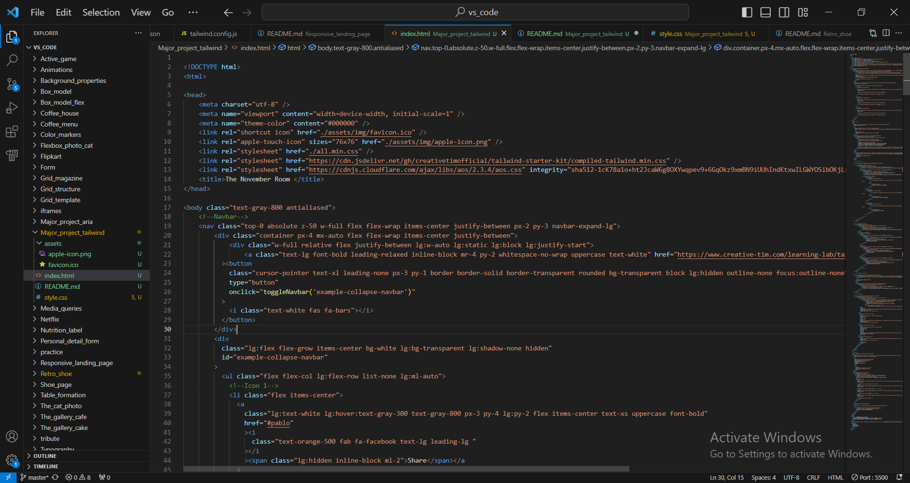
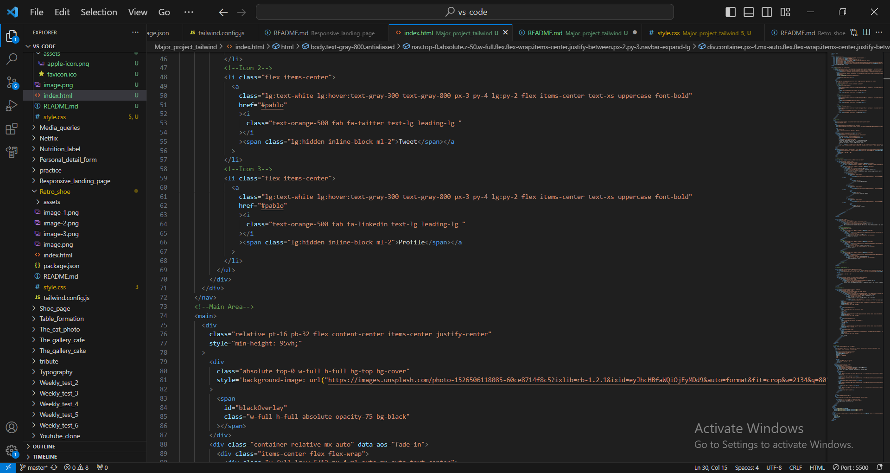
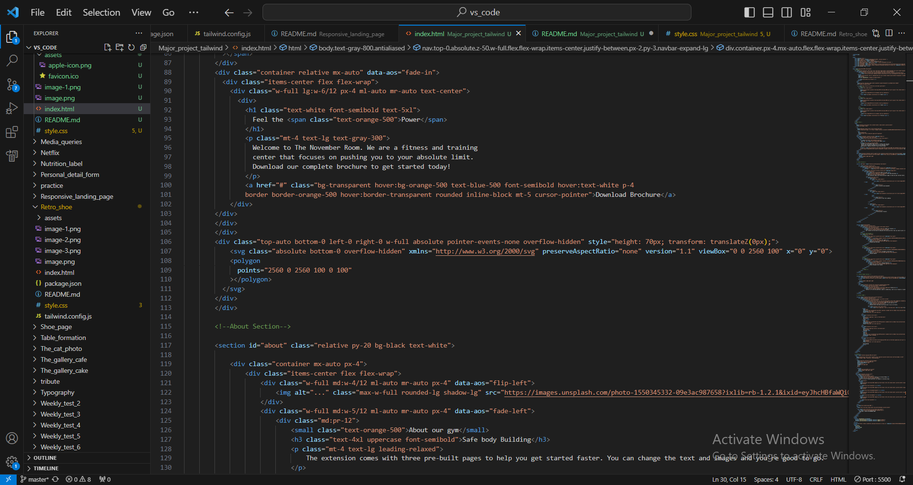
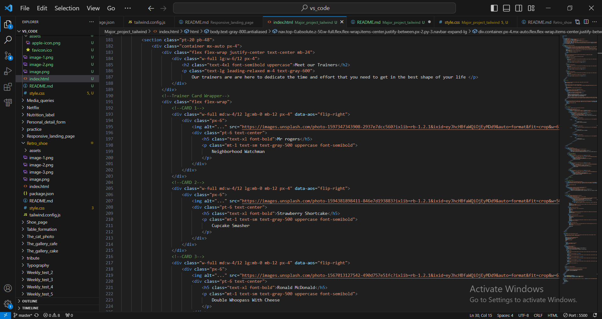
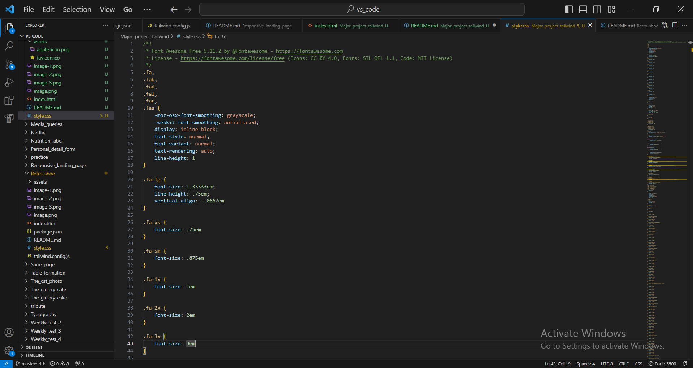

https://gautamkamboj.github.io/vs_code/Major_project_tailwind/index.html

## Document Structure:

The document starts with the usual !DOCTYPE html> declaration, specifying the document type as HTML.
The html> element represents the root of the HTML document.
The head> section contains metadata about the document, such as character encoding, viewport settings, and links to external resources like stylesheets and icons.
The body> section contains the visible content of the webpage.
Meta Tags:

meta> tags provide metadata information for the webpage, including character encoding and viewport settings.
The meta name="theme-color" content="#000000" /> tag sets the theme color of the browser's address bar.
Favicon and Icons:

link> tags reference the website's favicon (a small icon displayed in the browser tab) and Apple touch icon (used for iOS devices).
Stylesheets:

Several link> tags link to external stylesheets. These stylesheets define the visual appearance of the website.
Two of the stylesheets are loaded from external sources using CDNs (Content Delivery Networks).

Navigation Bar:

The navigation bar (nav>) is styled with various CSS classes and contains links to social media profiles (Facebook, Twitter, LinkedIn).
Main Content:

The main content of the website is contained within the main> tag.
The content starts with a hero section, featuring a background image and a call to action button to download a brochure.
About Section:

The next section provides information about the gym, including an image, a title, and a description. It also lists some features.

Trainers Section:

This section showcases gym trainers with their images and descriptions.

Contact Sections:

There are two contact sections. The first one introduces the concept of contacting the gym, and the second one provides a contact form for users to fill out.
Footer:

The footer contains links to social media profiles and copyright information.

various CSS classes applied to HTML elements.

These classes are a characteristic feature of Tailwind CSS.
Examples include classes like text-gray-800, bg-black, px-4, text-xl, and many others. These classes define the styling and layout of elements.
Tailwind CSS CDN:

In the head> section, there is a link to a compiled Tailwind CSS stylesheet from a CDN (Content Delivery Network).
This link is: link rel="stylesheet" href="https://cdn.jsdelivr.net/gh/creativetimofficial/tailwind-starter-kit/compiled-tailwind.min.css" />
It includes pre-built styles from Tailwind CSS that are applied to elements throughout the document.
Custom Tailwind CSS:

The HTML code also includes some custom styles defined using Tailwind CSS classes. For example, you can see custom class definitions like text-orange-500, bg-transparent, hover:bg-orange-500, etc.

These custom styles extend Tailwind CSS's utility classes to create unique styles for the website.

