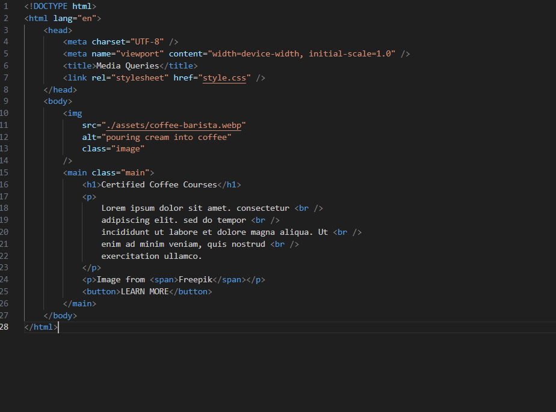
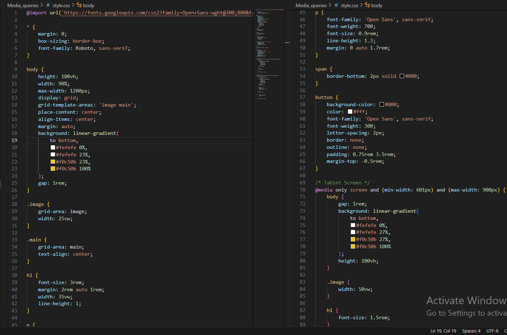
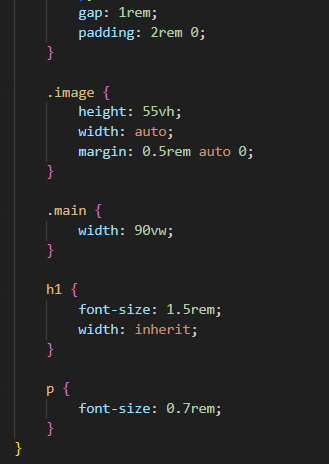

Hosted link-https://gautamkamboj.github.io/vs_code/Media_queries/index.html

## HTML

Document Type Declaration (!DOCTYPE html>): This declaration specifies the document type and version of HTML being used (HTML5).

HTML Element (html lang="en">): The root element of the HTML document, which encapsulates all the content on the page. The lang attribute is set to "en" (English) to define the document's language.

Head Section (head>): This section contains metadata and links to external resources used by the web page.

Character Set (meta charset="UTF-8">): Specifies the character encoding for the document as UTF-8, which supports a wide range of characters and symbols.

Viewport Meta Tag (meta name="viewport" content="width=device-width, initial-scale=1.0">): Defines how the web page should be displayed on different devices by adapting to the device's width and setting the initial scale to 1.0.

Title Element (title>): Sets the title of the web page, which is displayed in the browser's title bar or tab.

Stylesheet Link (link rel="stylesheet" href="style.css" />): Links an external CSS (Cascading Style Sheets) file named "style.css" to apply styles to the HTML content.

Body Section (body>): The main content of the web page is enclosed within the body> tags.

Image Element img>: Displays an image of someone pouring cream into coffee. The src attribute specifies the image file's path, and the alt attribute provides alternative text for the image for accessibility purposes. The class attribute assigns the "image" class to this element, which can be used for styling with CSS.

Main Element (main>): Represents the main content of the web page.

Heading Element (h1>): Displays the main title "Certified Coffee Courses."

Paragraph Elements (p>): Contains paragraphs of text with line breaks (represented by br /> tags) for spacing. The content is typical placeholder text (Lorem Ipsum). There are two p> elements inside the main>.

Span Element (span>): Used within the second p> element to enclose the text "Freepik." It is often used for inline styling or to group elements for JavaScript manipulation.

Button Element (button>): Represents a button labeled "LEARN MORE." It can be used for user interactions or actions on the web page.

## CSS

Font Imports:

Google Fonts are imported for two font families: 'Open Sans' and 'Roboto' with specific font weights. These fonts will be used for text elements throughout the page.
Universal Selector (*):

The universal selector is used to apply the following styles to all elements on the page:
margin: 0;: Sets margin to 0 for all elements.
box-sizing: border-box;: Ensures that padding and border are included in the element's total width and height calculations.
font-family: Roboto, sans-serif;: Defines the default font family for all elements as 'Roboto' and a generic sans-serif font.
Body Styles:

height: 100vh;: Sets the body height to 100% of the viewport height.
width: 90%;: Sets the body width to 90% of the maximum width.
max-width: 1200px;: Limits the maximum width of the body to 1200 pixels.
display: grid;: Turns the body into a grid container.
grid-template-areas: 'image main';: Defines a two-column grid layout with areas named 'image' and 'main'.
place-content: center;: Centers the content both vertically and horizontally.
align-items: center;: Vertically aligns the content to the center.
margin: auto;: Centers the grid container horizontally.
background: linear-gradient(...);: Applies a linear gradient background to the body.
gap: 1rem;: Specifies a gap between grid items.
Image Styles (image class):

grid-area: image;: Places the image within the 'image' grid area.
width: 25vw;: Sets the image width to 25% of the viewport width.
Main Content Styles (main class):

grid-area: main;: Places the main content within the 'main' grid area.
text-align: center;: Centers the text horizontally.
Heading (h1) Styles:

Defines styles for h1 elements, setting the font size, margin, width, and line height.
Paragraph (p) Styles:

Defines styles for p elements, specifying font family, font weight, font size, line height, and margins.
The span element within a p has a bottom border to underline text.
Button Styles (button):

Styles for the button element, including background color, text color, font family, font weight, letter spacing, border, padding, and margin.
Media Queries:

The CSS includes media queries to make the page responsive for different screen sizes.
Tablet Screen (@media): Adjusts styles for screens with a minimum width of 601px and a maximum width of 900px.

Mobile Screen (@media): Adjusts styles for screens with a maximum width of 600px.