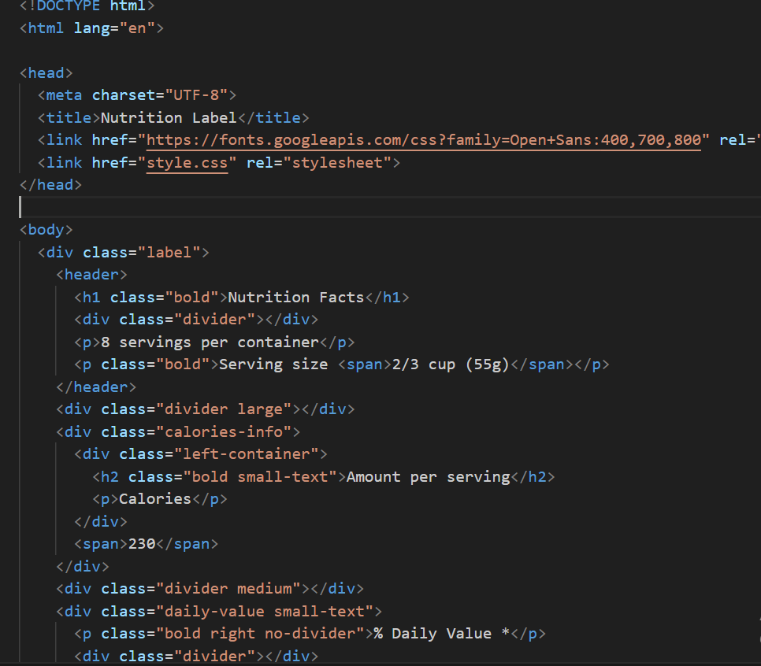
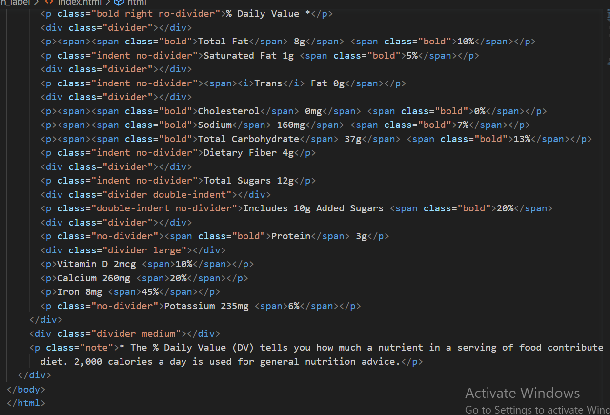
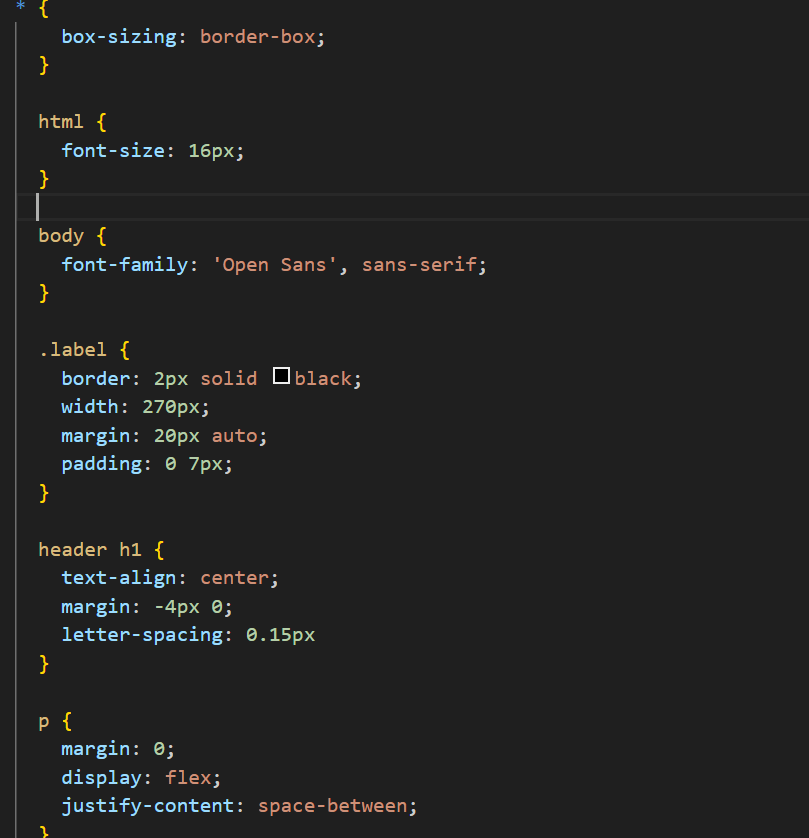
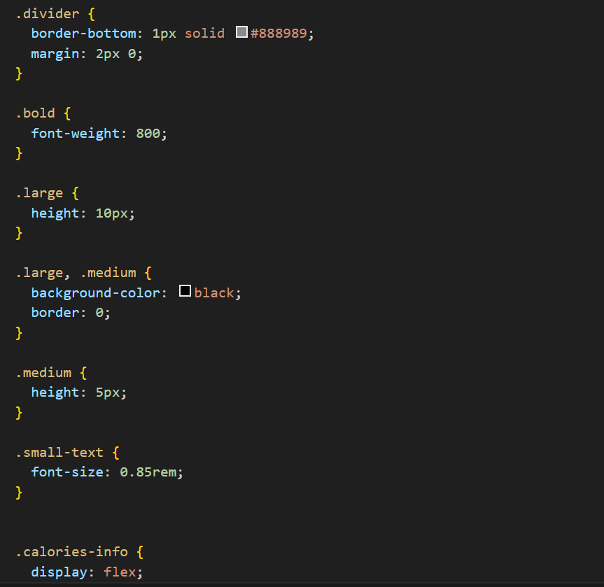
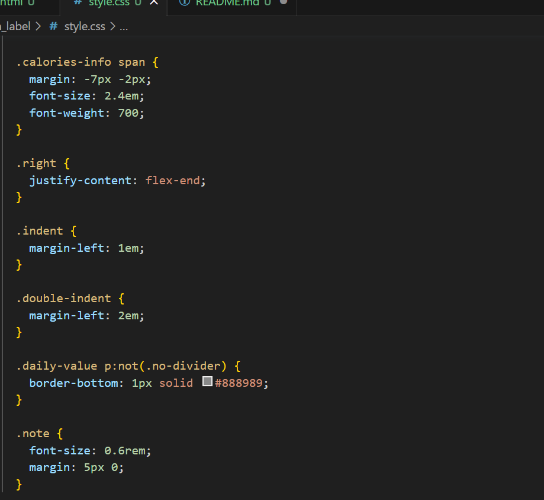

hosted link - https://gautamkamboj.github.io/vs_code/Nutrition_label/index.html

## HTML

!DOCTYPE html>: This declaration specifies that the document is an HTML5 document.

html lang="en">: The root element of the HTML document, indicating that the document is in English ("en").

head>: This section contains metadata about the document, including the character encoding, page title, and links to external resources (Google Fonts and a CSS stylesheet).

meta charset="UTF-8">: Specifies the character encoding as UTF-8.
title>Nutrition Label title>: Sets the title of the webpage to "Nutrition Label."
link href="https://fonts.googleapis.com/css?family=Open+Sans:400,700,800" rel="stylesheet">: Links to the Google Fonts API to load the Open Sans font family.
link href="./styles.css" rel="stylesheet">: Links an external CSS stylesheet named "styles.css" to the HTML document to apply styles to the content.
body>: The main content of the webpage is contained within the body> element.

div class="label">: This div> element represents the nutrition label container, which contains various sections of nutrition information.

header>: This section contains the header of the label, including the title, servings per container, serving size, and a divider.

h1 class="bold">Nutrition Facts /h1>: The title "Nutrition Facts" is displayed in a bold font.
div class="divider"> /div>: A horizontal divider line is added beneath the header.
p>8 servings per container /p>: Information about the number of servings per container.
p class="bold">Serving size span>2/3 cup (55g)/span> /p>: Information about the serving size, displayed in bold, with serving size details in a span> element.
div class="divider large"> /div>: A large horizontal divider is added below the header.

div class="calories-info">: This section contains information about calories per serving.

div class="left-container">: A container for the left side of the calories section.

h2 class="bold small-text">Amount per serving /h2>: The text "Amount per serving" is displayed in a smaller bold font.
p>Calories/p>: The word "Calories" is displayed.
span>230/span>: The number of calories (230) per serving is displayed.

div class="divider medium">/div>: A medium horizontal divider separates the calories section from the next section.

div class="daily-value small-text">: This section contains information about daily values for various nutrients.

p class="bold right no-divider">% Daily Value */p>: A bold label indicating "% Daily Value" is displayed to the right without a divider.

div class="divider">/div>: A horizontal divider is added.

Nutrient information is presented in a series of p> elements, with each nutrient's name, amount, and percentage of the daily value.

div class="divider large">/div>: A large horizontal divider separates the daily values section from the note section.

p class="note">* The % Daily Value (DV) tells you how much a nutrient in a serving of food contributes to a daily diet. 2,000 calories a day is used for general nutrition advice./p>: A note explaining the meaning of "% Daily Value" and the daily calorie reference is displayed at the bottom of the label.

## CSS

*: This selector targets all elements on the page and sets the box-sizing property to "border-box," ensuring that padding and border are included in the element's total width and height.

html: Styles applied to the root HTML element.

font-size: 16px;: Sets the default font size to 16 pixels for the entire document.
body: Styles applied to the entire body of the document.

font-family: 'Open Sans', sans-serif;: Sets the font family to "Open Sans" or a generic sans-serif font if "Open Sans" is not available on the user's device.
.label: Styles applied to the container with the class "label" (the nutrition label itself).

border: 2px solid black;: Adds a black border with a width of 2 pixels around the label.
width: 270px;: Sets the width of the label to 270 pixels.
margin: 20px auto;: Centers the label horizontally with a top margin of 20 pixels and auto for left and right margins.
padding: 0 7px;: Adds 7 pixels of padding to the left and right sides of the label.
header h1: Styles applied to the h1> element inside the header.

text-align: center;: Centers the text horizontally within the header.
margin: -4px 0;: Adjusts the margin to fine-tune the vertical alignment of the header text.
letter-spacing: 0.15px;: Sets the letter spacing for the header text.
p: Styles applied to all p> elements.

margin: 0;: Removes default margins from paragraphs.
display: flex;: Makes paragraphs behave as flex containers.
justify-content: space-between;: Adds space between items inside flex containers.
.divider: Styles applied to elements with the class "divider" (horizontal dividers).

border-bottom: 1px solid #888989;: Adds a 1-pixel solid border at the bottom of dividers.
margin: 2px 0;: Sets a small margin above and below dividers.
.bold: Styles applied to elements with the class "bold."

font-weight: 800;: Sets the font weight to 800, making text appear bold.
.large, .medium: Styles applied to elements with the classes "large" and "medium."

.large: Sets a larger height for elements with the "large" class (used for dividers).
.medium: Sets a medium height for elements with the "medium" class (used for dividers).
.small-text: Styles applied to elements with the class "small-text."

font-size: 0.85rem;: Reduces the font size to 0.85 rem for smaller text.
.calories-info: Styles applied to the container for calorie information.

display: flex;: Makes the container a flex container.
justify-content: space-between;: Adds space between items inside the container.
align-items: flex-end;: Aligns items to the flex-end (bottom) of the container.
.calories-info h2: Styles applied to the h2> element inside the calorie information section.

margin: 0;: Removes default margins from the h2> element.
.left-container p: Styles applied to paragraphs inside the left container of the calorie information section.

margin: -5px -2px;: Adjusts margins for precise alignment.
font-size: 2em;: Increases the font size for these paragraphs.
font-weight: 700;: Sets the font weight to 700, making text appear bold.
.calories-info span: Styles applied to spans inside the calorie information section.

margin: -7px -2px;: Adjusts margins for precise alignment.
font-size: 2.4em;: Increases the font size for these spans.
font-weight: 700;: Sets the font weight to 700, making text appear bold.
.right: Styles applied to elements with the class "right."

justify-content: flex-end;: Aligns content to the flex-end (right) of containers.
.indent, .double-indent: Styles applied to elements with the classes "indent" and "double-indent."

.indent: Adds a 1em margin on the left, creating an indentation.
.double-indent: Adds a 2em margin on the left, creating a deeper indentation.
.daily-value p:not(.no-divider): Styles applied to paragraphs within the daily value section that do not have the class "no-divider."

border-bottom: 1px solid #888989;: Adds a 1-pixel solid border at the bottom of these paragraphs to create dividers.
.note: Styles applied to the note paragraph.

font-size: 0.6rem;: Reduces the font size for the note.
margin: 5px 0;: Adds margins to space the note from other elements.

