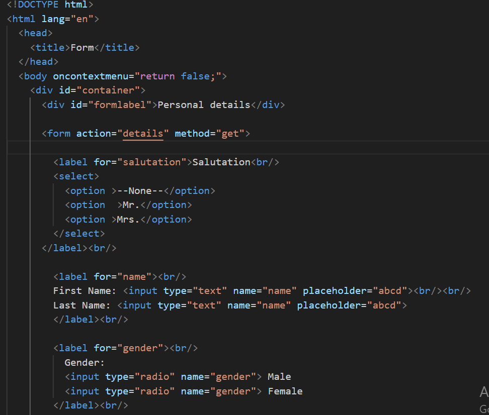

# Read me file
this file contains screenshot of html file and explaination of html tags used.

Hosted link - https://gautamkamboj.github.io/vs_code/Personal_detail_form/detailForm.html

## Head, title, headings

Title tag "Form" is present in head tag.

The form tag in HTML is used to create an HTML form that can be used to collect and submit user input to a server for processing.

The action attribute specifies the URL to which the form data will be submitted when the user submits the form.

The label and select tags are HTML elements used for creating forms and input elements. The label tag is used to label form elements, and the select tag is used to create a dropdown or select list for users to choose an option from a list.

option tag specifies the value that will be sent to the server when the form is submitted.

Input tag is used to create various types of form controls or input fields in web forms. It allows users to enter different types of data, such as text, numbers, checkboxes, radio buttons, and more. additional attributes like id, name, and value can be used to customize the input element further.

type Attribute Specifies the type of input field. Common types include "text", "password", "radio", "checkbox", "number", "email", and more.

The textarea tag is particularly useful for collecting longer pieces of text from users, such as comments or feedback, where a single-line input field is not suitable.

The rows attribute specifies the number of visible rows for the textarea.
The cols attribute specifies the number of visible columns for the textarea.

input tag with the type attribute set to "submit" to create submit button.

A submit button is used to submit the form data to the server for processing to the url specified in action attribute.