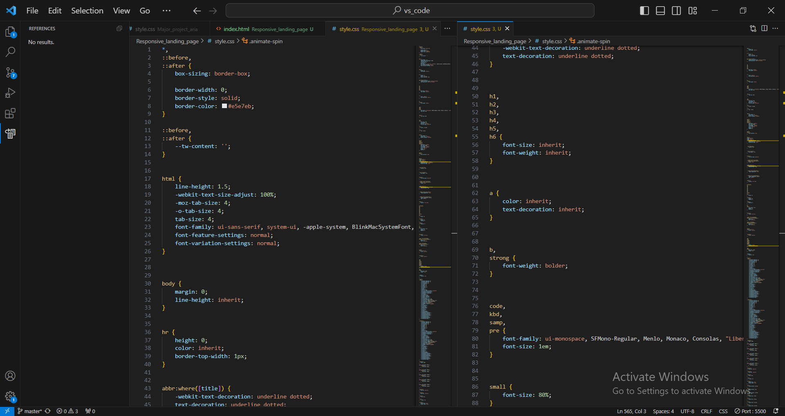

https://gautamkamboj.github.io/vs_code/Responsive_landing_page/index.html

## HTML
Document Type Declaration (!DOCTYPE html>): This declaration specifies that the document follows the HTML5 standard.

HTML Element (html lang="en">): The root element of an HTML document. The lang attribute is set to "en" to indicate that the document is in English.

Head Section (head>): Contains meta information about the document and links to external resources. Here, it includes:

meta elements specifying character set and viewport settings.
A link element to import an external CSS stylesheet named "output.css."
The document's title displayed in the browser tab.
Body Section (body>): The main content of the webpage is contained within the body element. Here, it includes:

A header element that represents the top section of the webpage, containing a logo, navigation links, and buttons.
A section element that contains a heading, paragraph, and buttons, which is likely a featured content section.
An img element displaying an image on the right side of the featured content.
Header Section (header>): Represents the header of the webpage and contains the site's logo, navigation links, and buttons.

Logo (a class="flex title-font ...">): An anchor element (a>) that contains a logo with SVG code and a text element. It appears to be a site logo with the text "Geekster."

Navigation (nav class="flex flex-wrap ...">): A navigation section containing a list of links (a>) for navigating the website.

Buttons (button class="inline-flex ...">): Two buttons with icons and text. One button is labeled "Geek" with an arrow icon, and the other is labeled "No" with a different icon.

Featured Content (section class="text-gray-600 ...">): A section containing a heading, paragraph, and buttons. It seems to be a featured content section with an image.

Heading (h1 class="title-font ...">): A large heading with a title and subtitle.

Paragraph (p class="mb-8 leading-relaxed">): A paragraph of text providing some information.

Buttons (button class="inline-flex ...">): Two buttons with different styles, "Yes" and "No."

Image (img class="object-cover ...">): An image displayed on the right side of the content. It has classes for styling, including size and rounded corners.

## CSS

Universal Box Sizing and Borders: This section ensures that all elements, including pseudo-elements (::before and ::after), use the border-box box-sizing model. It also sets default border styles and colors.

Typography and Fonts: Sets default font styles, sizes, and families for the html and body elements. It also removes the default margin on the body element and defines styles for headings, links, and various text elements.

Tables and Forms: Contains styles for tables and form elements, ensuring consistent rendering and removing any default browser styles.

Buttons and Form Controls: Styles for buttons, inputs, selects, and textareas. It removes default button styles and ensures consistent sizing.

Images and Media Elements: Defines styles for images and media elements, ensuring that they are responsive and fit within their containers.

Utility Classes: This section contains utility classes for common layout and styling tasks. For example, classes like .container, .absolute, .relative, .bg-gray-300, .text-gray-900, and many others can be used to apply predefined styles to HTML elements.

Media Queries: Sets responsive breakpoints using media queries (@media) to adjust styles based on screen width.

Animations: Defines a keyframe animation called spin and an .animate-spin class that applies this animation.

Pseudo-Classes and States: Includes styles for hover and focus states, making it easy to apply interactive styles to elements.

Custom CSS Variables: Defines custom CSS variables (prefixed with --tw-) that can be used to customize various aspects of the styles, such as colors, shadows, and more.

Responsive Utility Classes: Provides responsive utility classes with prefixes like sm:, md:, and lg: to apply styles based on screen size breakpoints.

Tailwind CSS Utility Classes: These classes are part of the Tailwind CSS framework and are used for quickly applying styles to HTML elements. Examples include .text-3xl, .bg-indigo-500, .p-8, .rounded-lg, and .hover:bg-indigo-600.