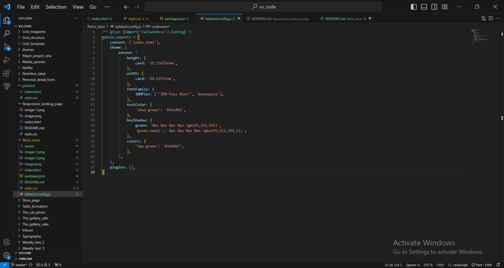

https://gautamkamboj.github.io/vs_code/Retro_shoe/index.html

## HTML

!doctype html>: This declaration defines the document type and version as HTML.

html lang="en">: The opening tag for the HTML document with the language attribute set to English.

head>: The head section of the HTML document contains metadata and links to external resources.

Meta tags: These tags provide metadata about the document, including character encoding and viewport settings.

title>: Specifies the title of the webpage displayed in the browser's title bar or tab.

link>: These tags link external resources such as stylesheets and fonts to the document.

script>: This tag includes an external JavaScript library (Font Awesome) for icons.

body class="grid w-screen h-screen place-content-center font-IBMPlex">: The body of the HTML document contains the visible content of the webpage. It has a class attribute that applies several CSS classes to style the content.

class="grid w-screen h-screen place-content-center font-IBMPlex": These classes are used for layout, positioning, and font styling.
div class="bg-gradient-to-t from-black to-black to-65% from-white from-65% h-card w-card shadow-xl">: This div> element serves as a container for the main content of the webpage. It has various CSS classes for styling, including background gradients and shadows.

Inside the main div>, there's a flex container with two child elements:

img>: This image element displays an image of the retro shoe. It has a class for styling and an alt attribute for accessibility.

Another div>: This container holds the product details and buttons.

Inside this div>, there are headings (h1> and h2>) for the product name and price.

Several a> elements with classes are used to display size options for the product.

Buttons for buying the product and adding it to the bag.

An i> element is used for a heart icon.

p class="inline-block w-10/12 pr-10 text-right">: This p> element displays a message about free shipping. It has CSS classes for styling.

## CSS

Universal Box Sizing:

This rule sets the box-sizing property to border-box for all elements, including pseudo-elements :after and :before. It also removes the border from these elements.

Typography and Text Styling:
The CSS code includes several rules for setting typography and text styles, such as font sizes, line heights, and font families for various elements.

Spacing and Layout:
There are rules that define margin and padding for different classes (e.g., .ml-2, .ml-20, .mt-20) to control spacing between elements. Additionally, there are rules for controlling the size of specific elements (e.g., .h-14, .w-10/12, .py-10).

Background and Gradients:
The code defines background colors and gradients using classes like .bg-black, .bg-new-green, and .bg-gradient-to-t.

Box Shadows:
It defines shadow effects using classes like .shadow-green, .shadow-green-small, and .shadow-xl.

Hover Effects:
There are hover effects defined using classes like .hover:bg-black, .hover:bg-slate-100, .hover:text-red-600, and .hover:shadow-green-small. These styles are applied when an element is hovered over.

Transition Duration:
The .duration-300 class sets a transition duration of 0.3 seconds, which is used for smooth transitions when certain properties change.

Other Utility Classes:
The CSS code also defines various utility classes that affect elements' appearance, positioning, and behavior, such as .flex, .grid, .inline-block, .flex-col, .place-content-center, and many more.

## tailwind config

content: Specifies which files Tailwind CSS should scan to find the classes you are using in your HTML. In this case, it's set to 'index.html', indicating that only the index.html file will be scanned for Tailwind CSS classes.

theme: This section allows you to extend or customize Tailwind CSS's default theme. It includes several nested options:

extend: Extends the default theme with additional configurations. In this example, it extends the theme with custom values for height, width, font family, text color, boxShadow, and colors.

height: Defines a custom height value named 'card' with a value of '35.15625rem'. This can be used as a utility class in your HTML or CSS.

width: Defines a custom width value named 'card' with a value of '68.4375rem'. Similar to height, this can be used as a utility class.

fontFamily: Adds a custom font family named 'IBMPlex' with a fallback to 'monospace'. You can use this custom font family in your CSS.

textColor: Defines a custom text color named 'shoe-green' with a hexadecimal color value '#1bc8bb'.

boxShadow: Defines custom box shadow presets named 'green' and 'green-small' with specific shadow values.

colors: Adds a custom color named 'new-green' with a hexadecimal color value '#2dd4bf'.

plugins: This section allows you to include Tailwind CSS plugins if needed. Currently, it's an empty array, indicating that no additional plugins are included in this configuration.

## package.json file

devDependencies: This section lists the development dependencies for your project. These are packages that are required during development but not needed in a production environment. Here, you have three devDependencies:

"prettier": "^3.0.3": Prettier is a code formatter. Version 3.0.3 is specified as a devDependency.

"prettier-plugin-tailwindcss": "^0.5.4": This is a Prettier plugin specifically for formatting Tailwind CSS code. Version 0.5.4 is specified as a devDependency.

"tailwindcss": "^3.3.3": Tailwind CSS is a utility-first CSS framework. Version 3.3.3 is specified as a devDependency. This is the core package you'll use to work with Tailwind CSS.

scripts: This section defines custom scripts that can be run using the npm run command. You have two scripts defined:

"buildcss": This script runs the npx tailwind command to build your CSS file. It specifies the input file (input.css), the output file (style.css), and the --watch flag, which means that Tailwind CSS will watch for changes and rebuild the CSS file automatically when changes are detected. This is useful during development to see changes in real-time.

"minify": This script runs the npx tailwindcss command with the --minify flag, which minifies the CSS in style.css. Minification reduces the size of the CSS file by removing unnecessary whitespace and comments. This script is typically used when preparing your project for production.

