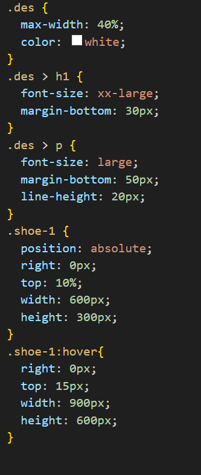

Hosted link- https://gautamkamboj.github.io/vs_code/Shoe_page/index.html

## HTML

!DOCTYPE html>: This declaration specifies that the document is an HTML5 document.

html lang="en">: The root element of the HTML document, indicating that the document is in English ("en").

head>: This section contains metadata about the document, including the character encoding, compatibility settings, title, and a link to an external CSS stylesheet.

meta charset="UTF-8">: Specifies the character encoding as UTF-8.
meta http-equiv="X-UA-Compatible" content="IE=edge">: Sets compatibility settings for Internet Explorer.
meta name="viewport" content="width=device-width, initial-scale=1.0">: Defines the viewport settings for responsive design.
title>Document /title>: Sets the title of the webpage to "Document."
link rel="stylesheet" href="./style.css">: Links an external CSS stylesheet named "style.css" to the HTML document to apply styles to the content.
body oncontextmenu="return false;">: The main content of the webpage is contained within the body> element. The oncontextmenu attribute is used to prevent right-click context menus.

div class="container">: This div> element represents the main container of the webpage.

div class="shoe">: This div> element represents a section displaying information about a shoe. It has an inline style attribute that applies a linear gradient background.

div class="des">: This div> element contains the description of the shoe.

h1>Shoe-1 /h1>: A level 1 (h1) heading displaying the shoe's name.
p>: Paragraphs providing additional information about the shoe.
img class="shoe-1" src="./shoe.png" alt="shoe" />: An image element displaying an image of the shoe. It has a class "shoe-1" for styling.

## CSS

*: This universal selector applies the following styles to all HTML elements on the page.

margin: 0;: Sets the margin to 0 for all elements.
padding: 0;: Sets the padding to 0 for all elements.
box-sizing: border-box;: Ensures that padding and borders are included in the element's total width and height.
body: Styles applied to the body> element.

background-color: lightgrey;: Sets the background color of the entire page to light grey.
.container: Styles applied to an element with the class "container."

width: 100%;: Sets the width of the container to 100% of its parent's width.
height: 100vh;: Sets the height of the container to 100% of the viewport height.
position: relative;: Specifies that the container is a positioned element with respect to which other elements are positioned.
overflow: hidden;: Hides any content that overflows the container.
.container::after: Styles applied to a pseudo-element (::after) of the container.

content: "";: Adds content to the pseudo-element.
position: absolute;: Positions the pseudo-element absolutely within the container.
inset: 0;: Sets the pseudo-element's top, right, bottom, and left positions to 0, effectively covering the entire container.
transform: skewY(10deg);: Applies a 10-degree skew transformation to the pseudo-element, giving it a slanted appearance.
background: linear-gradient(to right, #b92b27, #1565c0);: Sets a linear gradient background for the pseudo-element, creating a gradient from red (#b92b27) to blue (#1565c0).
z-index: -1;: Positions the pseudo-element behind the content of the container.
box-shadow: 0px 0px 10px black;: Adds a black shadow to the pseudo-element.
.shoe: Styles applied to an element with the class "shoe."

width: 85%;: Sets the width of the shoe element to 85% of its parent's width.
height: 75%;: Sets the height of the shoe element to 75% of its parent's height.
padding: 2%;: Adds 2% padding to the shoe element.
margin: auto;: Centers the shoe element horizontally.
margin-top: 7.5%;: Sets a top margin to create spacing between the shoe and the top of the container.
box-shadow: 0px 0px 10px black;: Adds a black shadow to the shoe element.

.des: Styles applied to an element with the class "des."

max-width: 40%;: Sets the maximum width of the "des" element to 40% of its parent's width.
color: white;: Sets the text color to white.
.des > h1: Styles applied to level 1 (h1) headings within the "des" element.

font-size: xx-large;: Sets the font size to extra-large for h1 headings.
margin-bottom: 30px;: Adds a bottom margin of 30 pixels to create spacing.
.des > p: Styles applied to paragraphs within the "des" element.

font-size: large;: Sets the font size to large for paragraphs.
margin-bottom: 50px;: Adds a bottom margin of 50 pixels to create spacing.
line-height: 20px;: Sets the line height for paragraphs to 20 pixels.
.shoe-1: Styles applied to an element with the class "shoe-1."

position: absolute;: Positions the "shoe-1" element absolutely.
right: 0px;: Sets the initial right position to 0 pixels.
top: 10%;: Sets the initial top position to 10% from the top of the container.
width: 600px;: Sets the width of the "shoe-1" element to 600 pixels.
height: 300px;: Sets the height of the "shoe-1" element to 300 pixels.
.shoe-1:hover: Styles applied to the "shoe-1" element when it is hovered.

right: 0px;: Sets the right position to 0 pixels when hovered.
top: 15px;: Sets the top position to 15 pixels when hovered.
width: 900px;: Increases the width to 900 pixels when hovered.
height: 600px;: Increases the height to 600 pixels when hovered.