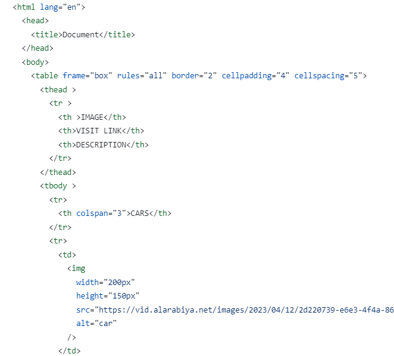
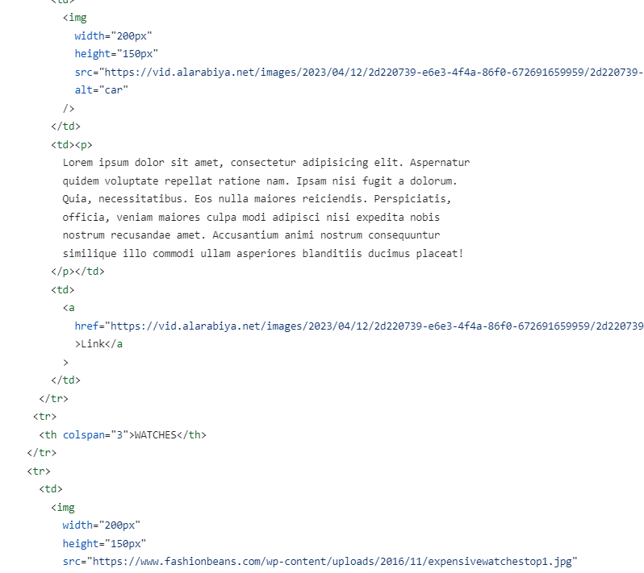

# Read me file
this file contains screenshot of html file and explaination of html tags used.

Hosted link - https://gautamkamboj.github.io/vs_code/Table_formation/table.html

## Head, title, headings

Title tag "document" is present in head tag.

Table tag is used to create table.

The tr (table row) and td (table data/cell) tags are HTML tags used to create structured tables on web pages. Tables are often used to display tabular data in a structured format.

 frame, rules, border, cellpadding, cellspacing are different attributes of img tag to specify the structure of the table.
 
 thead tag, which is used to define the header section of an HTML table.

 The tbody tag in HTML is used to group the main content of an HTML table. It contains one or more rows (tr) that represent the data rows of the table. This tag helps structure the content and is often used in combination with the thead (table header) 

Image tag(img ) is used for cat photo and url is provided in src attribute    
      src="https://vid.alarabiya.net/images/2023/04/12/2d220739-e6e3-4f4a-86f0-672691659959/2d220739-e6e3-4f4a-86f0-672691659959.jpg?crop=1:1&width=1000"
          
         
alt attribute is used in the img tag to provide alternative text for images.alt="car"

Height and width attribute is used to specify and format the image pixels.
 height="150px"
 width="200px"

 
