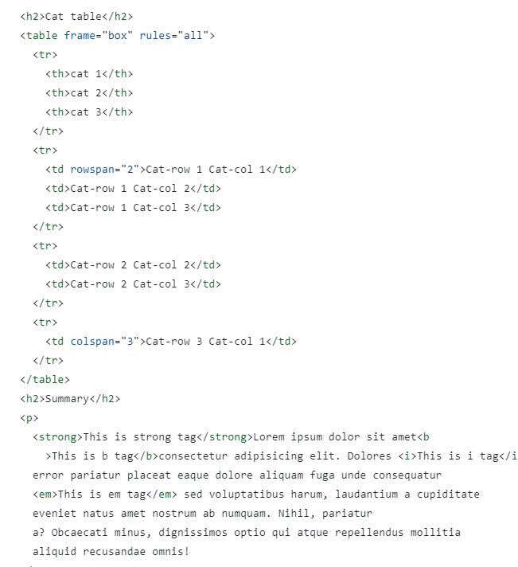

# Read me file
this file contains screenshot of html file and explaination of html tags used.

Hosted link - https://gautamkamboj.github.io/vs_code/The_cat_photo/cat.html

## Head, title, headings

Title tag "document" is present in head tag.
 
"Cat Photo App" is present in h1 tag present in div.

"Cat photo" is present in h2 heading tag. 

Anchor tag is used to create hyper link "cat photos.(anchor tag)" and href attribute is used to redirect the link to #catlist.

Image tag(img ) is used for cat photo and url is provided in src attribute    
       src="https://cdn.freecodecamp.org/curriculum/cat-photo-app/relaxing-cat.jpg"

alt attribute is used in the img tag to provide alternative text for images.

## CAT List

Id attribute is used in div tag to create unique id that is used in href.

unordered list is used to list items using (li) tag.

Image tag(img ) is used for cat photo and url is provided in src attribute    
      src="https://cdn.freecodecamp.org/curriculum/cat-photo-app/lasagna.jpg"
          
         
alt attribute is used in the img tag to provide alternative text for images.alt="lasagne.img"

Height and width attribute is used to specify and format the image pixels.
 height="250px"
 width="350px"

## top 3 things cats hate

H1 tag is used in "Top 3 things cats hate"
 
ordered list is used to list items using (li) tag.

Image tag(img ) is used for cat photo and url is provided in src attribute    
       src="https://cdn.freecodecamp.org/curriculum/cat-photo-app/cats.jpg"
          height="250px"
          width="350px"
          
         
alt attribute is used in the img tag to provide alternative text for images.          alt="cats-grp.img"

Height and width attribute is used to specify and format the image pixels.
 height="250px"
 width="350px"

Strong tag is used to make elements bold in between the content. 

## Cat table

Table tag is used to create table.

frame attribute specify shape. Box

The tr (table row) and td (table data/cell) tags are HTML tags used to create structured tables on web pages. Tables are often used to display tabular data in a structured format.

Strong tag is used to make elements bold in between the content.