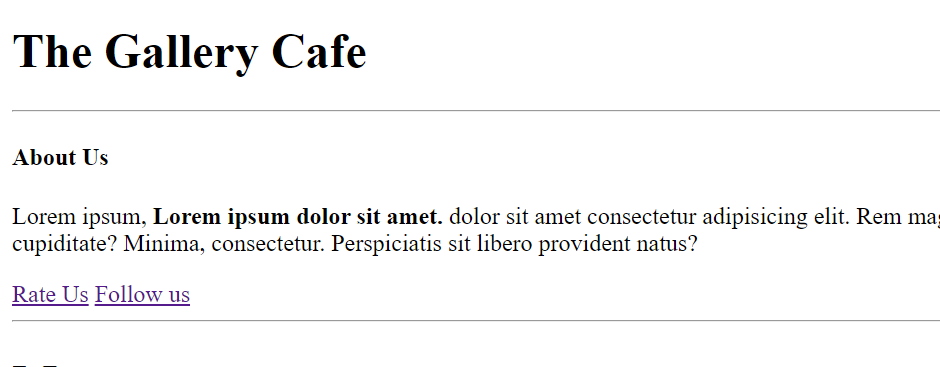

# Read me file
this file contains screenshot of html file and explaination of html tags used.

Hosted link - https://gautamkamboj.github.io/vs_code/The_gallery_cafe/cafe.html#

## Head, title, headings

Title tag "document" is present in head tag.
 
"The Gallery Cafe" is present in h1 tag present in div.

Underline under "The Gallery Cafe" is using Horizontal Row(hr) tag.

"About Us" is present in h4 tag.

paragraph tag(p) is used to display description. Strong tag is used to bold elements in between.

Anchor tag "a" is used to creare empty hyperlinks "rate us" "follow us".

## MENU

H1 tag is used for "Menu"
H4 tag for "South Indian"

ordered list(ol) is used with list items(li) tags used for "Dosa Idli Utpam" listing in numbers.
Subsequently Punjabi and Extras are dispalyed.

Two Underlines is displayed using two Horizontal Row(hr) tag.

## Contact

H1 tag is used in "Contact"
 
 Paragraph(p) tag is used for the content

Strong tag is used to make elements bold in between the content. 