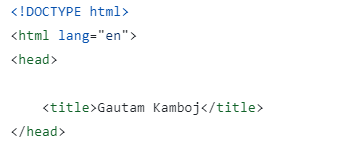
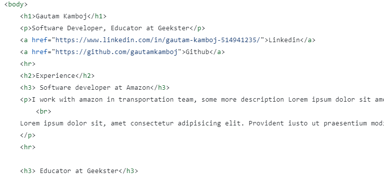
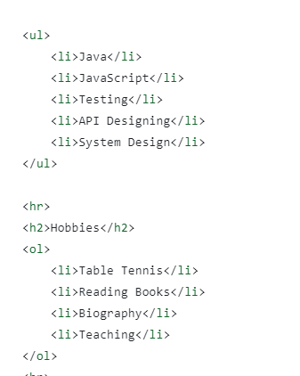
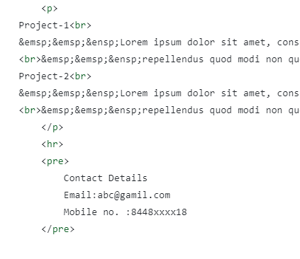

# Read me file
this file contains screenshot of html file and explaination of html tags used.

## Head, title
DOCTYPE html- It is an "information" to the browser about what document type to expect. also version of html.
head-	Defines information about the document
title-	Defines the title of a document

## Body, Paragraph, Anchor, Heading
body -	It is used to define the body section of an HTML document.
p - 	It represents a paragraph in an HTML document.
a - It is termed as anchor tag and it creates a hyperlink or link. href contains url link and element between tag is displayed.
h1-h6 - It defines headings for an HTML document from level 1 to level 6. h1 is largest and h6 is smallest.
hr - It is used to apply horizontal row.
br - Break tag is used to apply 1 line break in a paragraph.

## list(ordered, unordered)

Ol-  it defines ordered list( eg 1,2,3).
ul - it defines unordered list(bullet points).
li - these are used for listing items.

## pre, &emsp;, &ensp;
pre - It defines preformatted text in an HTML document. the font of content inside pre tag cannot be changed.
&emsp - it is used to give two space between words in a paragraph
&ensp - it is used to give one space between words in a paragraph

