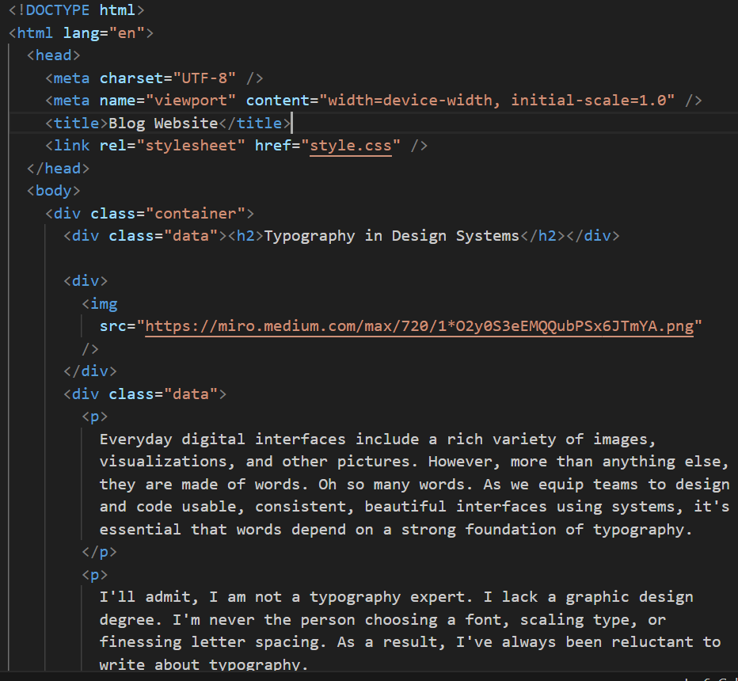
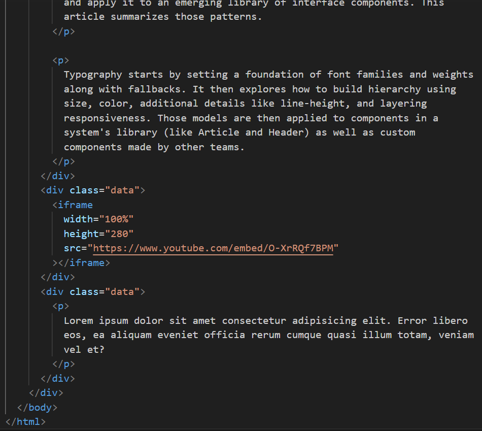
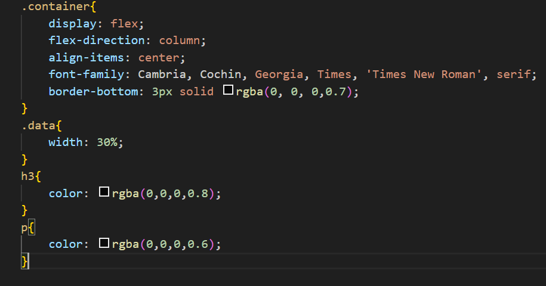

Hosted link- https://gautamkamboj.github.io/vs_code/Typography/index.html

## HTML

!DOCTYPE html>: This declaration specifies that the document is an HTML5 document.

html lang="en">: The root element of the HTML document, indicating that the document is in English ("en").

head>: This section contains metadata about the document, including the character encoding, page title, and a link to an external CSS stylesheet.

meta charset="UTF-8">: Specifies the character encoding as UTF-8.
meta name="viewport" content="width=device-width, initial-scale=1.0">: Defines the viewport settings for responsive design.
title>Blog Website /title>: Sets the title of the webpage to "Blog Website."
link rel="stylesheet" href="style.css" />: Links an external CSS stylesheet named "style.css" to the HTML document to apply styles to the content.
body>: The main content of the webpage is contained within the body> element.

div class="container">: This div> element represents the main content container.

div class="data">: This div> element contains the title of the blog post.

h2>Typography in Design Systems /h2>: A level 2 heading displaying the title of the blog post.
div>: This div> element contains an image.

img src="https://miro.medium.com/max/720/1*O2y0S3eEMQQubPSx6JTmYA.png" />: An image is embedded in the webpage using the img element and its src attribute.
div class="data">: This div> element contains multiple paragraphs of text related to the blog post.

p>: Multiple paragraphs of text provide information about typography in design systems.
div class="data">: This div> element contains an embedded YouTube video.

iframe>: An iframe> element is used to embed a YouTube video by specifying the video's URL within the src attribute.
div class="data">: This div> element contains a single paragraph of text.

p>: A single paragraph of placeholder text (Lorem ipsum) is included.

## CSS

.container: Styles applied to the main container div.

display: flex;: Makes the container a flex container.
flex-direction: column;: Arranges flex items vertically in a column.
align-items: center;: Centers the flex items horizontally within the container.
font-family: Cambria, Cochin, Georgia, Times, 'Times New Roman', serif;: Sets the font family for the container text.
border-bottom: 3px solid rgba(0, 0, 0, 0.7);: Adds a 3-pixel solid black border at the bottom of the container, giving it a separation line.
.data: Styles applied to div elements with the class "data."

width: 30%;: Sets the width of these div elements to 30% of their parent container.
h3: Styles applied to level 3 (h3) headings.

color: rgba(0, 0, 0, 0.8);: Sets the text color of h3 headings to a semi-transparent black (0.8 alpha value).
p: Styles applied to paragraphs.

color: rgba(0, 0, 0, 0.6);: Sets the text color of paragraphs to a semi-transparent black (0.6 alpha value).