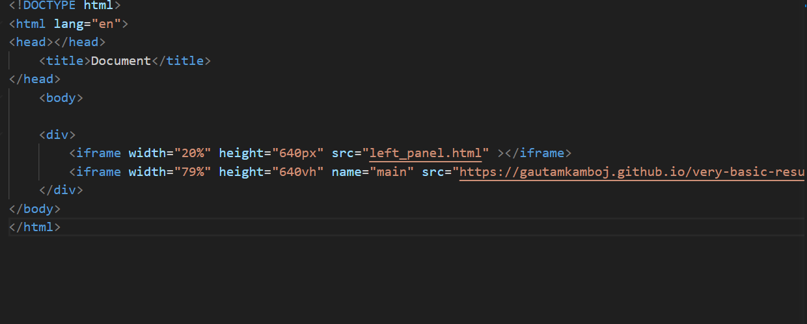
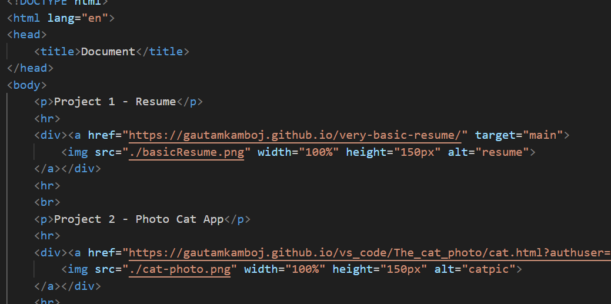

## READ ME

# WEEKLY TEST
The iframe (inline frame) tag in HTML is used to embed another HTML document or web page within the current web page. It's commonly used to display external content, such as maps, videos, or external web pages, directly within a section of your web page.

There are 2 iframes used,first to Show the content and other to display the menu.

left frame source is created in seperate html file and anchor tags are used to target the elements to the right frame.

Target attribute is fed with the name of the iframe so that it can redirect to content on that.

image tags are used within anchor tag so that when user click on the image the content will be displayed on the iframe on the right.

