## Read me 

# HTML doc

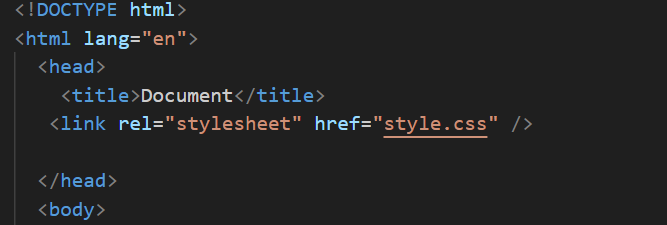

The document starts with the usual HTML, head, and title elements.

The CSS file "style.css" is linked to the HTML document.

The page content is contained within the body element.

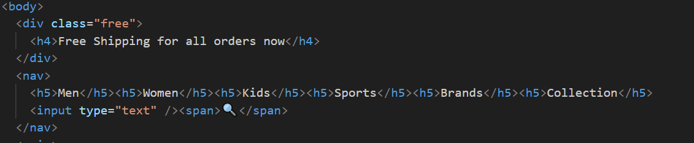

Free Shipping Banner:

A div element with the class "free" displays a banner promoting free shipping.
Navigation Bar:

A nav element contains links to various categories and an input field for searching.
h5 elements are used for category links.
An input element allows users to enter search queries.
A 🔍 span is used as a search icon.

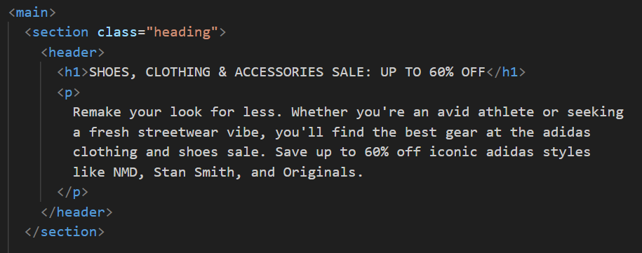

Main Content Sections:

The main element contains the main content of the page.
The first section with the class "heading" features a header with a title and a description.
The second section with the class "trending" displays trending products, each contained within a div element with the class "nike."

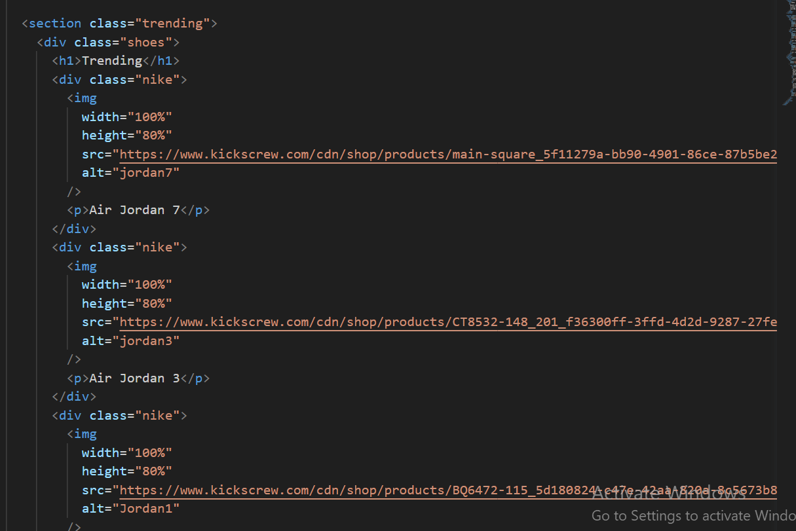

Description Section:

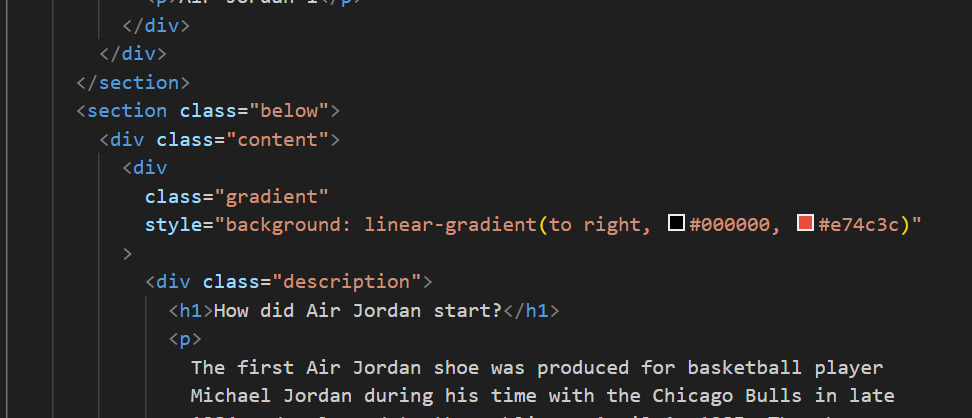

The final section with the class "below" contains a content area with a gradient background.
Within this section, there's a "gradient" div with a linear gradient background and a description.
An img element with the class "circle" displays an image.

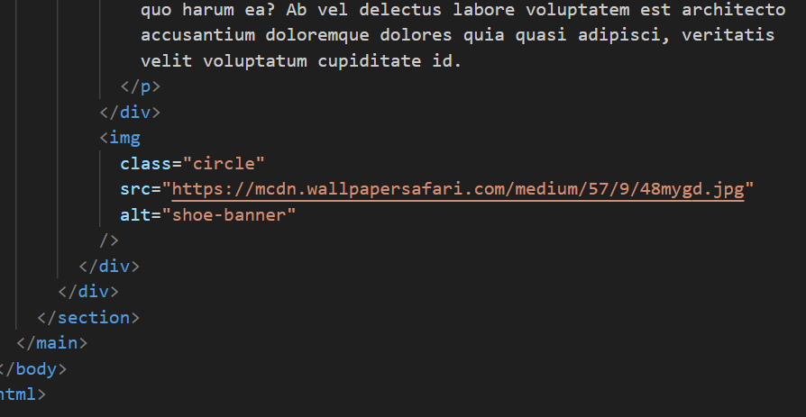

# css 

The universal selector (*) is used to reset default margins, padding, and box sizing for all elements on the page.

The .free class is applied to an element, setting a background gradient, text color, and centering the text content.

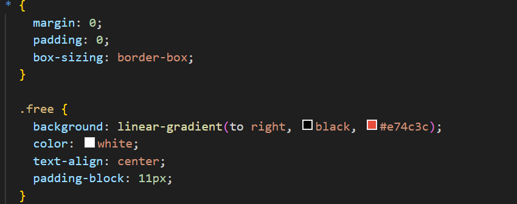

The nav selector is used to style the navigation bar, setting its background color, text alignment, and making it sticky at the top of the page.

Inside the nav, there are styles for h5 elements, input elements, and a span element.

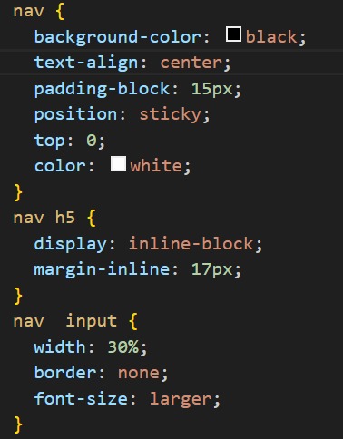

The .heading class is applied to a section with a background image, setting padding, font size, and text color.

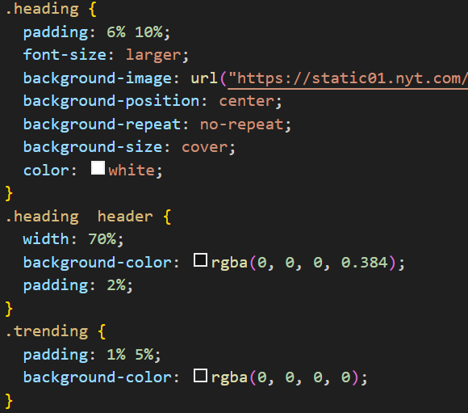

The .trending and .shoes classes define styles for specific sections of the page.

There are two rules for the .shoes class, which may override the first one if they are not meant to be different styles for different elements with the same class.

The .nike class is applied to specific elements, defining their appearance.

The .below class applies a linear gradient background.

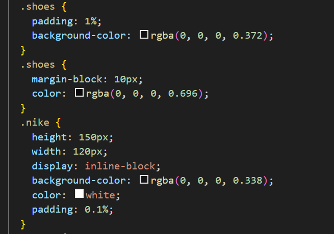

The .content class defines the styling for the main content area of the page.

The .gradient class sets styles for a specific section, including width, height, padding, margins, and a box shadow.
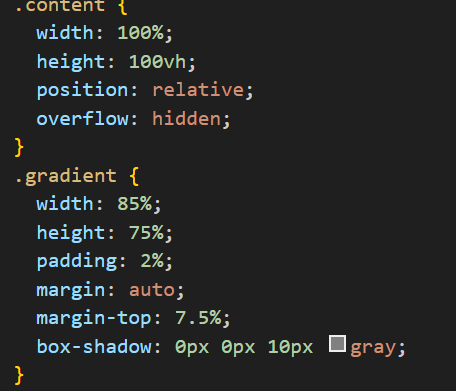

The .description class defines styles for a description section, including text color and size.

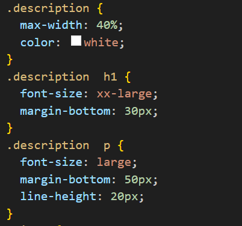
The .circle class is applied to a circular element, and there's a hover effect that increases its size and moves it slightly.

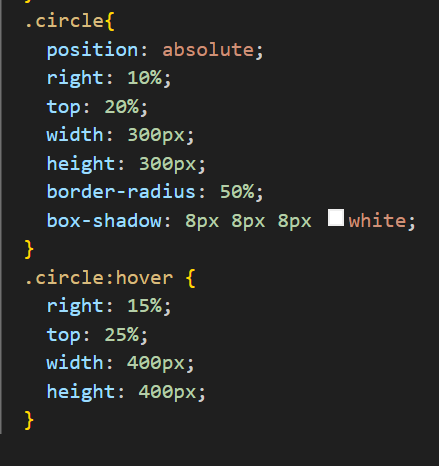