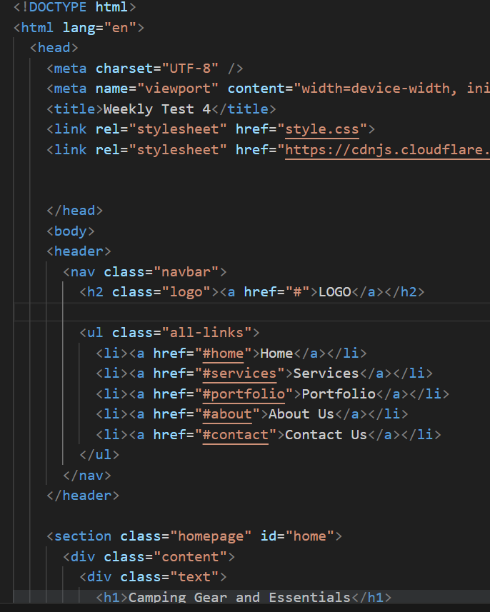
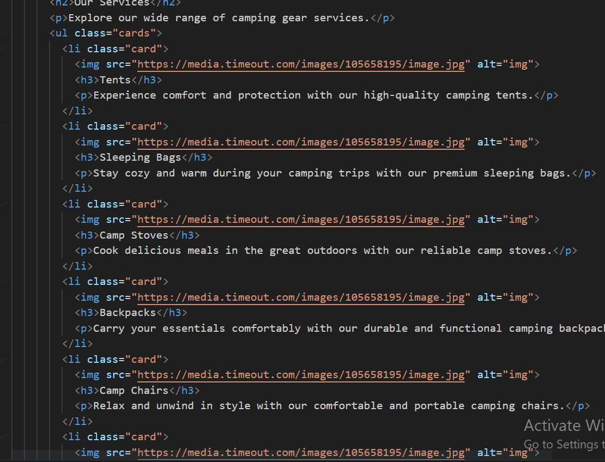
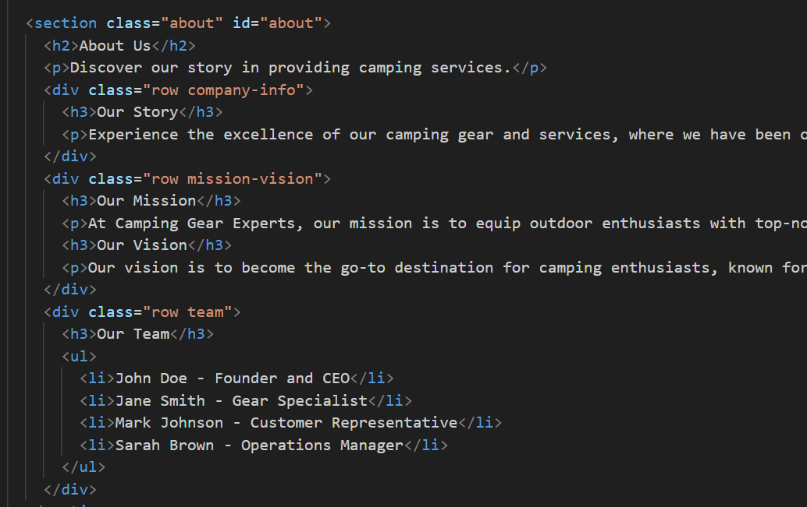
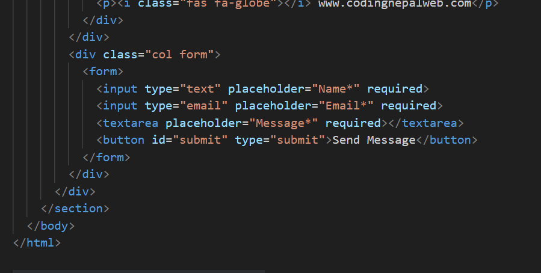
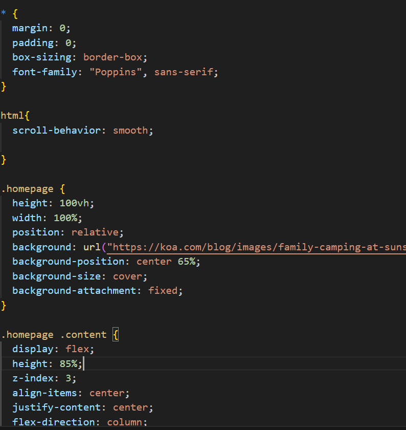
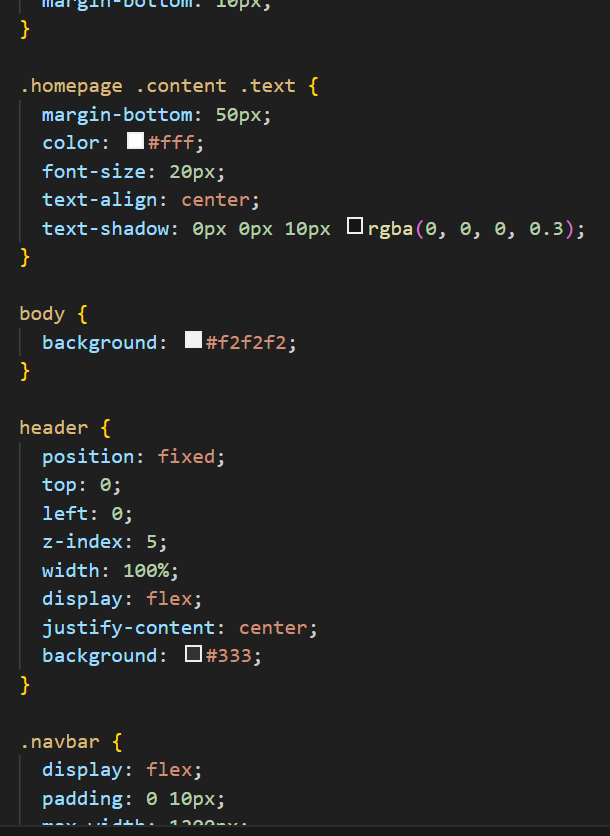
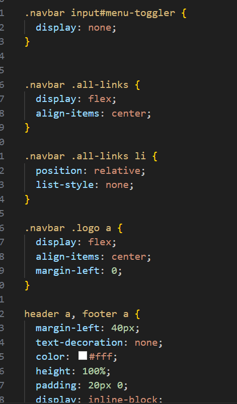
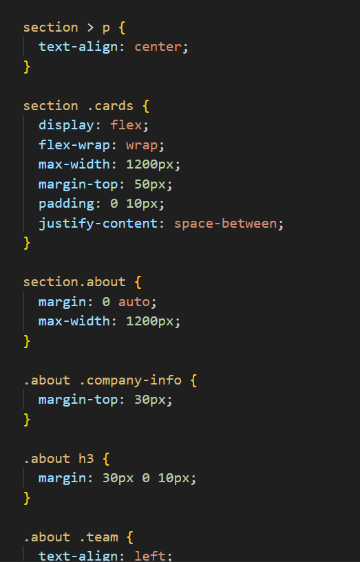
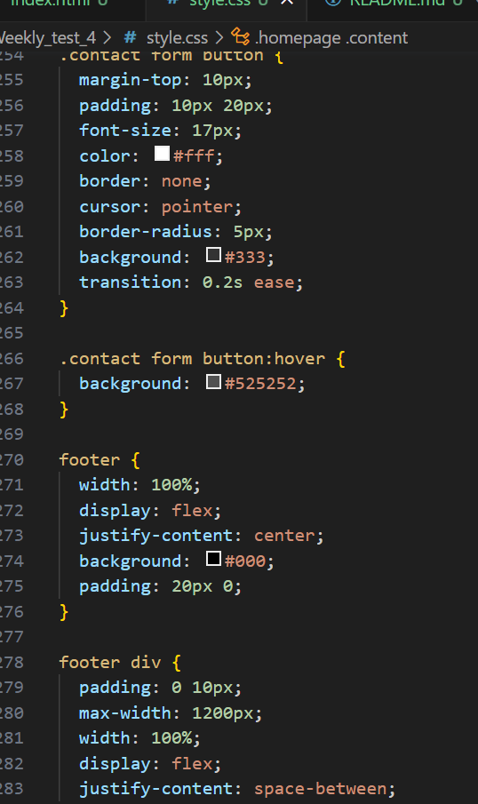

Hosted link-https://gautamkamboj.github.io/vs_code/Weekly_test_4/index.html

## HTML Tags:

!DOCTYPE html>:

This declaration defines the document type and version of HTML being used. It informs the web browser that the document is an HTML5 document.

html lang="en">:

The root html> element that contains the entire HTML document.
lang="en" specifies the language of the document as English.
head>:

Contains metadata and links to external resources.
meta charset="UTF-8">: Specifies the character encoding for the document as UTF-8, which includes a wide range of characters.
meta name="viewport" content="width=device-width, initial-scale=1.0">: Sets the viewport properties for responsive web design, ensuring the page displays correctly on various device screen sizes.
title>: Sets the title of the webpage that appears in the browser's title bar.
link rel="stylesheet" href="style.css">: Links an external CSS stylesheet named "style.css" to apply styles to the HTML.
link rel="stylesheet" href="https://cdnjs.cloudflare.com/ajax/libs/font-awesome/6.3.0/css/all.min.css">: Links an external Font Awesome CSS library for using icons.

body>:

Contains the visible content of the webpage.
header>:

Represents the header section of the webpage.
Contains a navigation bar and a logo.
nav>:

Defines a navigation section within the header.
Contains navigation links.
h2 class="logo">:

A heading element with the class "logo."
Contains an anchor (a>) tag that links to the homepage.
input type="checkbox" id="menu-toggler">:

An input element of type checkbox used for a responsive menu toggle.
id="menu-toggler" is used to associate this input with a label for toggling the menu.
ul class="all-links">:

An unordered list element with the class "all-links."
Contains list items (li>) representing navigation links.

section>:

Represents a section or block of content on the webpage.
Each section has a specific purpose and content.
a href="#">:

An anchor element that creates hyperlinks.
href="#" is a placeholder link that doesn't navigate to another page.

img>:

An inline element used to display images.
src attribute specifies the image source.
alt attribute provides alternative text for accessibility.
h1>, h2>, h3>:

Heading elements used to define headings with varying levels of importance.
h1> is the highest level, typically used for the main title.
p>:

A paragraph element used to define text paragraphs.

div>:

A generic container element used for grouping and styling content.

form>:

Defines an HTML form for user input.
Contains input fields, a textarea, and a submit button.

## CSS

*:

The universal selector selects all elements on the page.
margin: 0; and padding: 0; reset the default margin and padding for all elements to zero.
box-sizing: border-box; ensures that the total width and height of an element include padding and border.
font-family: "Poppins", sans-serif; sets the default font family for all elements to "Poppins," a sans-serif font.

html:

Styles applied to the html element.
scroll-behavior: smooth; adds smooth scrolling behavior to anchor links within the page.
.homepage:

Styles for the "Homepage" section.
height: 100vh; sets the height of the section to 100% of the viewport height.
background properties set a background image, position, size, and attachment.
.homepage .content:

Styles for the content within the homepage section.
display: flex; arranges child elements in a flex container.
height: 85%; takes up 85% of the parent's height.
z-index: 3; sets the stacking order (z-index) to 3.
align-items, justify-content, and flex-direction align and arrange the content vertically and horizontally.

.homepage .content h1:

Styles for the heading inside the homepage content.
font-size and font-weight set the font size and weight.
margin-bottom adds space below the heading.
.homepage .content .text:

Styles for the text content within the homepage.
margin-bottom adds space below the text.
color sets the text color.
text-align centers the text.
text-shadow adds a subtle shadow to the text for better visibility.
body:

Styles for the overall body of the webpage.
background sets the background color.
header:

Styles for the header section.
position: fixed; fixes the header at the top of the viewport.
top: 0; left: 0; positions it at the top left corner.
z-index: 5; sets the stacking order.
background sets the background color.
.navbar:

Styles for the navigation bar.
display: flex; arranges child elements in a flex container.
padding, max-width, and width control the spacing and width of the navbar.
align-items and justify-content center elements vertically and horizontally.
.navbar input#menu-toggler:

Styles for the menu toggler input element.
display: none; hides the input element initially.
.navbar .all-links:

Styles for the navigation links.
display: flex; arranges links in a flex container.
align-items centers links vertically.
.navbar .all-links li:

Styles for individual list items in the navigation.
.navbar .logo a:

Styles for the logo link.
header a and footer a:

Styles for anchor links in the header and footer.
margin-left adds space between links.
text-decoration removes underlines from links.
color sets the text color.
header a:hover and footer a:hover:

Styles for anchor links on hover.
color changes the text color on hover.
.content a:

Styles for links within the content area.
color sets the text color.
display and padding control the link's appearance.
border, border-radius, and box-shadow create a button-like effect.
transition adds a smooth color transition on hover.
.content a:hover:

Styles for links within the content area on hover.
color and background change the link's appearance on hover.