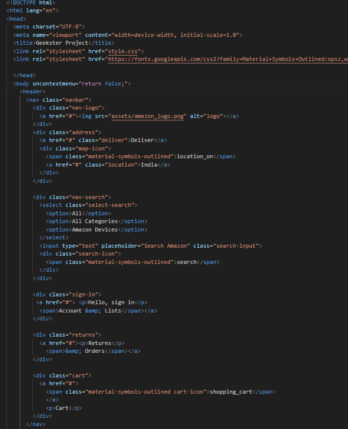
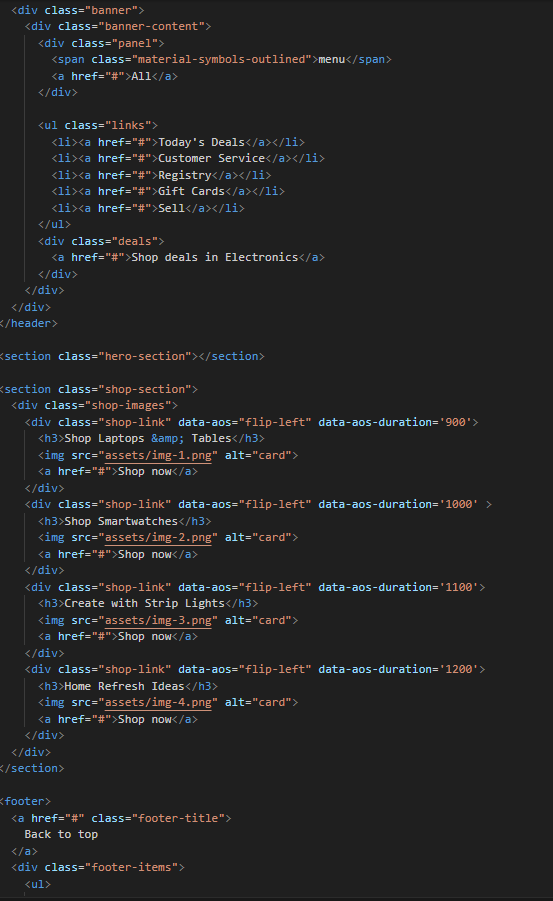
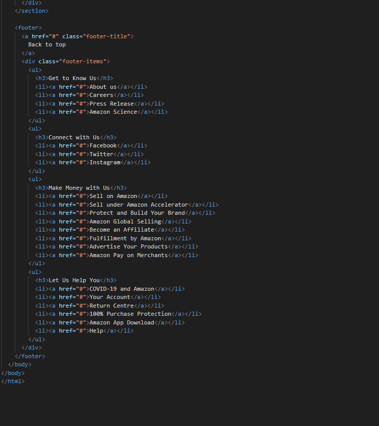
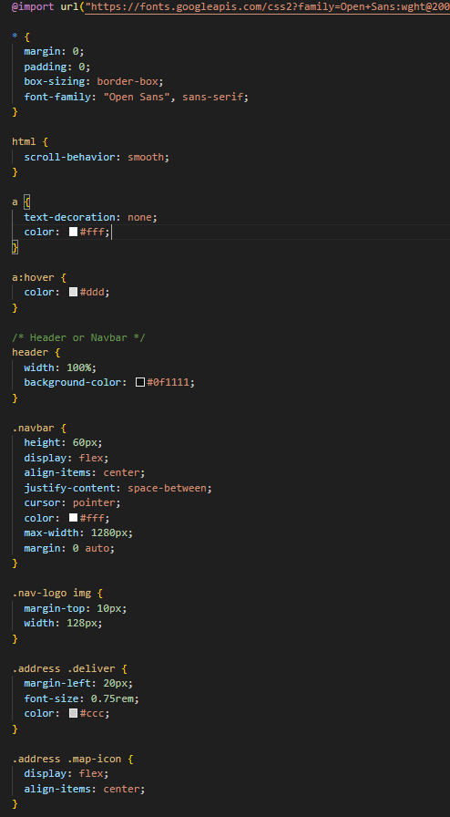
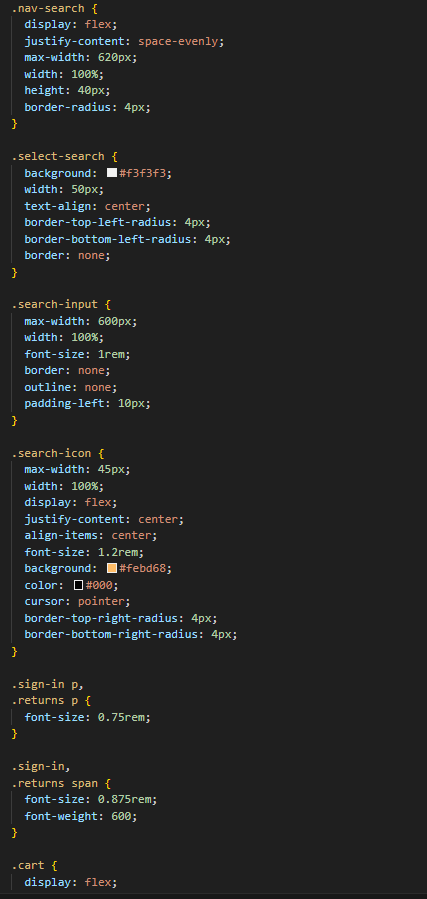
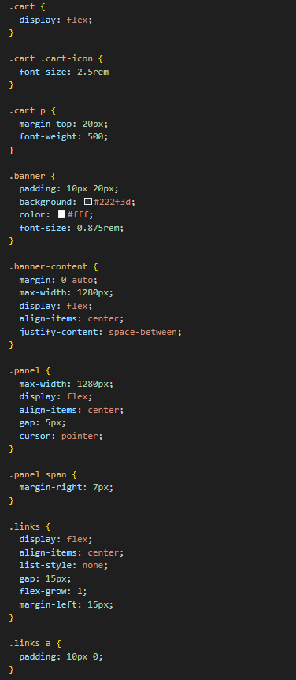
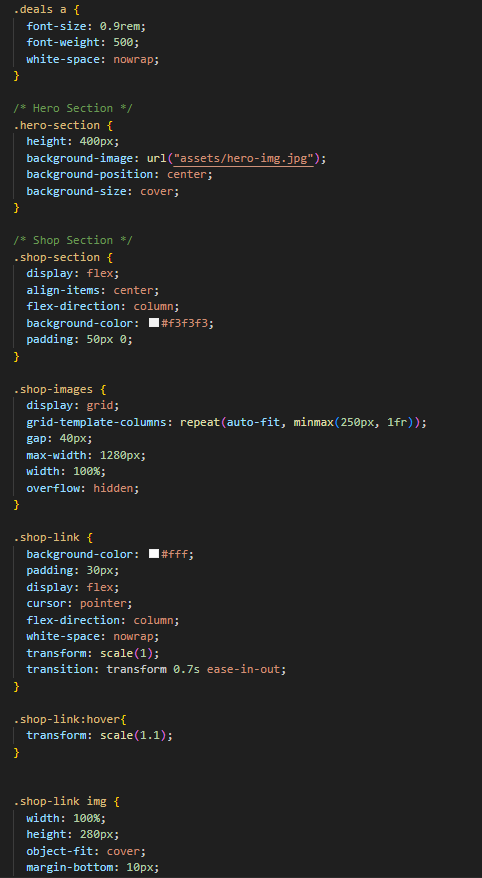
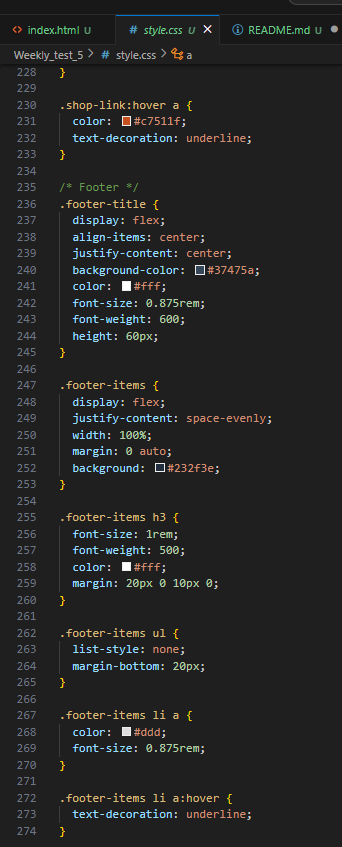

Hosted link-https://gautamkamboj.github.io/vs_code/Weekly_test_5/index.html

## HTML

!DOCTYPE html>: This declaration specifies the document type and version of HTML you are using.

html lang="en">: This is the root element of your HTML document, and it specifies that the document is written in English.

head>: This section contains meta information about the document, including character encoding, viewport settings, and the title of the page.

title>: Sets the title of the webpage, which typically appears in the browser's title bar or tab.

link>: These elements link to external resources, such as a CSS file for styling and a Google Fonts stylesheet for custom fonts.

body>: This is the main content of your webpage. It contains the header, sections, and footer.

header>: This section typically contains elements like navigation menus, logos, and other header content.

nav>: A navigation menu within the header.

div>: These are div elements used for structuring and grouping content.

a>: Anchor elements create hyperlinks, and they are used for linking to other pages or resources.

img>: Image elements display images on the webpage.

select>: A dropdown select element for choosing search categories.

input>: An input element for user text input, used for searching in this case.

p>: Paragraph elements for text content.

ul>: Unordered list elements, used for creating lists of links.

li>: List item elements within unordered lists.

section>: These represent different sections of the webpage, such as a hero section and a shop section.

footer>: The footer section contains links and information usually found at the bottom of a webpage.

## CSS

@import: This rule is used to import an external CSS stylesheet from Google Fonts, specifically the "Open Sans" font in various weights.

Universal Selector (*): This selector applies styles to all elements on the page. In this case, it's used to set some default styles, including margin, padding, box-sizing, and the font family.

html: Styles applied to the html element, including scroll-behavior for smooth scrolling.

a: Styles for anchor (link) elements and their hover state.

header: Styles for the header section of the page.

.navbar: Styles for the navigation bar within the header.

.nav-logo img: Styles for the logo image within the navigation bar.

.address .deliver: Styles for the "Deliver" link in the address section.

.address .map-icon: Styles for the map icon and location link in the address section.

.nav-search: Styles for the search bar in the navigation.

.select-search: Styles for the select element in the search bar.

.search-input: Styles for the search input field.

.search-icon: Styles for the search icon.

.sign-in p, .returns p: Styles for some text elements in the header.

.sign-in, .returns span: Styles for text elements within the sign-in and returns sections.

.cart: Styles for the shopping cart section.

.cart .cart-icon: Styles for the shopping cart icon.

.cart p: Styles for the text in the shopping cart section.

.banner: Styles for the banner section.

.banner-content: Styles for the content within the banner.

.panel: Styles for a panel within the banner.

.links: Styles for a list of links within the banner.

.deals a: Styles for a link in the "Shop deals in Electronics" section.

.hero-section: Styles for the hero section of the page.

.shop-section: Styles for the shop section of the page.

.shop-images: Styles for the grid of shop images.

.shop-link: Styles for individual shop links within the grid.

.shop-link img: Styles for the images within shop links.

.shop-link h3: Styles for the headings within shop links.

.shop-link a: Styles for the links within shop links, including hover effects.

.footer-title: Styles for the footer title.

.footer-items: Styles for the items within the footer.

.footer-items h3: Styles for the headings within the footer.

.footer-items ul: Styles for lists within the footer.

.footer-items li a: Styles for links within lists in the footer, including hover effects