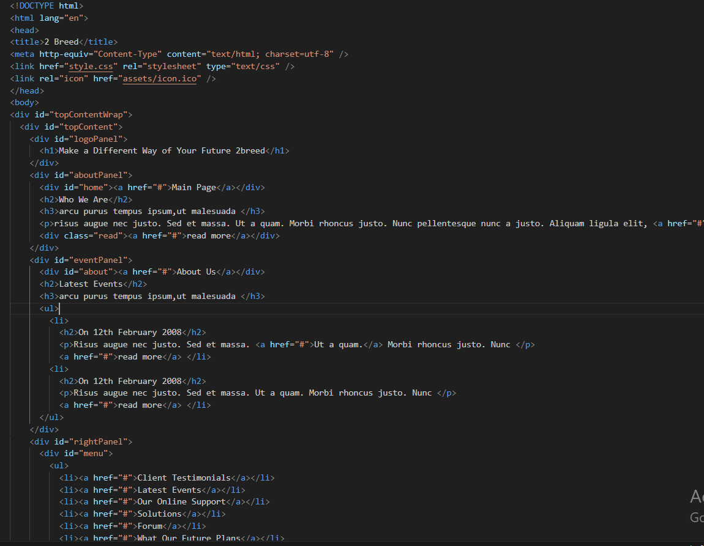
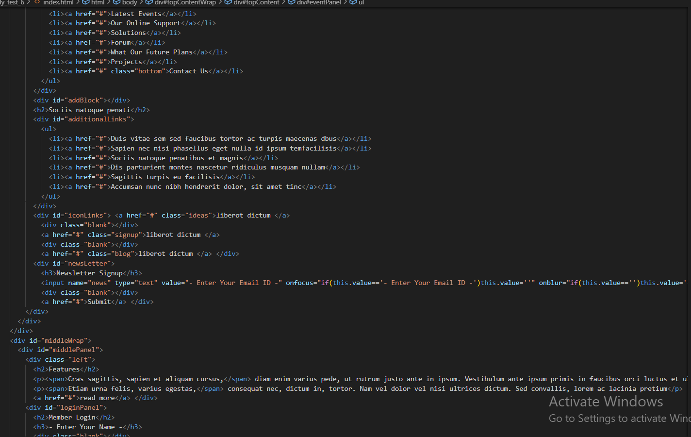
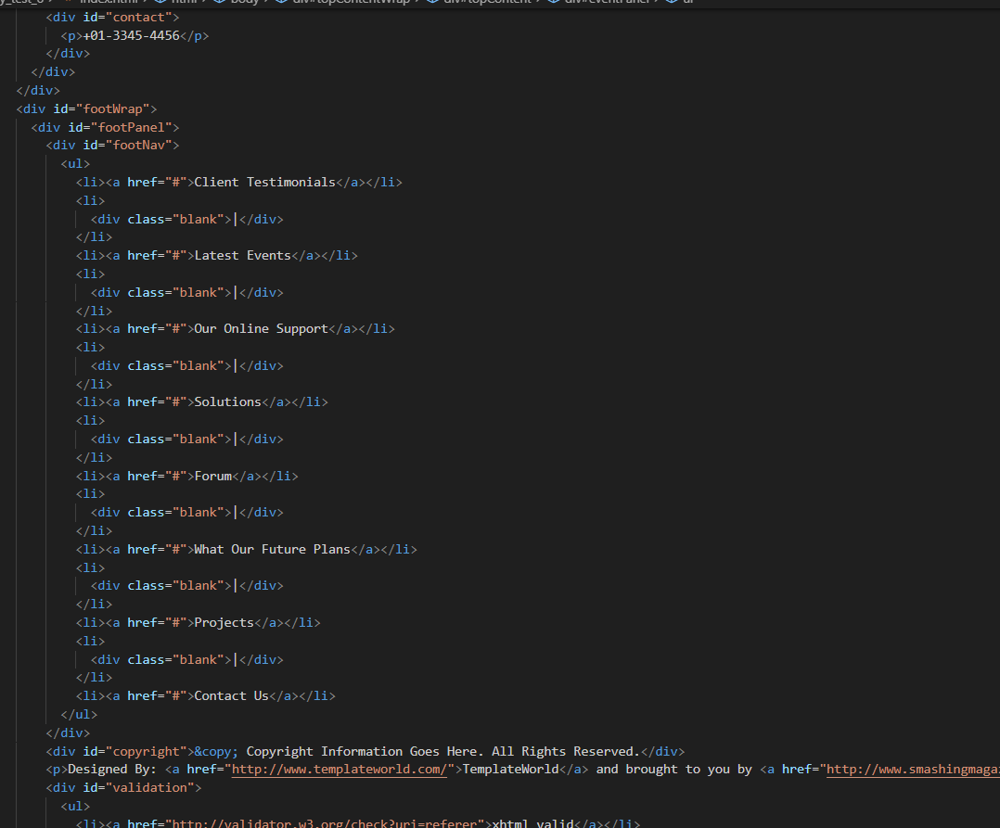
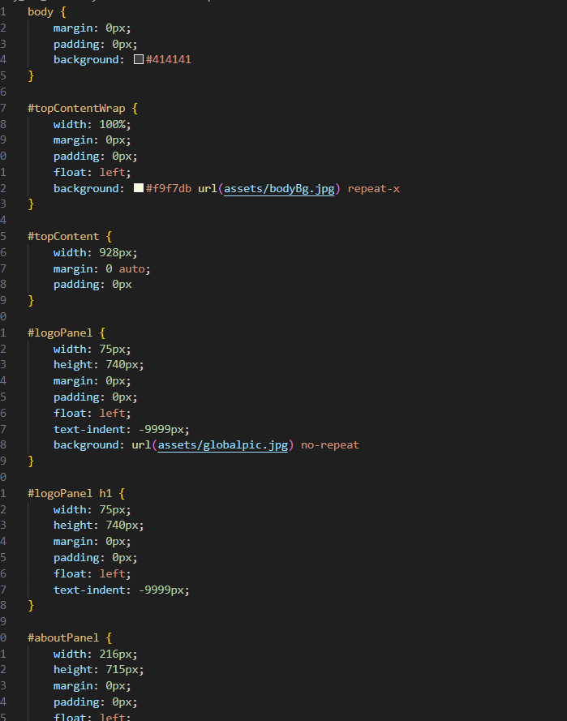
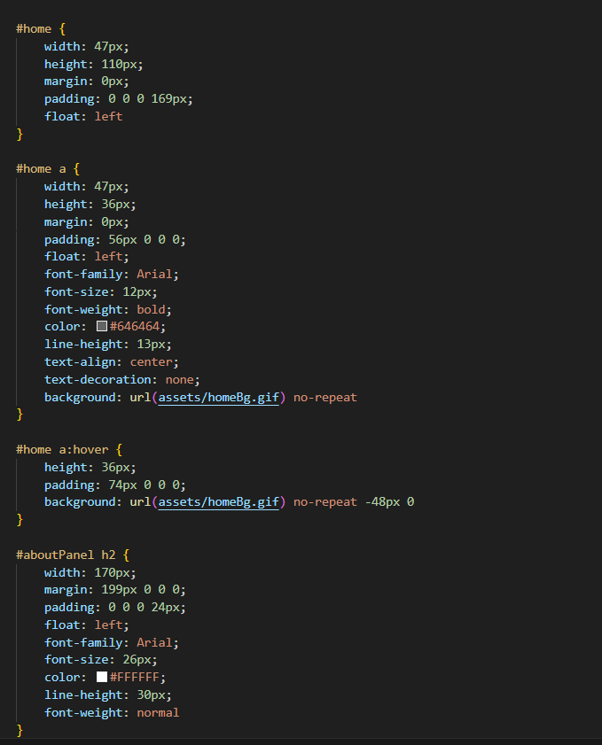
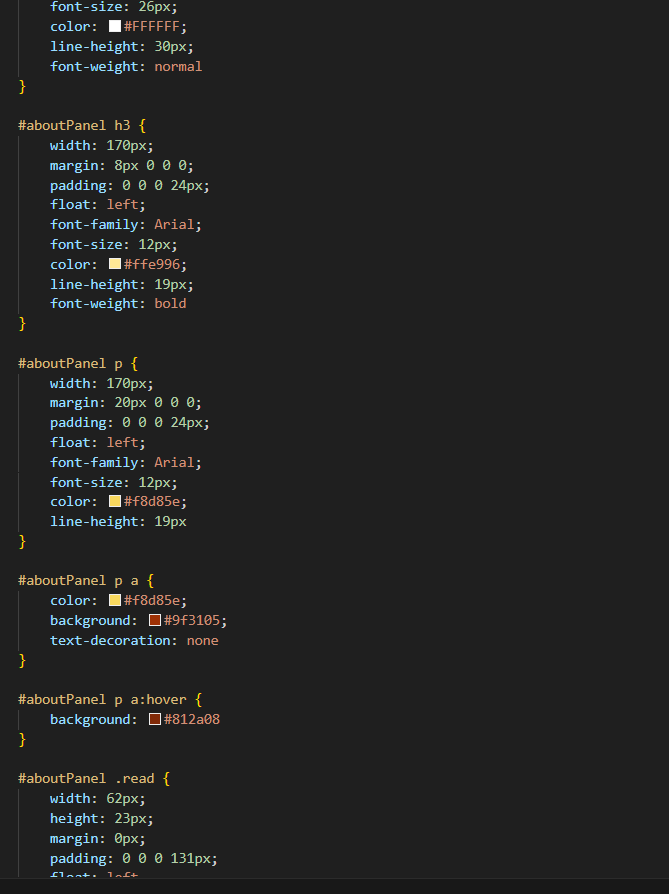
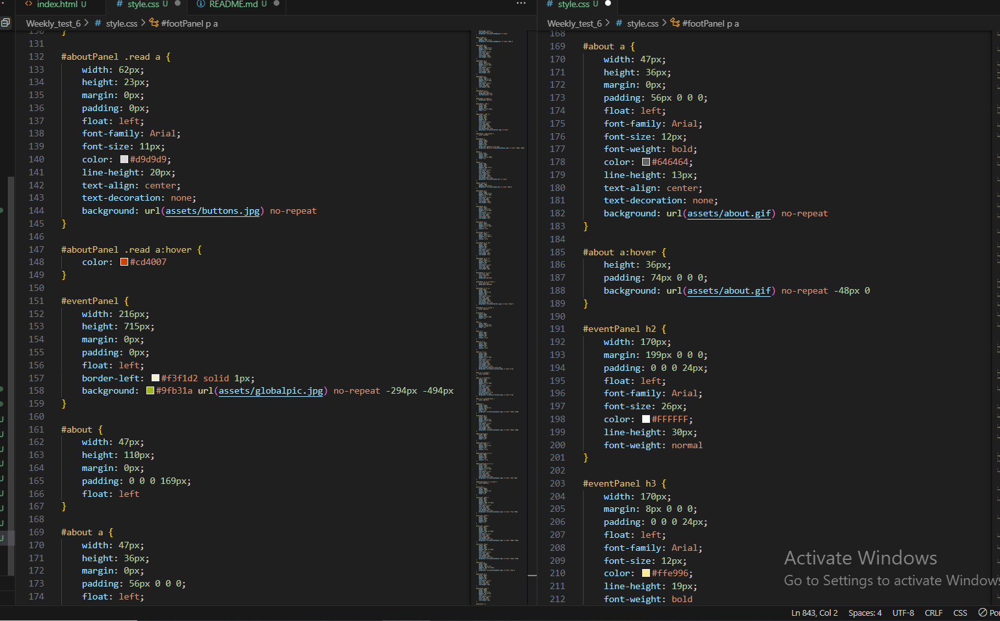
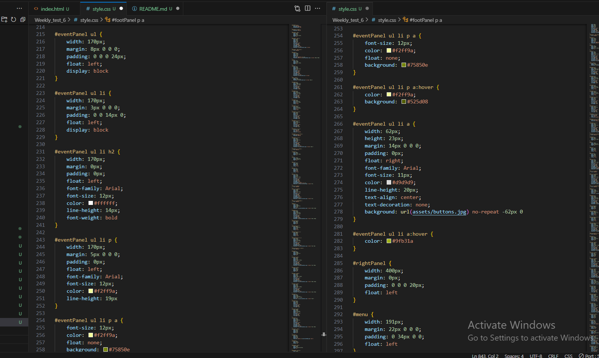
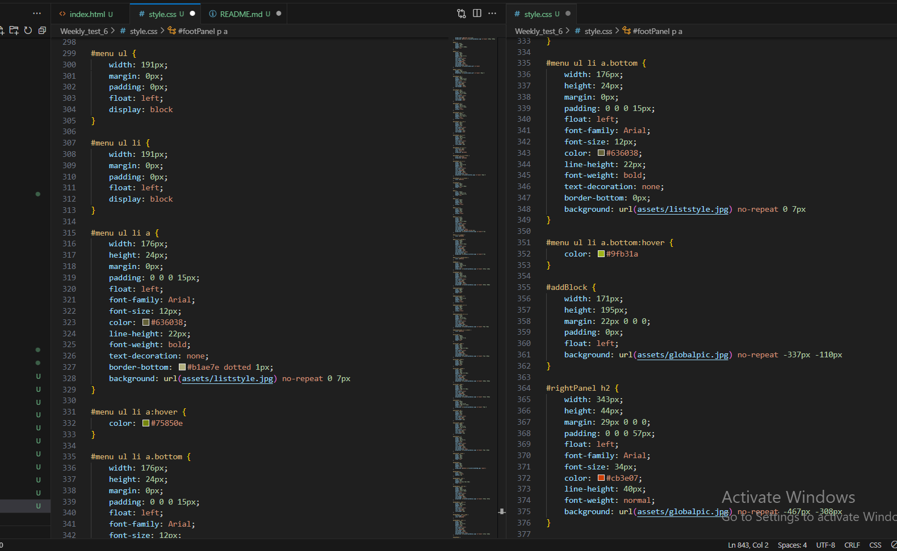
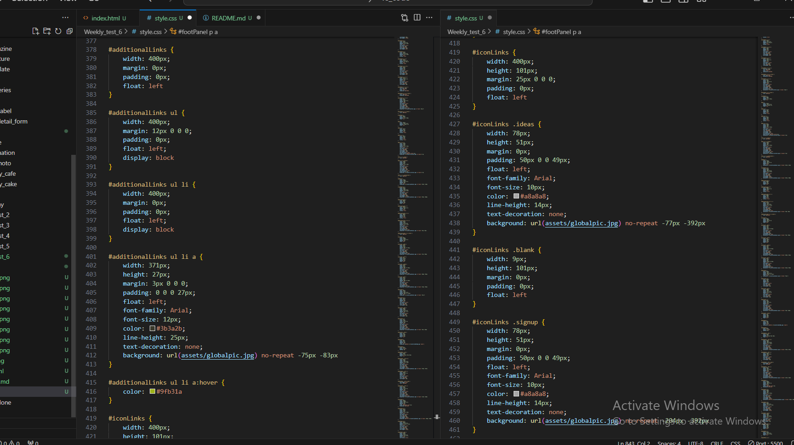

https://gautamkamboj.github.io/vs_code/Weekly_test_6/index.html

## HTML

Header Section:

The header section contains essential metadata about the webpage.
It typically includes the title of the webpage, character encoding information, and references to external resources like stylesheets and icons.

Top Content Section:

The top content section is usually the first visible part of the webpage.
It often includes elements such as a logo or title, navigation links, and introductory text.

About Panel:

The about panel provides information about the website or organization.
It may include a brief description, links to different sections, and a "read more" link to access additional details.

Event Panel:

The event panel focuses on showcasing the latest events or news related to the website or organization.
It includes event titles, descriptions, and "read more" links for more information.

Right Panel:

The right panel typically contains additional navigation links and various other content.
It may have menus, additional links, icons, and a newsletter signup form.

Middle Panel:

The middle panel is the central area of the webpage where the main content is displayed.
It often includes features, articles, descriptions, and "read more" links to access detailed information.

Login Panel:

The login panel allows users to log in to their accounts.
It includes fields for entering a username and password, a "Forgot Password" link, and a login button.

Footer Section:

The footer section appears at the bottom of the webpage.
It contains various types of content, such as navigation links, copyright information, and validation links.
The footer provides essential information and links to different parts of the website.

## CSS

Global Styling:

body: Sets the background color for the entire page and removes default margin and padding.

Top Content Section:

#topContentWrap and #topContent: These elements control the styling of the top content section of the webpage, including its background image.

Logo Panel:

#logoPanel and #logoPanel h1: These elements define the logo's appearance, including its background image and text hiding technique.

About Panel:

#aboutPanel, #home, #home a, #aboutPanel h2, #aboutPanel h3, and #aboutPanel p: These elements style the about panel, including its headings, text, and links.

Event Panel:

#eventPanel, #about, #about a, #eventPanel h2, #eventPanel h3, #eventPanel ul, #eventPanel ul li, and other selectors: These styles control the appearance of the event panel, including headings, lists, and links.

Right Panel:

#rightPanel, #menu, #menu ul, #menu ul li, #menu ul li a, #addBlock, #additionalLinks, #additionalLinks ul, #additionalLinks ul li, #additionalLinks ul li a, #iconLinks, #iconLinks .ideas, #iconLinks .blank, #iconLinks .signup, #iconLinks .blog, #newsLetter, #newsLetter h3, #newsLetter input, and #newsLetter a: These selectors handle the styling of the right panel, including menus, additional links, icons, and the newsletter signup form.

Middle Panel:

#middleWrap, #middlePanel, #middlePanel .left, #middlePanel .left h2, #middlePanel .left p, #middlePanel .left a, #loginPanel, #loginPanel h2, #loginPanel h3, #loginPanel input, #loginPanel .blank, #loginPanel p, and #loginPanel p a: These styles define the appearance of the middle panel, including headings, paragraphs, and login form.

Contact:

#contact and #contact p: These styles control the appearance of contact information in the middle panel.
Footer Section:

#footWrap, #footPanel, #footNav, #footNav ul, #footNav ul li, #footNav ul li .blank, #footNav ul li a, #copyright, #validation, #validation ul, #validation ul li, #validation ul li .blank, and #validation ul li a: These selectors handle the styling of the footer section, including navigation links, copyright information, and validation links.