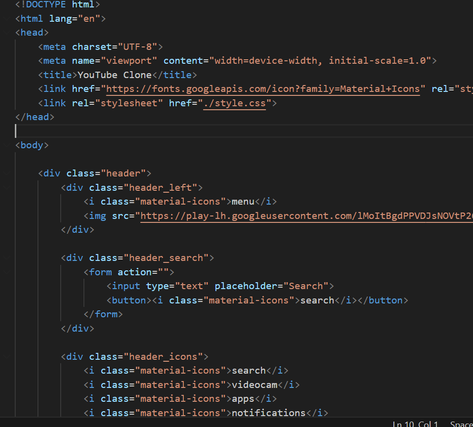
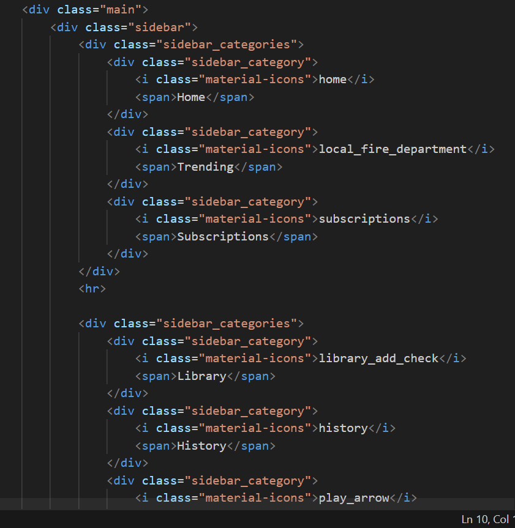
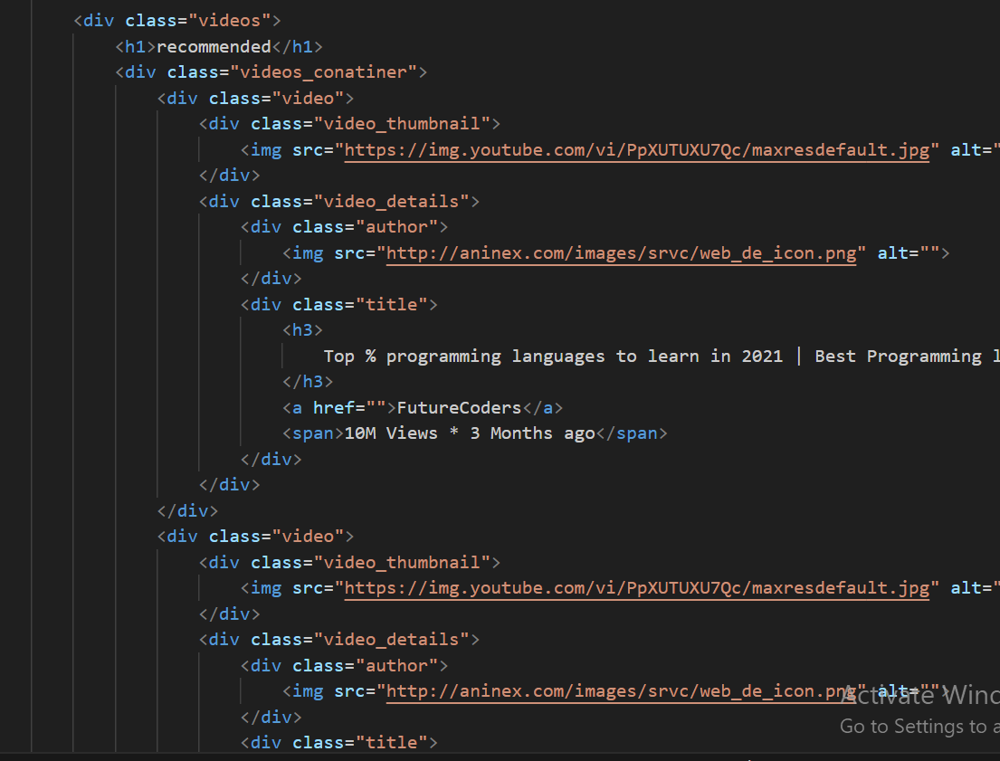
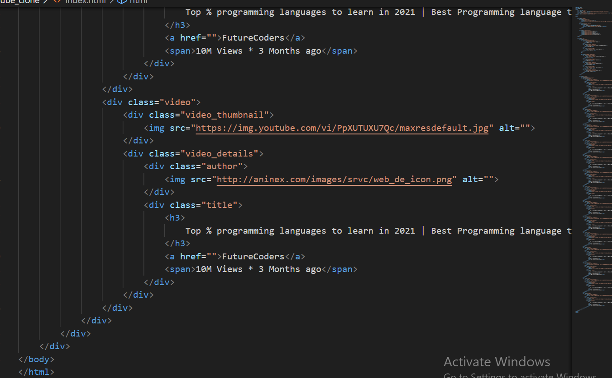
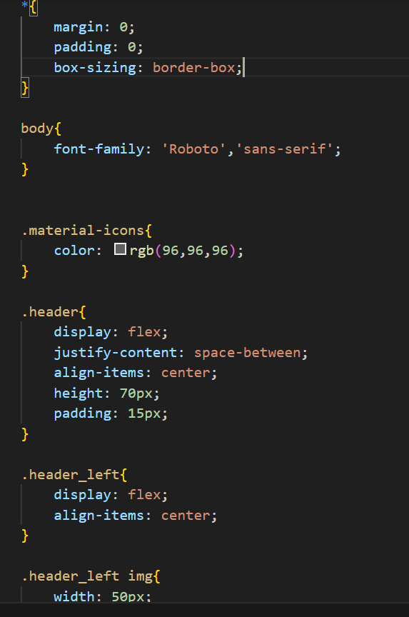
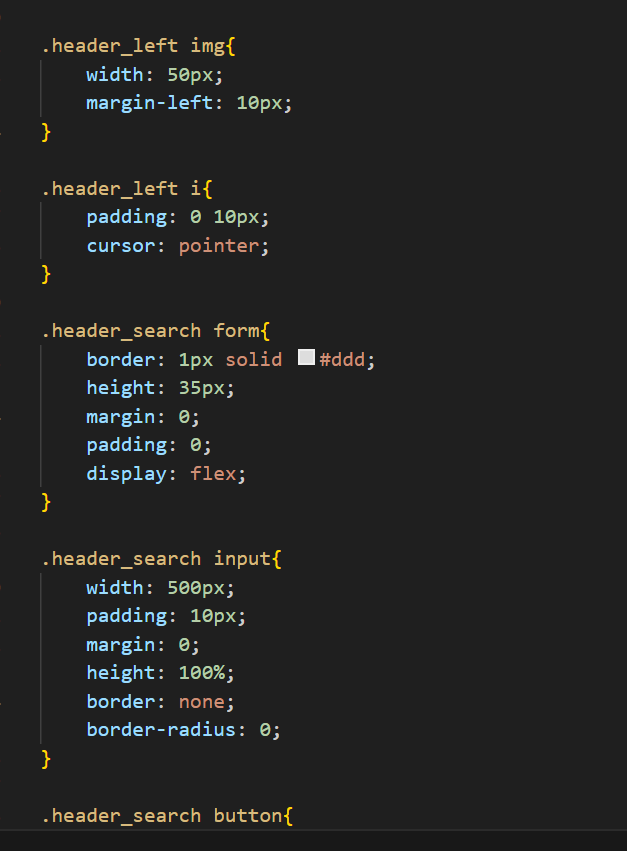
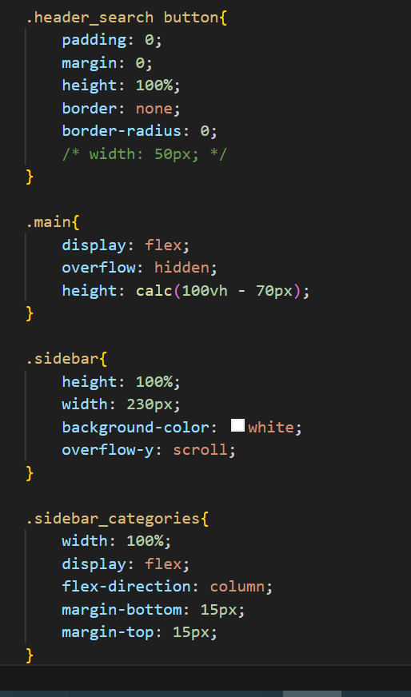
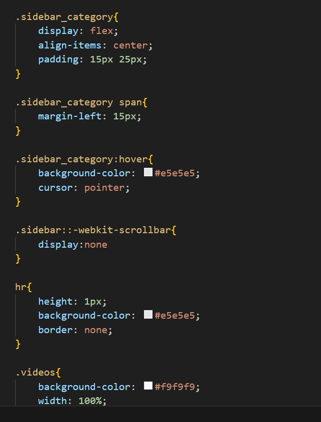
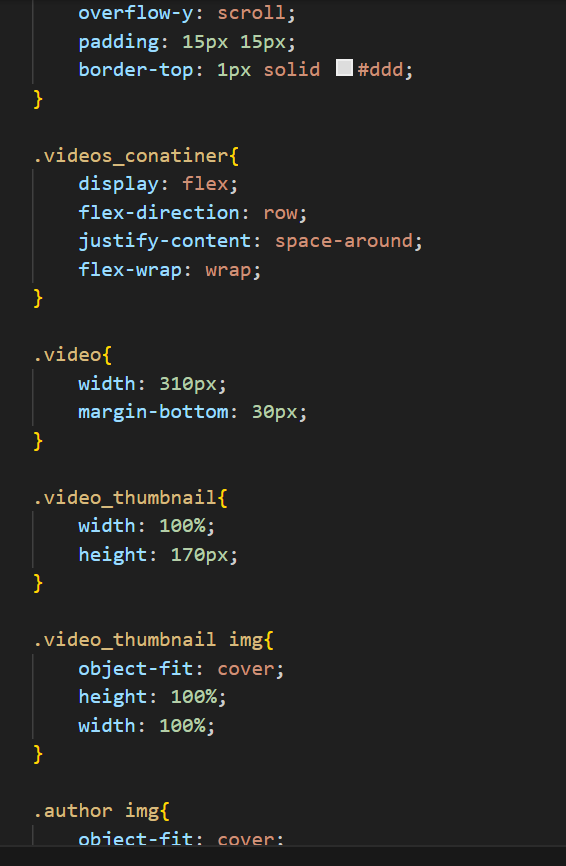
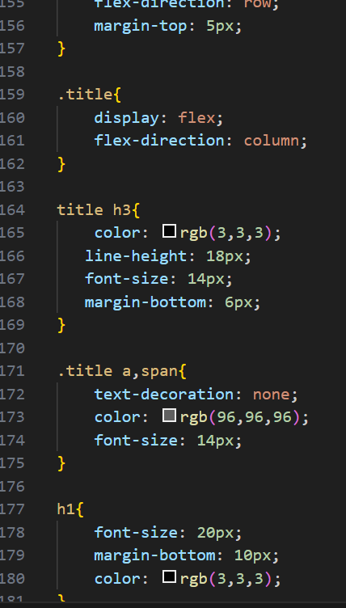

Hosted link-https://gautamkamboj.github.io/vs_code/Youtube_clone/index.html

## html

# Document Structure:

This is a standard HTML5 document structure with the !DOCTYPE html> declaration.
It includes the necessary head> section where metadata and external resources (CSS and fonts) are linked.

The body> section contains the actual content of the webpage.
# Header Section:

The header section is represented by the div class="header"> element.
Within the header, there are three main parts:

# Header Left (div class="header_left">):
It contains the menu icon (i class="material-icons">menu /i>) and the YouTube logo image.

# Header Search (div class="header_search">):
It includes a search form with an input field and a search button.

# Header Icons (div class="header_icons">):
It contains various icons for search, video camera, apps, notifications, and account circle.

# Sidebar Section (div class="sidebar">):

The sidebar section is where different categories and links are displayed.
It includes categories like "Home," "Trending," and "Subscriptions," as well as other links like "Library," "History," "Your Videos," "Watch Later," and "Liked Videos."
These categories and links are represented by div class="sidebar_category"> elements with icons (i class="material-icons">) and text.

# Main Content Section (div class="main">):

The main content section includes a list of recommended videos.
Each video is represented by a div class="video"> element.
For each video, there's a thumbnail image (div class="video_thumbnail">) and details such as the video author's image, title, author name, and view count.
The video details are wrapped in a div class="video_details"> element.

# Styling and Icons:

The webpage uses Google's Material Icons for various icons such as the menu, search, video camera, apps, notifications, and account circle.

## CSS

Universal Reset (* Selector):

Resets margin, padding, and box-sizing for all elements on the page to ensure consistent styling.
body Styles:

Sets the font family to 'Roboto' and the generic sans-serif as a fallback for the entire webpage.
.material-icons Styles:

Defines a color (gray) for elements with the class .material-icons. This class is typically used with icon fonts like Google's Material Icons.
.header Styles:

Styles the header section of the page:
Uses flexbox to create a horizontal layout with space-between alignment, which separates the header's left and right content.
Sets a fixed height, padding, and aligns items vertically in the center.

.header_left Styles:

Styles the left part of the header (containing the menu icon and logo):
Aligns items vertically in the center.
Adds spacing to the logo image.
.header_left img Styles:

Styles the logo image by setting a fixed width and adding left margin.
.header_left i Styles:

Styles the menu icon by adding horizontal padding and setting it as a pointer cursor.
.header_search Styles:

Styles the search bar section within the header:
Creates a border around the search bar.
Sets a fixed height.
Defines flex properties for the input and button elements inside it.
.header_search input Styles:

Styles the input field within the search bar:
Sets a specific width and height.
Removes border and border-radius for a flat design.
Adds padding.
.header_search button Styles:

Styles the search button within the search bar:
Removes padding, margin, border, and border-radius to make it a simple button.
.main Styles:

Styles the main content section of the page:
Uses flexbox to create a horizontal layout.
Sets an overflow property to hide content that overflows the container.
Calculates the height using calc to ensure it takes up the remaining viewport height minus the header height.

.sidebar Styles:

Styles the sidebar section of the page:
Sets a fixed width.
Defines a background color.
Uses overflow-y to enable scrolling for the sidebar content if it overflows.
.sidebar_categories Styles:

Styles the container for sidebar categories:
Sets width and margin for spacing.
.sidebar_category Styles:

Styles individual sidebar categories:
Uses flexbox for alignment.
Adds padding and hover effect to highlight the category on hover.

hr Styles:

Styles horizontal rules (lines):
Sets the height and background color to create a horizontal line.
.videos Styles:

Styles the section that contains videos:
Sets background color, width, height, and overflow-y to enable scrolling.
.videos_conatiner Styles:

Styles the container for video thumbnails:
Uses flexbox for a responsive layout with wrapping.
.video Styles:

Styles individual video elements within the container:
Sets a fixed width and margin at the bottom.

.video_thumbnail Styles:

Styles the video thumbnail container:
Sets the width and height and uses object-fit to cover the container.
.video_thumbnail img Styles:

Styles the video thumbnail images:
Uses object-fit to cover the image and ensure it maintains its aspect ratio.
.author img Styles:

Styles author images:
Sets width, height, border-radius, and margin.
.video_details Styles:

Styles the container for video details:
Uses flexbox to create a row layout.

.title Styles:

Styles the title and related elements within video details:
Uses flexbox for vertical layout.
Sets color, line height, font size, and margin.
h1 Styles:

Styles level 1 headings (<h1>) with a larger font size, margin, and color.