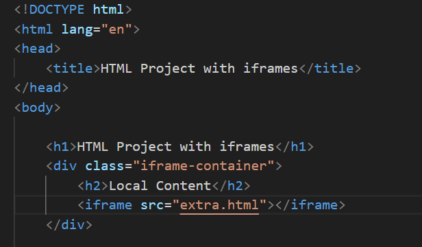
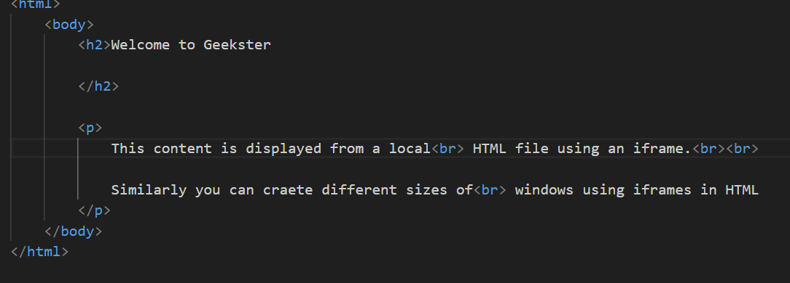
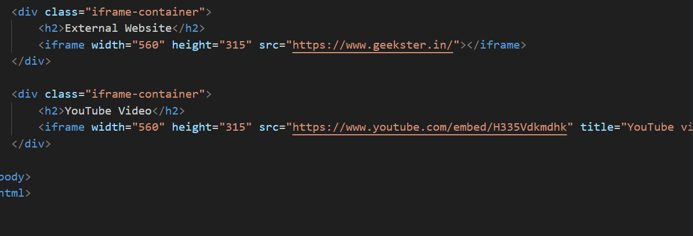

## READ ME

# iFrame

The iframe (inline frame) tag in HTML is used to embed another HTML document or web page within the current web page. It's commonly used to display external content, such as maps, videos, or external web pages, directly within a section of your web page.

Local content- 

src attribute contains the URL or address of file that is to be displayed in the frame.

external website can be fed in src attribute.
height and width attribute are used to specify the viewport of the frame.

