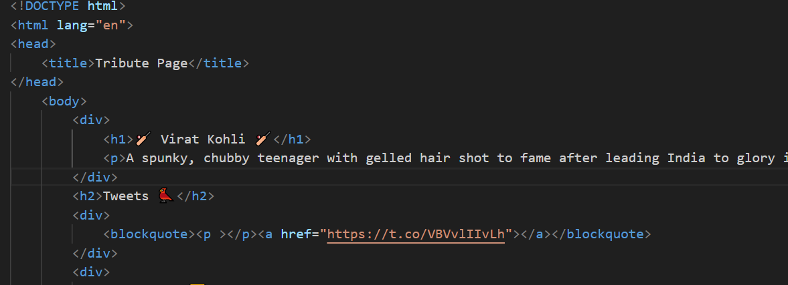
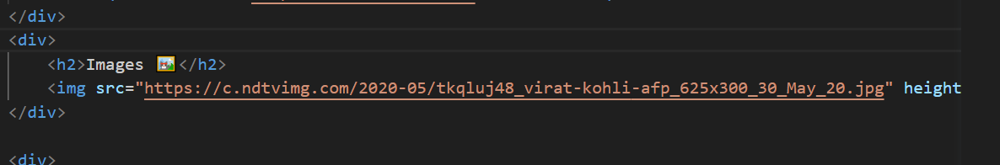
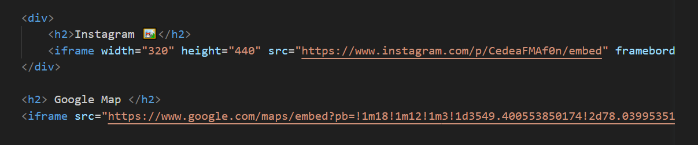
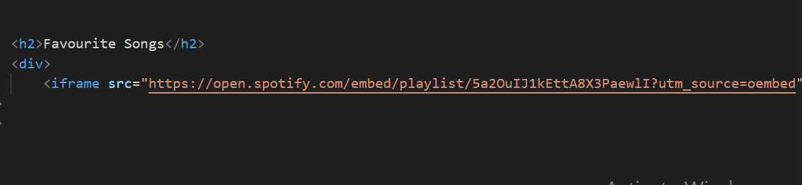

## READ ME 

The blockquote element represents content that is quoted from another source, optionally with a citation which must be within a footer or cite element, and optionally with in-line changes such as annotations and abbreviations.
Virat kohli tweet url is provided in the anchor tag present in blockquote.

Image tag(img ) is used for photo and url is provided in src attribute.

The iframe (inline frame) tag in HTML is used to embed another HTML document or web page within the current web page. It's commonly used to display external content, such as maps, videos, or external web pages, directly within a section of your web page.

To embed a Google Map using an iframe in HTML, you can use the Google Maps Embed API. This allows you to create an iframe that displays a map with a specific location, zoom level, and other customization options.
Go to the Google Maps Embed API page.

Enter the location you want to display on the map in the "Search" field.

Customize the map by adjusting options such as zoom level, size, and map type.

Copy the generated iframe code provided by the Google Maps Embed API.

Similarly spotify link can be given in anchor tag within an iframe.